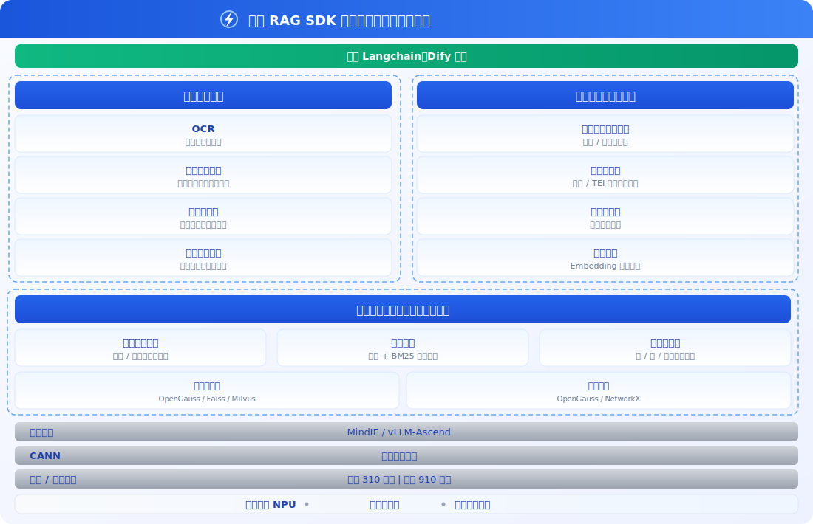

<h1 align="center">RAG SDK</h1>

<h2>昇腾面向大语言模型的知识检索增强开发套件</h2>

[![Zread](https://img.shields.io/badge/Zread-Ask_AI-_.svg?style=flat&color=0052D9&labelColor=000000&logo=data%3Aimage%2Fsvg%2Bxml%3Bbase64%2CPHN2ZyB3aWR0aD0iMTYiIGhlaWdodD0iMTYiIHZpZXdCb3g9IjAgMCAxNiAxNiIgZmlsbD0ibm9uZSIgeG1sbnM9Imh0dHA6Ly93d3cudzMub3JnLzIwMDAvc3ZnIj4KPHBhdGggZD0iTTQuOTYxNTYgMS42MDAxSDIuMjQxNTZDMS44ODgxIDEuNjAwMSAxLjYwMTU2IDEuODg2NjQgMS42MDE1NiAyLjI0MDFWNC45NjAxQzEuNjAxNTYgNS4zMTM1NiAxLjg4ODEgNS42MDAxIDIuMjQxNTYgNS42MDAxSDQuOTYxNTZDNS4zMTUwMiA1LjYwMDEgNS42MDE1NiA1LjMxMzU2IDUuNjAxNTYgNC45NjAxVjIuMjQwMUM1LjYwMTU2IDEuODg2NjQgNS4zMTUwMiAxLjYwMDEgNC45NjE1NiAxLjYwMDFaIiBmaWxsPSIjZmZmIi8%2BCjxwYXRoIGQ9Ik00Ljk2MTU2IDEwLjM5OTlIMi4yNDE1NkMxLjg4ODEgMTAuMzk5OSAxLjYwMTU2IDEwLjY4NjQgMS42MDE1NiAxMS4wMzk5VjEzLjc1OTlDMS42MDE1NiAxNC4xMTM0IDEuODg4MSAxNC4zOTk5IDIuMjQxNTYgMTQuMzk5OUg0Ljk2MTU2QzUuMzE1MDIgMTQuMzk5OSA1LjYwMTU2IDE0LjExMzQgNS42MDE1NiAxMy43NTk5VjExLjAzOTlDNS42MDE1NiAxMC42ODY0IDUuMzE1MDIgMTAuMzk5OSA0Ljk2MTU2IDEwLjM5OTlaIiBmaWxsPSIjZmZmIi8%2BCjxwYXRoIGQ9Ik0xMy43NTg0IDEuNjAwMUgxMS4wMzg0QzEwLjY4NSAxLjYwMDEgMTAuMzk4NCAxLjg4NjY0IDEwLjM5ODQgMi4yNDAxVjQuOTYwMUMxMC4zOTg0IDUuMzEzNTYgMTAuNjg1IDUuNjAwMSAxMS4wMzg0IDUuNjAwMUgxMy43NTg0QzE0LjExMTkgNS42MDAxIDE0LjM5ODQgNS4zMTM1NiAxNC4zOTg0IDQuOTYwMVYyLjI0MDFDMTQuMzk4NCAxLjg4NjY0IDE0LjExMTkgMS42MDAxIDEzLjc1ODQgMS42MDAxWiIgZmlsbD0iI2ZmZiIvPgo8cGF0aCBkPSJNNCAxMkwxMiA0TDQgMTJaIiBmaWxsPSIjZmZmIi8%2BCjxwYXRoIGQ9Ik00IDEyTDEyIDQiIHN0cm9rZT0iI2ZmZiIgc3Ryb2tlLXdpZHRoPSIxLjUiIHN0cm9rZS1saW5lY2FwPSJyb3VuZCIvPgo8L3N2Zz4K&logoColor=ffffff)](https://zread.ai/Ascend/RAGSDK)
[![DeepWiki](https://img.shields.io/badge/DeepWiki-Ask_AI-_.svg?style=flat&color=0052D9&labelColor=000000&logo=data:image/png;base64,iVBORw0KGgoAAAANSUhEUgAAACwAAAAyCAYAAAAnWDnqAAAAAXNSR0IArs4c6QAAA05JREFUaEPtmUtyEzEQhtWTQyQLHNak2AB7ZnyXZMEjXMGeK/AIi+QuHrMnbChYY7MIh8g01fJoopFb0uhhEqqcbWTp06/uv1saEDv4O3n3dV60RfP947Mm9/SQc0ICFQgzfc4CYZoTPAswgSJCCUJUnAAoRHOAUOcATwbmVLWdGoH//PB8mnKqScAhsD0kYP3j/Yt5LPQe2KvcXmGvRHcDnpxfL2zOYJ1mFwrryWTz0advv1Ut4CJgf5uhDuDj5eUcAUoahrdY/56ebRWeraTjMt/00Sh3UDtjgHtQNHwcRGOC98BJEAEymycmYcWwOprTgcB6VZ5JK5TAJ+fXGLBm3FDAmn6oPPjR4rKCAoJCal2eAiQp2x0vxTPB3ALO2CRkwmDy5WohzBDwSEFKRwPbknEggCPB/imwrycgxX2NzoMCHhPkDwqYMr9tRcP5qNrMZHkVnOjRMWwLCcr8ohBVb1OMjxLwGCvjTikrsBOiA6fNyCrm8V1rP93iVPpwaE+gO0SsWmPiXB+jikdf6SizrT5qKasx5j8ABbHpFTx+vFXp9EnYQmLx02h1QTTrl6eDqxLnGjporxl3NL3agEvXdT0WmEost648sQOYAeJS9Q7bfUVoMGnjo4AZdUMQku50McDcMWcBPvr0SzbTAFDfvJqwLzgxwATnCgnp4wDl6Aa+Ax283gghmj+vj7feE2KBBRMW3FzOpLOADl0Isb5587h/U4gGvkt5v60Z1VLG8BhYjbzRwyQZemwAd6cCR5/XFWLYZRIMpX39AR0tjaGGiGzLVyhse5C9RKC6ai42ppWPKiBagOvaYk8lO7DajerabOZP46Lby5wKjw1HCRx7p9sVMOWGzb/vA1hwiWc6jm3MvQDTogQkiqIhJV0nBQBTU+3okKCFDy9WwferkHjtxib7t3xIUQtHxnIwtx4mpg26/HfwVNVDb4oI9RHmx5WGelRVlrtiw43zboCLaxv46AZeB3IlTkwouebTr1y2NjSpHz68WNFjHvupy3q8TFn3Hos2IAk4Ju5dCo8B3wP7VPr/FGaKiG+T+v+TQqIrOqMTL1VdWV1DdmcbO8KXBz6esmYWYKPwDL5b5FA1a0hwapHiom0r/cKaoqr+27/XcrS5UwSMbQAAAABJRU5ErkJggg==)](https://deepwiki.com/Ascend/RAGSDK)

## ✨ 最新消息

🔹 **[2026.04.25]**：[RAG SDK 26.0.0 Release 版本发布](https://gitcode.com/Ascend/RAGSDK/releases/v26.0.0)

🔹 **[2025.12.30]**：RAG SDK 开源发布

## ℹ️ 简介

RAG SDK 是昇腾面向大语言模型的知识检索增强开发套件，为解决大模型知识更新缓慢以及垂直领域知识回答弱的问题，提供多模态文档解析、知识库管理、垂域调优、生成增强等能力，帮助用户快速构建基于昇腾平台的高性能、准确度高的大模型问答系统，降低大模型应用开发门槛，支持对接开源生态。

## ⚙️ 功能介绍

RAG SDK 提供以下核心模块：

| 类别 | 模块 | 功能简介 |
|:--|:--|:--|
| 知识管理 | 文档解析与切分 | 支持文档、表格、图片等多种类型文件的解析、切分与管理 |
| 向量化 | Embedding | 调用向量化模型对文本进行向量编码，支持本地部署和服务化部署 |
| 检索 | Retrieval | 基于昇腾 NPU 异构检索加速框架，提供高性能向量检索 |
| 排序 | Reranker | 对检索结果进行精排，提高检索质量 |
| 缓存 | Cache | 支持完全一致缓存和语义相似缓存，加速 RAG 应用 |
| 知识图谱 | GraphRag | 一种结构化的、分层的检索增强生成（RAG）方法 |

具体功能特性及使用指南参考[用户指南](./docs/zh/user_guide.md)对应章节。

## 🚀 快速入门

RAG SDK提供了一个简单的样例，帮助用户快速体验运用RAG SDK进行知识检索增强的流程。详情可参考[快速入门](docs/zh/quickstart.md)。

## 📦 安装指南

支持容器内和物理机内部署安装RAG SDK，详细的安装部署说明请参见《[安装部署](docs/zh/installation_guide.md)》。

## 📘 使用指南

RAG SDK的使用指南请参阅完整文档导航 **[RAG SDK 开发者文档](docs/zh/_menu_ragsdk.md)**。

## 🛠️ 贡献指南

欢迎参与项目贡献，贡献流程和规范请参见《[贡献指南](CONTRIBUTING.md)》。

## ⚖️ 相关说明

🔹 《[版本说明](docs/zh/release_notes.md)》 
🔹 《[许可证声明](./LICENSE.md)》 
🔹 《[安全声明](docs/zh/security_hardening.md)》 
🔹 《[免责声明](docs/zh/disclaimer.md)》 
🔹 《[第三方开源软件声明](Third_Party_Open_Source_Software_Notice)》 

## 🤝 建议与交流

如您在使用或参与过程中有任何问题与想法，可通过以下渠道与我们沟通、提交反馈或加入社区交流。

| 资源 | 说明 |
|:--|:--|
| [FAQ](docs/zh/faq.md) | 常见问题解答与使用答疑 |
| [创建Issue](https://gitcode.com/Ascend/RAGSDK/issues/new) | 提交 Bug、需求或建议 |
| [社区任务](https://gitcode.com/Ascend/RAGSDK/issues) | 查看和认领社区任务 |
| [会议日历](https://meeting.ascend.osinfra.cn/?sig=sig-MindSeriesSDK) | 社区定期例会与活动日程 |
