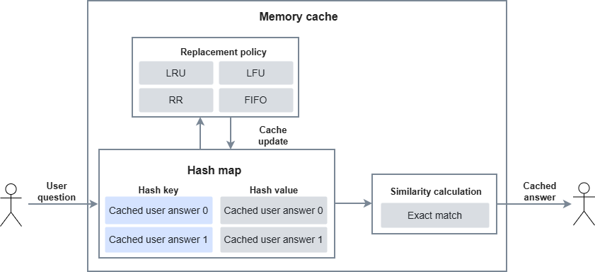
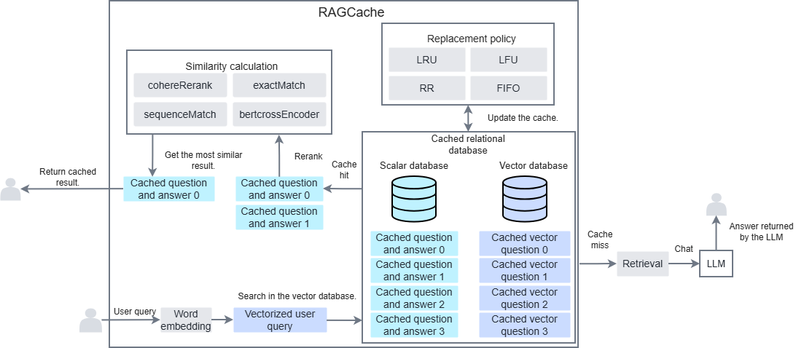

# Cache Module

## Overview

The main functionality of `MxRAGCache` comes from secondary development of the open-source component GPTCache. It supports the following basic cache functions:

- Cache initialization.
- Cache update.
- Cache aging.
- Cache query.
- Cache chaining.

Compared with GPTCache, `MxRAGCache` adds the following functions:

- Semantic approximate cache vector retrieval supports FAISS_NPU retrieval (Index SDK).
- Semantic approximate cache embedding supports RAG-optimized TEI Embedding.
- Semantic approximate cache similarity calculation supports RAG-optimized TEI Reranker.
- Cache support for RAG SDK chains, including image-to-image, text-to-text, and text-to-image.

In the original RAG SDK workflow, a question-answer cache is added before knowledge document retrieval. If a query hits the cache, it bypasses the LLM inference process. Therefore, it saves knowledge document retrieval latency and LLM inference latency, and improves end-to-end performance. Performance tests show that a cache hit can be 50 times faster than a cache miss.

## Module Introduction

### Cache Types

#### Overview

Cache types are divided into memory cache (hash map + exact match) and similarity cache (vector database + embedding + similarity calculation). Memory cache is used when the user's question matches exactly. Similarity cache is used when the user's question is not exactly the same but is similar. In actual use, you can also chain caches together.

#### Memory Cache

Memory cache is an exact-match cache. It uses a hash map in memory. The hash key is the hash value of the user's query, and the hash value is the user's question. The user's question must match exactly.

**Figure 1** Memory cache structure


#### Similarity Cache

Similarity cache is a semantic similarity matching cache. The storage structure is SQLite + a vector database (faiss, npu_faiss, milvus).

When you query, the system first embeds the user's question, queries the top `k` similar results from the vector database, then retrieves the cached answer and question from SQLite. It then reranks the cached question and the user's question to return the most similar result. This cache does not require exact matching. It only requires semantic similarity to hit.

**Figure 1** Similarity cache structure


## Cache Configuration

### Overview

This chapter mainly describes the configuration data that users can provide.

### `CacheConfig`

#### Class Function<a id="ZH-CN_TOPIC_0000002020105781"></a>

**Description**

Configuration data structure for the memory cache.

**Function Prototype**

```python
from gptcache.config import Config
from mx_rag.cache import CacheConfig
# Inherits from Config
CacheConfig(cache_size, eviction_policy, auto_flush, data_save_folder, min_free_space, similarity_threshold, disable_report, lock)
```

**Parameters**

|Parameter|Data Type|Optional/Required|Description|
|--|--|--|--|
|cache_size|int|Required|Cache size. This configures the number of cache entries. <br>`cache_size` cannot be less than or equal to 0. <br>Value range: `(0, 100000]`.|
|eviction_policy|EvictPolicy|Optional|Cache aging policy. <br>The default value is LRU. See [EvictPolicy](#evictpolicy) for details.|
|auto_flush|int|Optional|Frequency for persisting data to disk. This is the number of cache entries after which the system performs one disk write. <br>Default value: `20` <br>Value range: `(0, cache_size]`.|
|data_save_folder|str|Optional|Path for persisting cache data. The path length cannot exceed 1024, and the path cannot be a symbolic link or a relative path. <li>The size of each file in the directory cannot exceed 100 GB, the directory depth cannot exceed 64, and the total number of files cannot exceed 512.</li><li>The running user's group and users other than the running user must not have write permission to files in that directory.</li><li>The group of the files in the directory and the group of the parent directory of those files must belong to the running user.</li><br>Default value: the current user's home directory + `"/Ascend/mxRag/cache_save_folder"`. If the path does not exist, you must create it. The storage path cannot be in the following path list: [`/etc`, `/usr/bin`, `/usr/lib`, `/usr/lib64`, `/sys/`, `/dev/`, `/sbin`, `/tmp`].|
|min_free_space|int|Optional|Available space check for the disk persistence path, in bytes. Default value: `1 GB`. <br>Value range: `[20 MB, 100 GB]`.|
|similarity_threshold|float|Optional|Similarity calculation threshold. <br>Default value: `0.8` <br>Value range: `[0.0, 1.0]`.|
|disable_report|bool|Optional|Whether to support telemetry data. <br>Default value: `False` <br>Value range: `True` means not supported, and `False` means supported.|
|lock|multiprocessing.synchronize.Lock, _thread.LockType|Optional|`CacheConfig` does not support multithreaded or multiprocess processing. If you need to call this interface from multiple processes or threads, you must acquire a lock. Default value: `None`. <br>Possible values: <br>`None`: Do not use a lock. In this case, the interface does not support concurrency. <br>`multiprocessing.Lock()`: Process lock. In this case, the interface supports multiprocess calls. <br>`threading.Lock()`: Thread lock. In this case, the interface supports multithreaded calls.|

> [!NOTE]
>
>- This interface uses the pickle module internally, which has the risk of being attacked by maliciously crafted data during unpickling. You must ensure that the persisted data loaded from `data_save_folder` is stored securely and that you load only trusted persisted data.
>- For memory cache, the persisted file size cannot exceed 100 MB.

**Example**

```python
from paddle.base import libpaddle
from mx_rag.cache import CacheConfig
from mx_rag.cache import EvictPolicy
from mx_rag.cache import MxRAGCache
cache_config = CacheConfig(
    cache_size=100,
    eviction_policy=EvictPolicy.LRU,
    data_save_folder="path_to_cache_save_folder"
)
mxrag_l1_cache = MxRAGCache("memory_cache", cache_config)
```

### `SimilarityCacheConfig`

#### Class Function

**Description**

Configuration data structure for the similarity cache.

**Function Prototype**

```python
from mx_rag.cache import SimilarityCacheConfig
SimilarityCacheConfig(vector_config, cache_config, emb_config, similarity_config, retrieval_top_k, clean_size, **kwargs)
```

**Parameters**

|Parameter|Data Type|Optional/Required|Description|
|--|--|--|--|
|vector_config|Dict[str, Any]|Required|Configure the vector database. For details, see [Table 1](#vector_config). Note that if this is a faiss database, the `load_local_index` parameter in MindFAISS is overridden by the `data_save_folder` persisted path, `auto_save` is set to `False`, the string length in the configuration cannot exceed 1024, the length of iterable sequences in the dictionary cannot exceed 1024, the dictionary length cannot exceed 1024, and the nested depth of the dictionary cannot exceed 2 levels.|
|cache_config|str|Required|Configure the scalar database. Currently, only `sqlite` is supported.|
|emb_config|Dict[str, Any]|Required|Configure the embedding model. See [Table 2](#emb_config). The dictionary length cannot exceed 1024, the string length in the dictionary cannot exceed 1024, and the nested depth of the dictionary cannot exceed 1 level.|
|similarity_config|Dict[str, Any]|Required|Configure the similarity calculation model. The dictionary length cannot exceed 1024, the string length in the dictionary cannot exceed 1024, and the nested depth of the dictionary cannot exceed 1 level. See [Table 3](#similarity_config).|
|retrieval_top_k|int|Optional|Top `k` value for similarity retrieval. Default value: `1`. Value range: `(0, 1000]`.|
|clean_size|int|Optional|When the amount of cache data added each time exceeds `cache_size`, this is the number of entries to age out. Default value: `1`. Value range: `(0, cache_size]`.|
|**kwargs|Any|Required|See [CacheConfig](#cacheconfig) for details.|

> [!NOTE]
>
>- This interface uses the pickle module internally, which has the risk of being attacked by maliciously crafted data during unpickle. You must ensure that the persisted data loaded from `data_save_folder` is stored securely and that you load only trusted persisted data.
>- `vector_config` and `cache_config` must both be `None` or both be not `None`. If both `vector_config` and `cache_config` are `None`, the configuration is equivalent to memory cache.
>- For the SQLite database, the persisted file cannot exceed 30 GB. For the vector database, the persisted file cannot exceed 20 GB.

**Table 1** `vector_config`<a id="vector_config"></a>

|Parameter|Data Type|Optional/Required|Description|
|--|--|--|--|
|**kwargs|Dict[str, Any]|Required|See [create_storage](./databases.md#create_storage) for details.|
|top_k|int|Optional|Top `k` count for similarity retrieval. Default value: `5`.|
|vector_save_file|str|Required|Persisted path. When `vector_type` is `npu_faiss_db`, this parameter overrides the `load_local_index` parameter in MindFAISS and uses that value as the persisted path. For `milvus_db`, this parameter does not take effect.|

**Table 2** `emb_config` Parameters<a id="emb_config"></a>

|Parameter|Data Type|Optional/Required|Description|
|--|--|--|--|
|x_dim|int|Optional|Dimension of the embedding model. Default value: `0`.|
|skip_emb|bool|Optional|Whether to skip embedding. Default value: `False`.|
|**kwargs|Dict[str, Any]|Required|See `create_embedding` for details.|

**Table 3** `similarity_config` Parameters<a id="similarity_config"></a>

|Parameter|Data Type|Optional/Required|Description|
|--|--|--|--|
|score_min|float|Optional|Minimum possible value of the similarity score. Default value: `0.0`. <br>Value range: `[0.0, 100.0]`.|
|score_max|float|Optional|Maximum possible value of the similarity score. Default value: `1`. <br>Value range: `[1.0, 100.0]`. `"score_max"` must be greater than or equal to `"score_min"`.|
|reverse|bool|Optional|Relationship between the similarity score and the similarity value. Default value: `False`. <li>`False`: A higher similarity score means higher similarity.</li><li>`True`: A higher similarity score means lower similarity.</li>|
|**kwargs|Dict[str, Any]|Required|See [create_reranker](./reranker.md#create_reranker) for details.|

**Example**

Example 1: faiss_npu + local_embedding + local_reranker

```python
from mx_rag.cache import SimilarityCacheConfig
from mx_rag.cache import MxRAGCache
dim = 1024
dev = 1

similarity_config = SimilarityCacheConfig(
        vector_config={
            "vector_type": "npu_faiss_db",
            "x_dim": dim,
            "devs": [dev],

        },
        cache_config="sqlite",
        emb_config={
            "embedding_type": "local_text_embedding",
            "x_dim": dim,
            "model_path": "path_to_embedding_model", # emb model path.
            "dev_id": dev
        },
        similarity_config={
            "similarity_type": "local_reranker",
            "model_path": "path_to_reranker_model",  # reranker model path.
            "dev_id": dev
        },
        retrieval_top_k=1,
        cache_size=1000,
        clean_size=20,
        similarity_threshold=0.86,
        data_save_folder="path_to_cache_save_folder", # Persisted path.
        disable_report=True
    )
similarity_cache = MxRAGCache("similarity_cache", similarity_config)
```

Example 2: milvus_db + tei_embedding + tei_reranker

```python
import getpass
from paddle.base import libpaddle
from mx_rag.cache import SimilarityCacheConfig
from mx_rag.cache import EvictPolicy
from mx_rag.cache import MxRAGCache
from mx_rag.utils import ClientParam
from pymilvus import MilvusClient
dim = 1024

client = MilvusClient("https://x.x.x.x:port", user="xxx", password=getpass.getpass(), secure=True,   client_pem_path="path_to/client.pem",   client_key_path="path_to/client.key",   ca_pem_path="path_to/ca.pem",   server_name="localhost")
similarity_config = SimilarityCacheConfig(
    vector_config={
        "client": client,
        "vector_type": "milvus_db",
        "x_dim": dim,
        "collection_name": "mxrag_cache_123",  # milvus DB label.
        "param": None
    },
    cache_config="sqlite",
    emb_config={
        "embedding_type": "tei_embedding",
        "url": "https://<ip>:<port>/embed",  # IP address and listening port of the tei_embedding service.
        "client_param": ClientParam(ca_file="/path/to/ca.crt")
    },
    similarity_config={
        "similarity_type": "tei_reranker",
        "url": "https://<ip>:<port>/rerank",  # IP address and listening port of the tei_reranker service.
        "client_param": ClientParam(ca_file="/path/to/ca.crt")
    },
    retrieval_top_k=1,
    cache_size=100,
    auto_flush=100,
    similarity_threshold=0.70,
    data_save_folder="path_to_cache_save_folder",
    disable_report=True,
    eviction_policy=EvictPolicy.FIFO
)
similarity_cache = MxRAGCache("similarity_cache", similarity_config)
```

### `EvictPolicy`

#### Class Function

**Description**

Configuration for cache replacement policies.

**Function Prototype**

```python
from mx_rag.cache import EvictPolicy
class EvictPolicy(Enum)
```

**Parameters**

|Attribute|Data Type|Description|
|--|--|--|
|LRU|str|Replace the cache that has not been accessed for the longest time.|
|LFU|str|Replace the cache with the lowest access frequency.|
|FIFO|str|Replace caches in first-in, first-out order.|
|RR|str|Replace caches randomly.|

## Cache Data

### Overview

This section mainly describes the `MxRAGCache` functions for cache data update, cache data lookup, and cache data persistence.

### `MxRAGCache`

#### Class Function

**Description**

Provides cache storage, cache update, and cache persistence for user questions and answers.

**Function Prototype**

```python
from mx_rag.cache import MxRAGCache
MxRAGCache(cache_name, config)
```

**Parameters**

|Parameter|Data Type|Optional/Required|Description|
|--|--|--|--|
|cache_name|str|Required|Cache name. The name appears in the persisted filename. The string length must be in the range `(0, 64)`. Permitted characters: `[0-9a-zA-Z_]`.<br>It can contain only letters, numbers, and underscores.|
|config|CacheConfig/SimilarityCacheConfig|Required|Cache configuration. See [Cache Configuration](#cache-configuration).|

**Example**

```python
import json
import getpass
from paddle.base import libpaddle
from pymilvus import MilvusClient
from mx_rag.cache import CacheConfig, SimilarityCacheConfig
from mx_rag.cache import EvictPolicy
from mx_rag.cache import MxRAGCache
from mx_rag.utils import ClientParam

dim = 1024

cache_config = CacheConfig(
    cache_size=100,
    eviction_policy=EvictPolicy.LRU,
    data_save_folder="path_to_cache_save_folder"
)
cache = MxRAGCache("memory_cache", cache_config)
# Check whether the cache instance initializes successfully
cache_obj = cache.get_obj()
if cache_obj is None:
    print(f"cache init failed")
similarity_config = SimilarityCacheConfig(
    vector_config={
        "vector_type": "milvus_db",
        "x_dim": dim,
        "client": MilvusClient("https://x.x.x.x:port", user="xxx", password=getpass.getpass(), secure=True,   client_pem_path="path_to/client.pem", client_key_path="path_to/client.key", ca_pem_path="path_to/ca.pem", server_name="localhost")
        "collection_name": "mxrag_cache_123",  # milvus DB label.
        "use_http": False,
        "param": None
    },
    cache_config="sqlite",
    emb_config={
        "embedding_type": "tei_embedding",
        "url": "https://<ip>:<port>/embed",  # IP address and listening port of the tei_embedding service.
        "client_param": ClientParam(ca_file="/path/to/ca.crt")
    },
    similarity_config={
        "similarity_type": "tei_reranker",
        "url": "https://<ip>:<port>/rerank",  # IP address and listening port of the tei_reranker service.
        "client_param": ClientParam(ca_file="/path/to/ca.crt")
    },
    retrieval_top_k=1,
    cache_size=100,
    auto_flush=100,
    similarity_threshold=0.70,
    data_save_folder="path_to_cache_save_folder",
    disable_report=True,
    eviction_policy=EvictPolicy.FIFO
)
similarity_cache = MxRAGCache("similarity_cache", similarity_config)
# Configure cache chaining
cache.join(similarity_cache)
# Set the per-entry character limit to 4,000 characters
cache.set_cache_limit(4000)
# Set whether to display the cache process in detail
cache.set_verbose(False)
# Update the cache manually
cache.update("小明的爸爸是谁?", json.dumps({"小明的爸爸是谁?": "小明的爸爸名字是大明"}))
# Exact-match result
res = cache.search("小明的爸爸是谁?")
print(f"memory match res: {res}")
# Semantic similarity result
res = cache.search("小明的爸爸叫什么名字")
print(f"similarity match res: {res}")
# Call flush manually to persist the cache to disk. The cache also persists automatically according to the `auto_flush` configuration
cache.flush()
# Delete the persisted files and data
cache.clear()
```

#### `clear`

**Description**

Deletes the cached files that have already been persisted in `data_save_folder`. For memory cache, because it automatically calls `flush` again when it closes, you need to clear it again in your program.

**Function Prototype**

```python
def clear()
```

#### `flush`

**Description**

This function forces the user's cache data from memory to disk. The target path is the `data_save_folder` configuration parameter in [Class Function](#ZH-CN_TOPIC_0000002020105781).

You must call it after initialization.

**Function Prototype**

```python
def flush()
```

#### `get_obj`

**Description**

Gets the `gptcache` object, which is used to adapt to open-source RAG frameworks such as LangChain. You must call it after initialization.

**Function Prototype**

```python
def get_obj()
```

**Return Values**

|Data Type|Description|
|--|--|
|gptcache object|gptcache object|

#### `join`

**Description**

Chains two caches together to achieve multi-level caching.

**Function Prototype**

```python
def join(next_cache)
```

**Parameters**

|Parameter|Data Type|Optional/Required|Description|
|--|--|--|--|
|next_cache|MxRAGCache|Required|The next-level cache. The cache must be initialized first and cannot be chained to itself. The downstream cache must be of the `MxRAGCache` type. Chained caches cannot form a cycle, and the maximum chain depth is 6.|

#### `search`

**Description**

This function mainly finds the corresponding answer based on the user's question. You must call it after initialization.

**Function Prototype**

```python
def search(query)
```

**Parameters**

|Parameter|Data Type|Optional/Required|Description|
|--|--|--|--|
|query|str|Required|The user's question. String length range: `(0, 128 * 1024 * 1024]`.|

**Return Values**

|Data Type|Description|
|--|--|
|Dict|Returns a Unicode-encoded string of QA pairs, for example: `{"\u66aa....?": "\u6ae6..."，...}`|

#### `set_cache_limit`

**Description**

Sets the character limit for answers returned by the LLM when caching. If the string returned by the LLM exceeds this limit, the system does not cache it.

**Function Prototype**

```python
@classmethod
def set_cache_limit(cache_limit: int)
```

**Parameters**

|Parameter|Data Type|Optional/Required|Description|
|--|--|--|--|
|cache_limit|int|Required|Character limit for each cached answer. The default value is 1,000,000 characters. Value range: `(0, 1000000]`. For Chinese text, the length is calculated after conversion to Unicode.|

#### `set_verbose`

**Description**

Sets whether to enable logging.

**Function Prototype**

```python
@classmethod
def set_verbose(verbose: bool)
```

**Parameters**

|Parameter|Data Type|Optional/Required|Description|
|--|--|--|--|
|verbose|bool|Required|Whether to enable detailed logging. Default value: `False`. <li>`True`: Logs cache hits and misses.</li><li>`False`: Does not log cache hits and misses.</li>|

#### `update`

**Description**

This function mainly stores user questions and answers. You must call it after initialization, otherwise it raises an exception.

**Function Prototype**

```python
def update(query, answer)
```

**Parameters**

|Parameter|Data Type|Optional/Required|Description|
|--|--|--|--|
|query|str|Required|The user's question. String length range: `(0, 128 * 1024 * 1024]`.|
|answer|str|Required|The answer corresponding to the user's question. The string length range is `(0, min(1000000, cache_limit)]`. Otherwise, the system does not cache it. See [set_cache_limit](#set_cache_limit) for details.|

## Cache Adaptation

### Overview

This section mainly introduces the chain adaptation of `MxRAGCache`.

### `CacheChainChat`

#### Class Function

**Description**

Used to adapt the text-to-text, image-to-image, and text-to-image chains in RAG SDK. It also provides access to `MxRAGCache`. When the cache misses, the system performs LLM inference and then writes the result back to the cache.

**Function Prototype**

```python
from mx_rag.cache import CacheChainChat
CacheChainChat(cache,chain,convert_data_to_cache,convert_data_to_user)
```

**Parameters**

|Parameter|Data Type|Optional/Required|Description|
|--|--|--|--|
|cache|MxRAGCache|Required|RAG SDK cache.|
|chain|Chain|Required|RAG SDK chain used to access the LLM.|
|convert_data_to_cache|Callable[[Any], Dict]|Optional|This callback function is mainly used when user data cannot be converted to a string. In that case, the user provides a conversion function. <br>Default: no conversion.|
|convert_data_to_user|Callable[[Dict], Any]|Optional|This callback function is mainly used together with `convert_data_to_cache`. When a user question hits the cache, it converts the stored cache format to the user's format. <br>Default: no conversion.|

**Example**

```python
import time
from paddle.base import libpaddle
from langchain.text_splitter import RecursiveCharacterTextSplitter
from mx_rag.chain import SingleText2TextChain
from mx_rag.document.loader import DocxLoader
from mx_rag.embedding.local import TextEmbedding
from mx_rag.knowledge import KnowledgeDB
from mx_rag.knowledge.knowledge import KnowledgeStore
from mx_rag.llm import Text2TextLLM
from mx_rag.storage.document_store import SQLiteDocstore
from mx_rag.knowledge.handler import upload_files
from mx_rag.document import LoaderMng
from mx_rag.storage.vectorstore import MindFAISS
from mx_rag.utils import ClientParam
from mx_rag.cache import CacheChainChat, MxRAGCache, SimilarityCacheConfig

# Vector dimension
dim = 1024
# NPU card ID
dev = 0

similarity_config = SimilarityCacheConfig(
    vector_config={
        "vector_type": "npu_faiss_db",
        "x_dim": dim,
        "devs": [dev],

    },
    cache_config="sqlite",
    emb_config={
        "embedding_type": "local_text_embedding",
        "x_dim": dim,
        "model_path": "/path to emb",  # emb model path.
        "dev_id": dev
    },
    similarity_config={
        "similarity_type": "local_reranker",
        "model_path": "/path to reranker",  # reranker model path.
        "dev_id": dev
    },

    retrieval_top_k=1,
    cache_size=1000,
    clean_size=20,
    similarity_threshold=0.86,
    data_save_folder="/save path",  # Persisted path.
    disable_report=True
)
similarity_cache = MxRAGCache("similarity_cache", similarity_config)

# Initialize the cache
cache = MxRAGCache("similarity_cache", similarity_config)
# Step 1: offline knowledge base construction. First, register the document processor
loader_mng = LoaderMng()
# Load the document loader. You can use the one built into RAG SDK or the one from LangChain
loader_mng.register_loader(DocxLoader, [".docx"])
# Load the document splitter using LangChain
loader_mng.register_splitter(RecursiveCharacterTextSplitter, [".xlsx", ".docx", ".pdf"],
                             {"chunk_size": 200, "chunk_overlap": 50, "keep_separator": False})

emb = TextEmbedding(model_path="/path to emb", dev_id=dev)

# Initialize the document chunk relational database
chunk_store = SQLiteDocstore(db_path="./sql.db")
# Initialize the knowledge management relational database
knowledge_store = KnowledgeStore(db_path="./sql.db")
# Initialize vector retrieval

vector_store = MindFAISS(x_dim=dim,
                         devs=[dev],
                         load_local_index="./faiss.index"
                         )

# Add the knowledge base and administrator
knowledge_store.add_knowledge(knowledge_name="test", user_id='Default', role='admin')
# Initialize knowledge base management
knowledge_db = KnowledgeDB(knowledge_store=knowledge_store,
                           chunk_store=chunk_store,
                           vector_store=vector_store,
                           knowledge_name="test",
                           user_id='Default',
                           white_paths=["/home"])
# Complete offline knowledge base construction and upload the domain knowledge test.docx document
upload_files(knowledge_db, ["/path to files"],
             loader_mng=loader_mng,
             embed_func=emb.embed_documents,
             force=True)
# Step 2: online question answering. Initialize the retriever
retriever = vector_store.as_retriever(document_store=chunk_store,
                                      embed_func=emb.embed_documents, k=3, score_threshold=0.3)
# Configure the reranker

# Configure the text-to-text LLM chain. Adjust the IP address and port according to the actual environment
llm = Text2TextLLM(base_url="https://<ip>:<port>",
                   model_name="Llama3-8B-Chinese-Chat",
                   client_param=ClientParam(ca_file="/path/to/ca.crt"))
text2text_chain = SingleText2TextChain(llm=llm, retriever=retriever)
cache_chain = CacheChainChat(chain=text2text_chain, cache=cache)
start_time = time.time()
res = cache_chain.query("请描述2024年高考作文题目")
end_time = time.time()
print(f"no cache query time cost:{(end_time - start_time) * 1000}ms")
print(f"no cache answer {res}")
start_time = time.time()
res = cache_chain.query("2024年的高考题目是什么", )
end_time = time.time()
print(f"cache query time cost:{(end_time - start_time) * 1000}ms")
print(f"cache answer {res}")

```

#### `query`

**Description**

Provides an interface for querying the cache. When the cache cannot answer the query, it accesses the LLM.

**Function Prototype**

```python
def query(text, *args, **kwargs) -> Union[Dict, Iterator[Dict]]
```

**Parameters**

|Parameter|Data Type|Optional/Required|Description|
|--|--|--|--|
|text|str|Required|The user's original question. Character count range: `(0, 128M]`.|
|llm_config|LLMParameterConfig|Optional|LLM parameters. See [LLMParameterConfig](./llm_client.md#llmparameterconfig) for details.|
|*args/**kwargs|Any|Optional|Inherits the parent class method signature. RAG SDK does not use it.|

**Return Values**

|Data Type|Description|
|--|--|
|Union[Dict, Iterator[Dict]]|Returns the question-answer result. The content of `Dict` is: <li>With knowledge source: `{"query": query, "result": data, "source_documents": [{'metadata': xxx, 'page_content': xxx}]}`</li><li>Without knowledge source: `{"query": query, "result": data}`</li>|

## Automatic Generation of QA as Cache

### Overview

This section mainly introduces the interfaces for generating QA pairs and writing them to the `MxRAGCache` cache.

### `QAGenerate`

#### Class Function

**Description**

The question-answer generation class takes a title and body as input and calls the LLM to generate question-answer pairs from that body.

**Function Prototype**

```python
from mx_rag.cache import QAGenerate
QAGenerate(config: QAGenerationConfig)
```

**Parameters**

|Parameter|Data Type|Optional/Required|Description|
|--|--|--|--|
|config|QAGenerationConfig|Required|`QAGenerationConfig` object. It contains the parameters related to QA generation. <br>See [QAGenerationConfig](#qagenerationconfig) for the prototype description.|

**Example**

```python
from paddle.base import libpaddle
from transformers import AutoTokenizer
from mx_rag.cache import QAGenerationConfig, QAGenerate
from mx_rag.llm import Text2TextLLM
from mx_rag.utils import ClientParam
llm = Text2TextLLM(base_url="https://ip:port/v1/chat/completions", model_name="llama3-chinese-8b-chat",
                   client_param=ClientParam(ca_file="/path/to/ca.crt"))
# Use the model tokenizer and pass in the model path
tokenizer = AutoTokenizer.from_pretrained("/home/model/Llama3-8B-Chinese-Chat/", local_files_only=True)
# You can call MarkDownParser to generate titles and contents
titles = ["2024年高考语文作文题目"]
contents = ['2024年高考语文作文试题\n新课标I卷\n阅读下面的材料，根据要求写作。（60分）\n'
            '随着互联网的普及、人工智能的应用，越来越多的问题能很快得到答案。那么，我们的问题是否会越来越少？\n'
            '以上材料引发了你怎样的联想和思考？请写一篇文章。'
            '要求：选准角度，确定立意，明确文体，自拟标题；不要套作，不得抄袭；不得泄露个人信息；不少于800字。']
config = QAGenerationConfig(titles, contents, tokenizer, llm, qas_num=1)
qa_generate = QAGenerate(config)
qas = qa_generate.generate_qa()
print(qas)
```

#### `generate_qa`

**Description**

Passes the title and body to `QAGenerationConfig`. The system truncates the body according to the `max_tokens` value in `QAGenerationConfig`.

If the QA pairs returned by the LLM do not meet the format and quantity requirements, the system skips them. For example, the following text generates three required QAs:

```text
Q1：如何查询成都火车站的停运列车？
参考段落：'查询方式：铁路12306网页首页。查询流程：第一步：进入铁路12306app首页，点击【车站大屏】；第二步：左上角车站名下拉选择成都东站；第三步：搜索框输入车次即可查询车次情况。'
Q2：四川省将洪水灾害防御响应提升至哪个级别？
参考段落：四川将洪水灾害防御四级响应提升至三级。
Q3：在7月14日，四川省气象台发布了哪种天气预警？
参考段落：7月14日15时30分，四川省气象台继续发布暴雨蓝色预警。
```

**Function Prototype**

```python
def generate_qa(llm_config)
```

**Parameters**

|Parameter|Data Type|Optional/Required|Description|
|--|--|--|--|
|llm_config|LLMParameterConfig|Optional|Parameters for calling the LLM. Here, the default values of `temperature` and `top_p` are changed to `0.5` and `0.95`. See [LLMParameterConfig](./llm_client.md#llmparameterconfig) for the remaining parameter descriptions.|

**Return Values**

|Data Type|Description|
|--|--|
|Dict|Returns the generated QA pair list in the following format: <br>`{"从成都到重庆要多久？ : 乘坐高铁1个小时"，...}`|

### `QAGenerationConfig`

**Description**

Parameters for QA generation.

**Function Prototype**

```python
from mx_rag.cache import QAGenerationConfig
QAGenerationConfig(titles, contents, tokenizer, llm, max_tokens, qas_num)
```

**Parameters**

|Parameter|Data Type|Optional/Required|Description|
|--|--|--|--|
|titles|List[str]|Required|Title list. The titles and bodies correspond one to one. List length range: `[1, 10000]`. String length range: `[1, 100]`.|
|contents|List[str]|Required|Body list. The titles and bodies correspond one to one. List length range: `[1, 10000]`. String length range: `[1, 1048576]`.|
|tokenizer|transformers.PreTrainedTokenizerBase|Required|Tokenizer instance loaded through `AutoTokenizer.from_pretrained`. Loading external models has security risks, so set `local_files_only` to `True`.|
|llm|Text2TextLLM|Required|LLM object instance. See [Text2TextLLM](./llm_client.md#text2textllm) for the specific type.|
|max_tokens|int|Optional|Maximum token size used to truncate the body. The excess is discarded. Value range: `[500, 100000]`. Default value: `1000`. The actual effective value depends on the MindIE configuration. See the description of `maxSeqLen` in the "Core Concepts and Configuration > Configuration Parameter Descriptions (Service-Based)" section of the MindIE LLM Development Guide.|
|qas_num|int|Optional|Number of QA pairs to generate. Value range: `[1, 10]`. Default value: `5`.|

**Example**

```python
from paddle.base import libpaddle
from transformers import AutoTokenizer
from mx_rag.cache import QAGenerationConfig, QAGenerate
from mx_rag.llm import Text2TextLLM
from mx_rag.utils import ClientParam
llm = Text2TextLLM(base_url="https://ip:port/v1/chat/completions", model_name="llama3-chinese-8b-chat",
                   client_param=ClientParam(ca_file="/path/to/ca.crt"))
# Use the model tokenizer and pass in the model path
tokenizer = AutoTokenizer.from_pretrained("/home/model/Llama3-8B-Chinese-Chat/", local_files_only=True)
# You can call MarkDownParser to generate titles and contents
titles = ["2024年高考语文作文题目"]
contents = ['2024年高考语文作文试题\n新课标I卷\n阅读下面的材料，根据要求写作。（60分）\n'
            '随着互联网的普及、人工智能的应用，越来越多的问题能很快得到答案。那么，我们的问题是否会越来越少？\n'
            '以上材料引发了你怎样的联想和思考？请写一篇文章。'
            '要求：选准角度，确定立意，明确文体，自拟标题；不要套作，不得抄袭；不得泄露个人信息；不少于800字。']
config = QAGenerationConfig(titles, contents, tokenizer, llm, qas_num=1)
qa_generate = QAGenerate(config)
qas = qa_generate.generate_qa()
print(qas)
```

### `MarkDownParser`

#### Class Function

**Description**

Parses Markdown and returns the title and body.

**Function Prototype**

```python
from mx_rag.cache import MarkDownParser
MarkDownParser(file_path, max_file_num)
```

**Parameters**

|Parameter|Data Type|Optional/Required|Description|
|--|--|--|--|
|file_path|str|Required|Path to the folder that contains the Markdown files. The path length cannot exceed 1024. When you call `parse`, the system checks the following conditions: the path cannot be a symbolic link or a relative path, the size of each `.md` file in the folder cannot exceed 10 MB, and the number of `.md` files cannot exceed `max_file_num`. The path cannot be in the following list: [`/etc`, `/usr/bin`, `/usr/lib`, `/usr/lib64`, `/sys/`, `/dev/`, `/sbin`, `/tmp`].|
|max_file_num|int|Optional|Maximum number of Markdown files to parse. Default value: `1000`. Value range: `[1, 10000]`.|

**Return Values**

|Data Type|Description|
|--|--|
|Tuple[List[str], List[str]]|Returns the parsed Markdown `titles` list and `contents` list.|

**Example**

```python
from paddle.base import libpaddle
from mx_rag.cache import MarkDownParser
dir_path = "path to .md document"
parser = MarkDownParser(dir_path)
titles, contents = parser.parse()
print(titles)
print(contents)
```

#### `parse`

**Description**

Returns the Markdown title and body. The number of Markdown files in the folder cannot exceed `max_file_num`.

**Function Prototype**

```python
def parse()
```

**Return Values**

|Data Type|Description|
|--|--|
|Tuple[List[str], List[str]]|Returns the corresponding Markdown `titles` list and `contents` list.|
