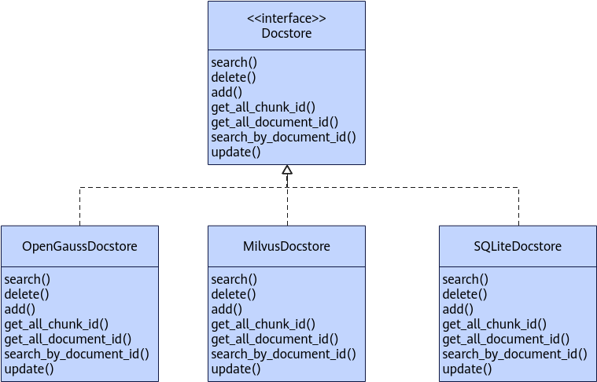
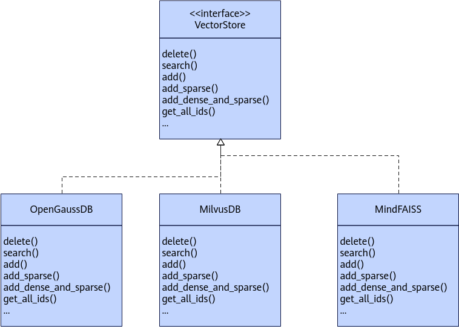

# Databases

## Relational Databases

### Database Structure

#### `KnowledgeModel` Class

```python
class KnowledgeModel(Base):
    __tablename__ = "knowledge_table"

    id = Column(Integer, primary_key=True, autoincrement=True)
    knowledge_id = Column(Integer, nullable=False)
    knowledge_name = Column(String, comment="Knowledge base name")
    user_id = Column(String, comment="User ID")
    role = Column(Enum("admin", "member"), comment="User role. `admin`: administrator, `member`: query only.")
    create_time = Column(DateTime, comment="Creation time", default=datetime.datetime.utcnow)
    __table_args__ = (
        UniqueConstraint('knowledge_name', 'user_id', name="knowledge_name"),
        {"sqlite_autoincrement": True}
    )
```

#### `DocumentModel` Class

```python
class DocumentModel(Base):
    __tablename__ = "document_table"

    document_id = Column(Integer, primary_key=True, autoincrement=True)
    knowledge_id = Column(Integer, comment="Knowledge base ID", nullable=False)
    knowledge_name = Column(String, comment="Knowledge base name")
    document_name = Column(String, comment="Document name")
    document_file_path = Column(String, comment="Document path")
    create_time = Column(DateTime, comment="Creation time", default=datetime.datetime.utcnow)
    __table_args__ = (
        UniqueConstraint('knowledge_id', 'document_name', name="knowledge_id"),
        {"sqlite_autoincrement": True}
    )
```

#### `ChunkModel` Class

When you upload a document, `chunk_id` matches the ID in the vector database.

```python
class ChunkModel(Base):
    __tablename__ = "chunks_table"

    chunk_id = Column(Integer, primary_key=True, comment="Primary key ID", autoincrement="auto")
    document_id = Column(Integer, comment="Document ID")
    document_name = Column(String(255), comment="Document name")
    chunk_content = Column(TEXT, comment="Text content")
    chunk_metadata = Column(JSON, comment="Metadata")
    create_time = Column(DateTime(timezone=True), server_default=text("CURRENT_TIMESTAMP"), comment="Creation time")
    __table_args__ = (
        Index('ix_document_id', 'document_id'),
        Index('ix_create_time', 'create_time')
    )
```

### Text Database Inheritance Relationships

**Figure 1** Text database inheritance relationships


### `Docstore`

#### Class Functionality

**Description**

An abstract class that handles relational databases.

**Function Prototype**

```python
from mx_rag.storage.document_store import Docstore
class Docstore(ABC)
```

#### `add`

**Description**

Adds multiple knowledge chunks corresponding to `document_id` to the database.

**Function Prototype**

```python
@abstractmethod
def add(documents, document_id)
```

#### `delete`

**Description**

Deletes all knowledge chunks corresponding to `document_id`.

**Function Prototype**

```python
@abstractmethod
def delete(document_id)
```

#### `search`

**Description**

Retrieves the content that corresponds to the knowledge chunk `chunk_id`.

**Function Prototype**

```python
@abstractmethod
def search(chunk_id) -> MxDocument
```

#### `get_all_chunk_id`

**Description**

Queries the IDs of all knowledge chunks. When one document is split into multiple chunks, one `document_id` corresponds to multiple `chunk_id` values when the data is stored.

**Function Prototype**

```python
@abstractmethod
def get_all_chunk_id(self) -> List[int]
```

#### `get_all_document_id`

**Description**

Queries the IDs of all documents. When one document is split into multiple chunks, one `document_id` corresponds to multiple `chunk_id` values when the data is stored.

**Function Prototype**

```python
@abstractmethod
def get_all_document_id(self) -> List[int]
```

#### `update`

**Description**

Updates chunk fragments in the relational database.

**Function Prototype**

```python
@abstractmethod
def update(chunk_ids: List[int], texts: List[str])
```

#### `search_by_document_id`

**Description**

Returns the document fragments corresponding to `document_id`.

**Function Prototype**

```python
@abstractmethod
def search_by_document_id(document_id: int)
```

### `OpenGaussDocstore`

#### Class Functionality

**Description**

Provides an OpenGauss knowledge database that mainly stores split chunk information.

**Function Prototype**

```python
from mx_rag.storage.document_store import OpenGaussDocstore
OpenGaussDocstore(engine, encrypt_fn, decrypt_fn, enable_bm25, index_name)
```

**Parameters**

|Parameter|Data Type|Optional/Required|Description|
|--|--|--|--|
|engine|Engine|Required|An `Engine` instance. For details, see <a href="https://docs.sqlalchemy.org/en/20/core/connections.html#sqlalchemy.engine.Engine">Engine</a>. Only the OpenGauss dialect is supported.<br>>[!NOTE] The `Engine` instance comes from the user. Therefore, ensure that you use a secure connection method.|
|encrypt_fn|Callable[[str], str]|Optional|A callback that returns a string no longer than `128 * 1024 * 1024` characters. It encrypts the `chunk` content of the [ChunkModel class](#chunkmodel-class) and returns a string. When `add` saves data, the database stores the data processed by `encrypt_fn` in the `chunk` field. <br>If the uploaded document involves personal data such as bank card numbers, ID card numbers, passport numbers, or passwords, configure this parameter to ensure data security.|
|decrypt_fn|Callable[[str], str]|Optional|A callback that returns a string no longer than `16 * 1024 * 1024` characters. It decrypts the `chunk` content of the `ChunkModel` class and returns a string. When `search` returns data, it returns the data processed by `decrypt_fn` in the `chunk` field.|
|enable_bm25|bool|Optional|Specifies whether the database supports BM25 sparse retrieval. If you set this parameter to `False`, full-text search is unavailable and `full_text_search` always returns `[]`. The default value is `True`.|
|index_name|str|Optional|The name of the created BM25 index. It must match the regular expression `^[a-zA-Z0-9_-]{6,64}$`, which means it can contain only uppercase letters, lowercase letters, numbers, underscores, and hyphens, and its length must be from 6 to 64 characters. The default value is `"chunks_content_bm25"`.|

**Example**

```python
import getpass
from sqlalchemy import URL, create_engine
from mx_rag.storage.document_store import MxDocument, OpenGaussDocstore
def encrypt_fn(value):
    # Secure encryption method
    return value
def decrypt_fn(value):
    # Secure decryption method
    return value
username = "<username>"

host = "<host>"
port = "<port>"
database = "database"
url = URL.create(
   "opengauss+psycopg2",
   username=username,
   password=getpass.getpass(),
   host=host,
   port=port,
   database=database
)
connect_args = {
    'sslmode': 'verify-full',
    'sslrootcert': "path_to root cert",
    'sslkey': "path_to key",
    'sslcert': "path_to cert",
    'sslpassword': getpass.getpass(prompt="cert key password:")
}
engine = create_engine(url, connect_args=connect_args)
chunk_store = OpenGaussDocstore(engine=engine, encrypt_fn=encrypt_fn, decrypt_fn=decrypt_fn)
texts = ["Example", "text"]
metadatas = [{} for _ in texts]
doc = [MxDocument(page_content=t, metadata=m, document_name="1.docx") for t, m in zip(texts, metadatas)]
document_id = 1
chunk_store.add(doc, document_id)
idx = chunk_store.get_all_chunk_id()
document = chunk_store.search(idx[0])
print(document.page_content)
print(chunk_store.full_text_search("text", filter_dict={"document_id": [0]}))
print(chunk_store.full_text_search("text", filter_dict={"document_id": [document_id]}))
chunk_store.update(idx[:2], ["text1", "text2"])
print(chunk_store.delete(document_id))
chunk_store.search_by_document_id(document_id)
```

#### `add`

**Description**

Stores document fragment information in the relational database.

**Function Prototype**

```python
def add(documents, document_id)
```

**Parameters**

|Parameter|Data Type|Optional/Required|Description|
|--|--|--|--|
|documents|List[MxDocument]. See [MxDocument](#mxdocument).|Required|A list of document fragment objects. The list cannot be empty and its length cannot exceed `1000 * 1000`.|
|document_id|int|Required|The document ID. See the database model [DocumentModel class](#documentmodel-class).|

**Return Values**

|Data Type|Description|
|--|--|
|List[int]|A list of stored document IDs.|

#### `delete`

**Description**

Deletes document fragment information from the relational database.

**Function Prototype**

```python
def delete(document_id)
```

**Parameters**

|Parameter|Data Type|Optional/Required|Description|
|--|--|--|--|
|document_id|int|Required|The document ID. See the database model [DocumentModel class](#documentmodel-class).|

**Return Values**

|Data Type|Description|
|--|--|
|List[int]|A list of deleted document IDs.|

#### `search`

**Description**

Searches for document information in the relational database.

**Function Prototype**

```python
def search(chunk_id)
```

**Parameters**

|Parameter|Data Type|Optional/Required|Description|
|--|--|--|--|
|chunk_id|int|Required|The document index. The value range is greater than or equal to 0.|

**Return Values**

|Data Type|Description|
|--|--|
|Optional[MxDocument]|Returns an `MxDocument` instance when a result is found. Returns `None` when no result is found. See [MxDocument](#mxdocument).|

#### `get_all_chunk_id`

**Description**

Queries the IDs of all document fragments.

**Function Prototype**

```python
def get_all_chunk_id()
```

**Return Values**

|Data Type|Description|
|--|--|
|List[int]|A list that contains all document fragment IDs in the relational database.|

#### `get_all_document_id`

**Description**

Queries the IDs of all documents. When one document is split into multiple chunks, one `document_id` corresponds to multiple `chunk_id` values when the data is stored.

**Function Prototype**

```python
def get_all_document_id()
```

**Return Values**

|Data Type|Description|
|--|--|
|List[int]|A list that contains all document IDs in the relational database.|

#### `search_by_document_id`

**Description**

Gets the document fragments that correspond to `document_id`.

**Function Prototype**

```python
def search_by_document_id(document_id: int)
```

**Parameters**

|Parameter|Data Type|Optional/Required|Description|
|--|--|--|--|
|document_id|int|Required|The document index. The value range is greater than or equal to 0.|

**Return Values**

|Data Type|Description|
|--|--|
|List[MxDocument]|Returns a list of `MxDocument` instances when results are found. Returns an empty list when no result is found. See [MxDocument](#mxdocument).|

#### `update`

**Description**

Updates document fragments in the relational database.

**Function Prototype**

```python
def update(chunk_ids: List[int], texts: List[str])
```

**Parameters**

|Parameter|Data Type|Optional/Required|Description|
|--|--|--|--|
|chunk_ids|List[int]|Required|A list of document IDs to update. The list length range is `(0, 1000000]`.|
|texts|List[str]|Required|A list of updated document content. The list length range is `(0, 1000000]`, and the string length range is `[1, 128 * 1024 * 1024]`. The `chunk_ids` list and the `texts` list correspond one to one.|

### `MxDocument`

#### Class Functionality

**Description**

A custom `MxDocument` class used to store the data interface after document loading and parsing.

**Function Prototype**

```python
from mx_rag.storage.document_store import MxDocument
class MxDocument(BaseModel):
    page_content: str
    metadata: dict
    document_name: str
```

**Parameters**

|Parameter|Data Type|Optional/Required|Description|
|--|--|--|--|
|page_content|str|Required|The split text. The length range is [0, 16 MB].|
|metadata|dict|Optional|Metadata, for example `{'source': '/workspace/gaokao.txt'}`. The dictionary length cannot exceed 1024, the string length in the dictionary cannot exceed `128 * 1024 * 1024`, and the nested depth of the dictionary cannot exceed 1.|
|document_name|str|Required|The file name. The length range is `[0, 1024]`.|

**Example**

```python
from langchain_community.document_loaders import TextLoader
from mx_rag.storage.document_store import MxDocument
loader = TextLoader("/xxx/gaokao.txt", encoding="utf-8")
document = loader.load()[0]
mx_document = MxDocument(page_content=document.page_content, metadata=document.metadata, document_name="gaokao.txt")
```

## Vector Databases

### Vector Database Inheritance Relationships

**Figure 1** Vector database inheritance relationships


### `VectorStore`

#### Class Functionality

**Description**

Provides an abstract class for vector databases.

**Function Prototype**

```python
from mx_rag.storage.vectorstore import VectorStore
VectorStore(ABC)
```

#### `save_local`

**Description**

Saves the index to disk.

**Function Prototype**

```python
def save_local()
```

#### `get_save_file`

**Description**

Returns the file path of the vector store.

**Function Prototype**

```python
def get_save_file()
```

#### `get_ntotal`

**Description**

Returns the total number of vectors.

**Function Prototype**

```python
def get_ntotal()
```

**Return Values**

|Data Type|Description|
|--|--|
|int|The total number of vectors in the vector database.|

#### `add`

**Description**

Stores vectors in the vector database.

**Function Prototype**

```python
@abstractmethod
def add(ids, embeddings, document_id)
```

**Parameters**

|Parameter|Data Type|Optional/Required|Description|
|--|--|--|--|
|ids|List[int]|Required|A list of index IDs for the vectors to add. The `ids` length range is [0, 10 million).|
|embeddings|ndarray|Required|A NumPy array object.|
|document_id|int|Optional|The ID of the document to which the vectors to add belong.|

#### `add_sparse`

**Description**

Stores sparse vectors in the vector database.

**Function Prototype**

```python
@abstractmethod
def add_sparse(ids, sparse_embeddings)
```

**Parameters**

|Parameter|Data Type|Optional/Required|Description|
|--|--|--|--|
|ids|List[int]|Required|A list of index IDs for the vectors to add. The `ids` length range is [0, 10 million).|
|sparse_embeddings|List[Dict[int, float]]|Required|Sparse vector objects.|

#### `add_dense_and_sparse`

**Description**

Stores dense vectors and sparse vectors in the vector database.

**Function Prototype**

```python
@abstractmethod
def add_dense_and_sparse(ids, dense_embeddings, sparse_embeddings)
```

**Parameters**

|Parameter|Data Type|Optional/Required|Description|
|--|--|--|--|
|ids|List[int]|Required|A list of index IDs for the vectors to add. The `ids` length range is [0, 10 million).|
|dense_embeddings|ndarray|Required|A NumPy array object.|
|sparse_embeddings|List[Dict[int, float]]|Required|Sparse vector objects.|

#### `delete`

**Description**

Deletes data from the vector database by ID list.

**Function Prototype**

```python
@abstractmethod
def delete(ids)
```

**Parameters**

|Parameter|Data Type|Optional/Required|Description|
|--|--|--|--|
|ids|List[int]|Required|A list of index IDs for the vectors to delete. The `ids` length range is [0, 10 million).|

#### `search`

**Description**

Retrieves vectors that are similar to the input vector in the database.

**Function Prototype**

```python
@abstractmethod
def search(embeddings, k, filter_dict)
```

**Parameters**

|Parameter|Data Type|Optional/Required|Description|
|--|--|--|--|
|embeddings|Union[List[List[float]], List[Dict[int, float]]]|Required|The vector object to search. It can be a dense vector or a sparse vector.|
|k|int|Optional|The number of similar vectors to return.|
|filter_dict|Dict|Optional|A dictionary of search conditions. Currently, only filtering by `document_id` is supported. Pass the filtered document IDs as a list, and the list length cannot exceed `1000 * 1000`. For example, to filter among documents with `document_id` values 1, 2, and 4, pass `{"document_id": [1, 2, 4]}`.|

#### `search_with_threshold`

**Description**

Retrieves vectors that are similar to the input vector in the database and filters them by threshold.

**Function Prototype**

```python
def search_with_threshold(embeddings, k, threshold, filter_dict)
```

**Parameters**

|Parameter|Data Type|Optional/Required|Description|
|--|--|--|--|
|embeddings|Union[ndarray, List[Dict[int, float]]]|Required|A dense vector or sparse vector. If it is the former, the type is `ndarray`. If it is the latter, the type is `List[Dict[int, float]]`.|
|k|int|Optional|The number of similar vectors to return. The default value is 3, and the value range is `(0, 10000]`.|
|threshold|float|Optional|The score threshold. The default value is 0.1, and the value range is `[0.0, 1.0]`.|
|filter_dict|Dict|Optional|A dictionary of search conditions. Currently, only filtering by `document_id` is supported. Pass the filtered document IDs as a list, and the list length cannot exceed `1000 * 1000`. For example, to filter among documents with `document_id` values 1, 2, and 4, pass `{"document_id": [1, 2, 4]}`.|

**Return Values**

|Data Type|Description|
|--|--|
|List[List[float]], List[List[int]]|The scores and IDs of the top `k` most similar vectors found.|

#### `as_retriever`

**Description**

Converts the vector database into a vector retriever.

**Function Prototype**

```python
def as_retriever(**kwargs):
```

**Parameters**

|Parameter|Data Type|Optional/Required|Description|
|--|--|--|--|
|**kwargs|Dict[str, Any]|Required|See [Class Functionality](./retrieval.md#class-overview).|

**Return Values**

|Data Type|Description|
|--|--|
|Retriever|The converted vector retriever object.|

#### `get_all_ids`

**Description**

Gets the IDs of all vectors in the vector data.

**Function Prototype**

```python
@abstractmethod
def get_all_ids()
```

#### `update`

**Description**

Updates data in the vector database.

**Function Prototype**

```python
@abstractmethod
def update(ids: List[int], dense: Optional[np.ndarray] = None,
           sparse: Optional[List[Dict[int, float]]] = None):
```

**Parameters**

|Parameter|Data Type|Optional/Required|Description|
|--|--|--|--|
|ids|List[int]|Required|A list of IDs to update in the vector database. The ID list and the vector list must correspond one to one. The `ids` length range is [0, 10 million).|
|dense|Optional[np.ndarray]|Optional|The dense vector returned by `embed_documents`. `dense` and `sparse` cannot both be `None`.|
|sparse|Optional[List[Dict[int, float]]]|Optional|The sparse vector returned by `embed_documents`. `dense` and `sparse` cannot both be `None`.|

### `VectorStorageFactory`

#### Class Functionality

**Description**

A factory class for vector databases.

**Function Prototype**

```python
from mx_rag.storage.vectorstore import VectorStorageFactory
class VectorStorageFactory(ABC):
    _NPU_SUPPORT_VEC_TYPE = {
        "opengauss_db": OpenGaussDB.create,
        "npu_faiss_db": MindFAISS.create,
        "milvus_db": MilvusDB.create
    }
```

#### `create_storage`

**Description**

A class method used to create a vector database.

**Function Prototype**

```python
@classmethod
def create_storage(cls, **kwargs) -> Optional[VectorStore]
```

**Parameters**

|Parameter|Data Type|Optional/Required|Description|
|--|--|--|--|
|**kwargs|Dict[str, Any]|Required|If `vector_type` is `npu_faiss_db`, see [create](#ZH-CN_TOPIC_0000001982155260). If `vector_type` is `milvus_db`, see [create](#ZH-CN_TOPIC_0000002009270488). If `vector_type` is `opengauss_db`, see [create](#ZH-CN_TOPIC_0000002177266524).|

**Return Values**

|Data Type|Description|
|--|--|
|Optional[VectorStore]|Returns the constructed vector database instance if creation succeeds. Returns `None` if creation fails.|

**Example**

- Create `npu_faiss_db`.

    ```python
    from mx_rag.storage.vectorstore import VectorStorageFactory
    storage = VectorStorageFactory.create_storage(vector_type="npu_faiss_db", x_dim = 1024,  devs[1], load_local_index="faiss.index")
    ```

- Create `milvus_db`.

    ```python
    import getpass
    from mx_rag.storage.vectorstore import VectorStorageFactory
    client = MilvusClient("https://x.x.x.x:port", user="xxx", password=getpass.getpass(), token="xxx", secure=True,   client_pem_path="path_to/client.pem",   client_key_path="path_to/client.key",   ca_pem_path="path_to/ca.pem",   server_name="localhost")
    storage = VectorStorageFactory.create_storage(vector_type="milvus_db", x_dim=1024,  client=client)
    ```

### `OpenGaussDB`

#### Class Functionality

**Description**

Provides a vector database based on OpenGauss.

**Function Prototype**

```python
from mx_rag.storage.vectorstore import OpenGaussDB
OpenGaussDB(engine, collection_name, search_mode, index_type, metric_type)
```

**Parameters**

|Parameter|Data Type|Optional/Required|Description|
|--|--|--|--|
|engine|Engine|Required|An `Engine` instance. For details, see <a href="https://docs.sqlalchemy.org/en/20/core/connections.html#sqlalchemy.engine.Engine">Engine</a>. Only the OpenGauss dialect is supported.<br>> [!NOTE] The `Engine` instance comes from the user. Therefore, ensure that you use a secure connection method.|
|collection_name|str|Optional|The collection name cannot be empty. The maximum length is 1024. It must be a valid Python identifier. The default value is `vectorstore`.|
|search_mode|SearchMode|Optional|The retrieval mode. Three modes are currently supported: dense retrieval (`DENSE`), sparse retrieval (`SPARSE`), and hybrid retrieval (`HYBRID`). The default value is dense retrieval. For an introduction to the type, see [SearchMode](#search_mode).|
|index_type|str|Optional|The vector retrieval type. IVFFLAT and HNSW are currently supported. The default value is HNSW. This field is valid for dense vectors in dense retrieval and hybrid retrieval modes. Sparse vector retrieval uses HNSW and does not support configuration.|
|metric_type|str|Optional|The vector distance calculation method. IP, L2, and COSINE are supported. The default value is IP.|

**Returns**

|Data Type|Description|
|--|--|
|OpenGaussDB|`OpenGaussDB` object.|

**Example**

```python
import getpass
import numpy as np
from mx_rag.storage.vectorstore import OpenGaussDB, SearchMode
from sqlalchemy import URL, create_engine

# OpenGauss
username = "demo"
password = getpass.getpass()
host = "<host here>"
port = "<port here>"
database = "testdb"

# vector config
dim = 128
n_emb = 1000

url = URL.create(
   "opengauss+psycopg2",
   username=username,
   password=password,
   host=host,
   port=port,
   database=database
)
connect_args = {
    'sslmode': 'verify-full',
    'sslrootcert': "path_to root cert",
    'sslkey': "path_to key",
    'sslcert': "path_to cert",
    'sslpassword': getpass.getpass(prompt="cert key password:")
}

# create an engine
engine = create_engine(url, pool_size=20, max_overflow=10, pool_pre_ping=True, connect_args=connect_args)
# search mode defaults to DENSE
# similarity strategy defaults to FLAT_IP
dense_store = OpenGaussDB.create(
    engine=engine,
    dense_dim=dim
)

# add vectors
dense_embeddings = np.random.randn(n_emb, dim)
ids = list(range(n_emb))
dense_store.add(ids, dense_embeddings)

# search vectors
res = dense_store.search(dense_embeddings[:3].tolist(), k=3)
print(res)

# delete vectors
count = dense_store.delete(ids)
print(count)

# update vector
dense_store.update([1], dense_embeddings[:1])

# drop table
dense_store.drop_collection()
```

#### `create`<a id="ZH-CN_TOPIC_0000002177266524"></a>

**Description**

Creates an `OpenGaussDB` object.

**Function Prototype**

```python
@classmethod
def create(**kwargs)
```

**Input parameter description**

>[!NOTE]
>
>All parameters for this method must be passed as keyword arguments.

|Parameter|Data Type|Optional/Required|Description|
|--|--|--|--|
|engine|Engine|Required|A parameter in `kwargs`. See the parameters for [Class Functionality](#milvusdb). You must pass this required parameter, or the method raises a `KeyError`.|
|index_type|str|Optional|The vector retrieval type. IVFFLAT and HNSW are currently supported. The default value is HNSW. This field is valid for dense vectors in dense retrieval and hybrid retrieval modes. Sparse vector retrieval uses HNSW and does not support configuration.|
|metric_type|str|Optional|The vector distance calculation method. IP, L2, and COSINE are supported. The default value is IP.|
|collection_name|str|Optional|The collection name cannot be empty. The maximum length is 1024. It must be a valid Python identifier. The default value is `vectorstore`.|
|search_mode|SearchMode|Optional|The retrieval mode. Three modes are currently supported: dense retrieval (`DENSE`), sparse retrieval (`SPARSE`), and hybrid retrieval (`HYBRID`). The default value is dense retrieval. For an introduction to the type, see [SearchMode](#search_mode).|
|dense_dim|int|Optional|The dimension of dense vectors.|
|sparse_dim|int|Optional|The dimension of sparse vectors. The default value is 100000. Configure this value according to the vocabulary scale of the sparse vector model. For example, the vocabulary scale of the `bge-m3` sparse model is 250002.|
|params|dict|Optional|Additional parameters for the index type. The default value is `None`. If `None`, this field is set to an empty dictionary. The dictionary validation rules require that string lengths in the dictionary cannot exceed 1024 characters, iterable sequence lengths in the dictionary cannot exceed 1024, the dictionary length cannot exceed 1024, and the nested depth of the dictionary cannot exceed 2 levels. Add an extra top-level type key, `sparse` or `dense`, to indicate whether the parameters apply to dense or sparse retrieval. Example configuration: `{"dense": {"lists": 200}, "sparse": {"m": 16, "ef_construction": 64}}`.|

**Return Values**

|Data Type|Description|
|--|--|
|OpenGaussDB|`OpenGaussDB` object.|

#### `create_collection`

**Description**

Creates the specified collection in the vector database and configures the index method.

**Function Prototype**

```python
def create_collection(dense_dim, sparse_dim,  params)
```

**Parameters**

|Parameter|Data Type|Optional/Required|Description|
|--|--|--|--|
|dense_dim|int|Optional|The vector length. It cannot be `None` in dense and hybrid retrieval modes. The default value is `None`.|
|sparse_dim|int|Optional|The sparse vector dimension. The default value is 100000.|
|params|dict|Optional|Additional parameters for the index type. The default value is `None`. If `None`, this field is set to an empty dictionary. The dictionary validation rules require that string lengths in the dictionary cannot exceed 1024 characters, iterable sequence lengths in the dictionary cannot exceed 1024, the dictionary length cannot exceed 1024, and the nested depth of the dictionary cannot exceed 2 levels. Add an extra top-level type key, `sparse` or `dense`, to indicate whether the parameters apply to dense or sparse retrieval. Example configuration: `{"dense": {"lists": 200}, "sparse": {"m": 16, "ef_construction": 64}}`.|

#### `drop_collection`

**Functionality**

Deletes the specified collection from the vector database.

**Function Prototype**

```python
def drop_collection()
```

#### `add`

**Description**

Adds text indexes to the vector database. The method first embeds the text chunks into vectors and then stores the vectors in the vector database.

**Function Prototype**

```python
def add(ids: List[int], embeddings: np.ndarray, document_id)
```

**Parameters**

|Parameter|Data Type|Optional/Required|Description|
|--|--|--|--|
|ids|List[int]|Required|A list of index IDs for the vectors to add. The `ids` length range is [0, 10 million).|
|embeddings|ndarray|Required|A NumPy array object.|
|document_id|int|Optional|The ID of the document to which the vectors to add belong.|

>[!NOTE]
>The `embeddings` shape must be 2. The number of vectors in `embeddings` must be equal to the length of `ids`. The total number of vectors added in a single operation must be less than 10 million.

#### `add_sparse`

**Description**

Adds text indexes to the vector database. The method first converts the text chunks into sparse representations to obtain sparse vectors and then stores the vectors in the vector database.

**Function Prototype**

```python
def add_sparse(ids, sparse_embeddings, document_id)
```

**Parameters**

|Parameter|Data Type|Optional/Required|Description|
|--|--|--|--|
|ids|List[int]|Required|A list of index IDs for the vectors to add. The `ids` length range is [0, 10 million).|
|sparse_embeddings|List[Dict[int, float]]|Required|Sparse vector objects.|
|document_id|int|Optional|The ID of the document to which the vectors to add belong.|

>[!NOTE]
>The number of vectors in `sparse_embeddings` must be equal to the length of `ids`. The total number of vectors added in a single operation must be less than 10 million.

#### `add_dense_and_sparse`

**Description**

Adds text indexes to the vector database. The method first embeds the text chunks into dense vectors and sparse vectors and then stores the vectors in the vector database.

**Function Prototype**

```python
def add_dense_and_sparse(ids, dense_embeddings, sparse_embeddings, document_id)
```

**Parameters**

|Parameter|Data Type|Optional/Required|Description|
|--|--|--|--|
|ids|List[int]|Required|A list of index IDs for the vectors to add. The `ids` length range is [0, 10 million).|
|dense_embeddings|ndarray|Required|A NumPy array object.|
|sparse_embeddings|List[Dict[int, float]]|Required|Sparse vector objects.|
|document_id|int|Optional|The ID of the document to which the vectors to add belong.|

>[!NOTE]
>
>- The `dense_embeddings` shape must be 2. The number of vectors in `dense_embeddings` must be equal to the length of `ids`.
>- The number of vectors in `sparse_embeddings` must be equal to the length of `ids`. The total number of vectors added in a single operation must be less than 10 million.

#### `delete`

**Description**

Deletes data from the vector database by ID list.

**Function Prototype**

```python
def delete(ids)
```

**Parameters**

|Parameter|Data Type|Optional/Required|Description|
|--|--|--|--|
|ids|List[int]|Required|A list of index IDs for the vectors to delete. The `ids` length range is [0, 10 million).|

**Return Values**

|Data Type|Description|
|--|--|
|int|The number of deleted vectors.|

#### `search`

**Description**

Retrieves vectors that are similar to the input vector in the database.

**Function Prototype**

```python
def search(embeddings, k, filter_dict)
```

**Parameters**

|Parameter|Data Type|Optional/Required|Description|
|--|--|--|--|
|embeddings|Union[List[List[float]], List[Dict[int, float]]]|Required|A dense vector or sparse vector. If it is the former, the type is `List[List[float]]`. If it is the latter, the type is `List[Dict[int, float]]`.|
|k|int|Optional|The number of similar vectors to return. The value must be greater than 0. The default value is `3`. The value range is `(0, 10000]`.|
|filter_dict|Dict|Optional|A dictionary of search conditions. Currently, only filtering by `document_id` is supported. Pass the filtered document IDs as a list, and the list length cannot exceed `1000 * 1000`. For example, to filter among documents with `document_id` values 1, 2, and 4, pass `{"document_id": [1, 2, 4]}`.|

**Return Values**

|Data Type|Description|
|--|--|
|Tuple[List[List[float]], List[List[int]]]|Returns two values. The first value is the list of scores for similar vectors, and the second value is the list of IDs for similar vectors.|

#### `get_all_ids`

**Description**

Gets the IDs of all vectors in the vector data.

**Function Prototype**

```python
def get_all_ids() -> List[int]
```

**Return Values**

|Data Type|Description|
|--|--|
|List[int]|A list that contains all vector IDs in the vector database.|

#### `update`

**Description**

Updates vectors in the vector database by ID.

**Function Prototype**

```python
def update(ids, dense, sparse)
```

**Parameters**

|Parameter|Data Type|Optional/Required|Description|
|--|--|--|--|
|ids|List[int]|Required|A list of IDs to update in the vector database. The ID list and the vector list must correspond one to one. The `ids` length range is [0, 10 million).|
|dense|Optional[np.ndarray]|Optional|The dense vector returned by `embed_documents`. `dense` and `sparse` cannot both be `None`.|
|sparse|Optional[List[Dict[int, float]]]|Optional|The sparse vector returned by `embed_documents`. `dense` and `sparse` cannot both be `None`.|

### `MilvusDB`

#### Class Functionality

**Description**

Provides a Milvus-based vector database. For collections in the same database, `add`, `add_sparse`, and `add_dense_and_sparse` must be used separately. Mixing them causes failures.

**Function Prototype**

```python
from mx_rag.storage.vectorstore import MilvusDB
MilvusDB(client, collection_name, search_mode, auto_id, index_type, metric_type, auto_flush)
```

**Parameters**

|Parameter|Data Type|Optional/Required|Description|
|--|--|--|--|
|client|MilvusClient|Required|A `MilvusClient` instance. It supports <a href="https://milvus.io/docs/zh/connect-to-milvus-server.md">server mode</a> and <a href="https://milvus.io/docs/zh/milvus_lite.md">Lite mode</a>.<br>> [!NOTE] The `MilvusClient` instance comes from the user. Therefore, ensure that you use a secure connection method.|
|collection_name|str|Optional|The collection name cannot be empty. The maximum length is 1024. The default value is `rag_sdk`.|
|search_mode|SearchMode|Optional|The retrieval mode. Three modes are currently supported: dense retrieval (`DENSE`), sparse retrieval (`SPARSE`), and hybrid retrieval (`HYBRID`). The default value is dense retrieval. For an introduction to the type, see [SearchMode](#search_mode).|
|auto_id|bool|Optional|Specifies whether the primary key auto-increments. The default value is `False`.|
|index_type|str|Optional|The vector retrieval type. FLAT, IVF_FLAT, IVF_PQ, and HNSW are currently supported. The default value is FLAT. This field is valid for dense vectors in dense retrieval and hybrid retrieval modes. Sparse vector retrieval uses `SPARSE_INVERTED_INDEX` and does not support configuration.|
|metric_type|str|Optional|The vector distance calculation method. IP, L2, and COSINE are supported. The default value is L2. This field is valid for dense vectors in dense retrieval and hybrid retrieval modes. Sparse vector distance calculation uses IP and does not support configuration.|
|auto_flush|bool|Optional|Specifies whether to automatically flush in-memory data when data changes. The default value is `True`.|

**Returns**

|Data Type|Description|
|--|--|
|MilvusDB|`MilvusDB` object.|

**Example**

```python
import getpass
from pymilvus import MilvusClient
from mx_rag.storage.vectorstore import MilvusDB
import numpy as np
# Server mode
client = MilvusClient("https://x.x.x.x:port", user="xxx", password=getpass.getpass(), secure=True,   client_pem_path="path_to/client.pem",   client_key_path="path_to/client.key",   ca_pem_path="path_to/ca.pem",   server_name="localhost")

# You can also use Lite mode, as shown below:
# client = MilvusClient("./milvus_demo.db")

vector_store = MilvusDB.create(client=client,  x_dim=1024)
vecs = np.random.randn(3, 1024)
vector_store.add([0, 1, 2], vecs)
print(vector_store.get_all_ids())
vector_store.delete([1])
vector_store.get_all_ids()
print(vector_store.search(vecs[1:2, :].tolist()))
vector_store.update([0], vecs[:1])
vector_store.drop_collection()
```

#### `create`<a id="ZH-CN_TOPIC_0000002009270488"></a>

**Description**

Creates a `MilvusDB` object.

**Function Prototype**

```python
@staticmethod
def create(**kwargs)
```

**Input parameter description**

>[!NOTE]
>All parameters for this method must be passed as keyword arguments.

|Parameter|Data Type|Optional/Required|Description|
|--|--|--|--|
|client|MilvusClient|Required|A parameter in `kwargs`. See the parameters for [Class Functionality](./databases.md#milvusdb). You must pass this required parameter, or the method raises a `KeyError`.|
|params|dict|Optional|Additional parameters for the index type. The default value is `{}`. This corresponds to the `params` parameter in `add_index`. For details, see Milvus Index-a-Collection. The dictionary validation rules require that string lengths in the dictionary cannot exceed 1024 characters, iterable sequence lengths in the dictionary cannot exceed 1024, the dictionary length cannot exceed 1024, and the nested depth of the dictionary cannot exceed 2 levels. Add an extra top-level type key, `sparse` or `dense`, to indicate whether the parameters apply to dense or sparse retrieval. Example configuration: <br>{<br>"dense":  {"nlist": 128},<br>"sparse": {"inverted_index_algo": "DAAT_MAXSCORE"}<br>}|
|x_dim|int|Optional|The vector dimension. This method calls `MilvusClient.create_collection`. See <a href="https://milvus.io/docs/index-vector-fields.md?tab=floating#Index-a-Collection">create_collection</a>.|
|collection_name|str|Optional|The collection name. This method calls `MilvusClient.set_collection_name`. See [set_collection_name](#set_collection_name). The default value is `"rag_sdk"`.|
|search_mode|SearchMode|Optional|The retrieval mode. Three modes are currently supported: dense retrieval (`DENSE`), sparse retrieval (`SPARSE`), and hybrid retrieval (`HYBRID`). The default value is dense `"DENSE"`. For an introduction to the type, see [search_mode](#search_mode).|
|auto_id|bool|Optional|Specifies whether the primary key auto-increments. The default value is `False`.|
|index_type|str|Optional|The vector retrieval type. FLAT, IVF_FLAT, IVF_PQ, and HNSW are currently supported. The default value is `"FLAT"`. This field is valid for dense vectors in dense retrieval and hybrid retrieval modes. Sparse vector retrieval uses `SPARSE_INVERTED_INDEX` and does not support configuration.|
|metric_type|str|Optional|The vector distance calculation method. IP, L2, and COSINE are supported. The default value is `"L2"`. This field is valid for dense vectors in dense retrieval and hybrid retrieval modes. Sparse vector distance calculation uses IP and does not support configuration.|
|auto_flush|bool|Optional|Specifies whether to automatically flush in-memory data when data changes. The default value is `"True"`.|

**Return Values**

|Data Type|Description|
|--|--|
|MilvusDB|`MilvusDB` object.|

#### `set_collection_name`

**Description**

Sets the collection name.

**Function Prototype**

```python
def set_collection_name(collection_name: str)
```

**Parameters**

|Parameter|Data Type|Optional/Required|Description|
|--|--|--|--|
|collection_name|str|Required|The collection name cannot be empty. The maximum supported length is 1024.|

#### `create_collection`

**Description**

Creates the specified collection in the vector database and configures the index method.

**Function Prototype**

```python
def create_collection(x_dim,  params)
```

**Parameters**

|Parameter|Data Type|Optional/Required|Description|
|--|--|--|--|
|x_dim|int|Required|The vector length. `0 < x_dim <= 1024 * 1024`. The default value is `None`.|
|params|dict|Optional|Additional parameters for the index type. The default value is `None`. If `None`, this field is set to an empty dictionary. See <a href="https://milvus.io/docs/zh/index.md?tab=floating#In-memory-Index">milvus In-memory-Index</a>. The dictionary validation rules require that string lengths in the dictionary cannot exceed 1024 characters, iterable sequence lengths in the dictionary cannot exceed 1024, the dictionary length cannot exceed 1024, and the nested depth of the dictionary cannot exceed 2 levels. Add an extra top-level type key, `sparse` or `dense`, to indicate whether the parameters apply to dense or sparse retrieval. Example configuration: <br>{<br>"sparse": {},<br>"dense": {}<br>}|

#### `search_mode`

**Description**

Gets the instance's retrieval mode.

**Function Prototype**

```python
@property
def search_mode()
```

**Return Values**

|Data Type|Description|
|--|--|
|SearchMode|The instance's retrieval mode.|

#### `client`

**Description**

Gets the instance's Milvus proxy.

**Function Prototype**

```python
@property
def client()
```

**Return Values**

|Data Type|Description|
|--|--|
|MilvusClient|The instance's Milvus proxy.|

#### `collection_name`

**Description**

Gets the name of the instance's Milvus service collection.

**Function Prototype**

```python
@property
def collection_name()
```

**Return Values**

|Data Type|Description|
|--|--|
|str|The collection name of the instance's Milvus server.|

#### `drop_collection`

**Functionality**

Deletes the specified collection from the vector database.

**Function Prototype**

```python
def drop_collection()
```

#### `add`

**Description**

Adds text indexes to the vector database. The method first embeds the text chunks into vectors and then stores the vectors in the vector database.

**Function Prototype**

```python
def add(ids: List[int], embeddings: np.ndarray, document_id, docs, metadatas)
```

**Parameters**

|Parameter|Data Type|Optional/Required|Description|
|--|--|--|--|
|ids|List[int]|Required|A list of index IDs for the vectors to add.|
|embeddings|ndarray|Required|A NumPy array object.|
|document_id|int|Optional|The ID of the document to which the vectors to add belong.|
|docs|List[str]|Optional|The text for the vectors to add.|
|metadatas|List[dict]|Optional|The metadata for the vectors to add.|

>[!NOTE]
>The `embeddings` shape must be 2. The number of vectors in `embeddings` must be equal to the length of `ids`. The number of documents in `docs` must be equal to the length of `ids`. The total number of vectors added in a single operation must be less than 10 million.

#### `add_sparse`

**Description**

Adds text indexes to the vector database. The method first converts the text chunks into sparse representations to obtain sparse vectors and then stores the vectors in the vector database.

**Function Prototype**

```python
def add_sparse(ids, sparse_embeddings, document_id, docs, metadatas)
```

**Parameters**

|Parameter|Data Type|Optional/Required|Description|
|--|--|--|--|
|ids|List[int]|Required|A list of index IDs for the vectors to add. The `ids` length range is [0, 10 million).|
|sparse_embeddings|List[Dict[int, float]]|Required|Sparse vector objects.|
|document_id|int|Optional|The ID of the document to which the vectors to add belong.|
|docs|List[str]|Optional|The text for the vectors to add.|
|metadatas|List[dict]|Optional|The metadata for the vectors to add.|

>[!NOTE]
>The number of vectors in `sparse_embeddings` must be equal to the length of `ids`. The number of documents in `docs` must be equal to the length of `ids`. The total number of vectors added in a single operation must be less than 10 million.

#### `add_dense_and_sparse`

**Description**

Adds text indexes to the vector database. The method first embeds the text chunks into dense vectors and sparse vectors and then stores the vectors in the vector database.

**Function Prototype**

```python
def add_dense_and_sparse(ids, dense_embeddings, sparse_embeddings, docs, metadatas, **kwargs)
```

**Parameters**

|Parameter|Data Type|Optional/Required|Description|
|--|--|--|--|
|ids|List[int]|Required|A list of index IDs for the vectors to add. The `ids` length range is [0, 10 million).|
|dense_embeddings|ndarray|Required|A NumPy array object.|
|sparse_embeddings|List[Dict[int, float]]|Required|Sparse vector objects.|
|docs|List[str]|Optional|The text for the vectors to add.|
|metadatas|List[dict]|Optional|The metadata for the vectors to add.|
|kwargs|Dict|Optional|Keyword arguments. Currently, only `document_id` is supported. This is the ID of the document to which the vectors to add belong. All other keyword arguments are ignored.|

>[!NOTE]
>The `dense_embeddings` shape must be 2. The number of vectors in `dense_embeddings` must be equal to the length of `ids`. The number of vectors in `sparse_embeddings` must be equal to the length of `ids`. The number of documents in `docs` must be equal to the length of `ids`. The total number of vectors added in a single operation must be less than 10 million.

#### `delete`

**Description**

Deletes data from the vector database by ID list.

**Function Prototype**

```python
def delete(ids)
```

**Parameters**

|Parameter|Data Type|Optional/Required|Description|
|--|--|--|--|
|ids|List[int]|Required|A list of index IDs for the vectors to delete. The `ids` length range is [0, 10 million).|

**Return Values**

|Data Type|Description|
|--|--|
|int|The number of deleted vectors.|

#### `search`

**Description**

Retrieves vectors that are similar to the input vector in the database.

**Function Prototype**

```python
def search(embeddings, k, filter_dict,  **kwargs)
```

**Parameters**

|Parameter|Data Type|Optional/Required|Description|
|--|--|--|--|
|embeddings|Union[List[List[float]], List[Dict]]|Required|A dense vector or sparse vector. If it is the former, the type is `List[List[float]]`. If it is the latter, the type is `List[Dict]`.|
|k|int|Optional|The number of similar vectors to return. The value must be greater than 0. The default value is `3`. The value range is `(0, 10000]`.|
|filter_dict|Dict|Optional|A dictionary of search conditions. Currently, only filtering by `document_id` is supported. Pass the filtered document IDs as a list, and the list length cannot exceed `1000 * 1000`. For example, to filter among documents with `document_id` values 1, 2, and 4, pass `{"document_id": [1, 2, 4]}`. The default value of `filter_dict` is `None`.|
|kwargs|Dict|Optional|Keyword arguments that can specify the keyword arguments of the `MilvusClient.search` method. For example, `output_fields` can specify the returned fields.|

**Return Values**

|Data Type|Description|
|--|--|
|Tuple[List[List[float]], List[List[int]], List[List[List]]]|Returns three values. The first value is the list of scores for similar vectors, the second value is the list of IDs for similar vectors, and the third value is the field values specified by `output_fields` in `kwargs`.|

#### `get_all_ids`

**Description**

Gets the IDs of all vectors in the vector data.

**Function Prototype**

```python
def get_all_ids() -> List[int]
```

**Return Values**

|Data Type|Description|
|--|--|
|List[int]|A list that contains all vector IDs in the vector database.|

#### `update`

**Description**

Updates vectors in the vector database by ID.

**Function Prototype**

```python
def update(ids, dense, sparse)
```

**Parameters**

|Parameter|Data Type|Optional/Required|Description|
|--|--|--|--|
|ids|List[int]|Required|A list of IDs to update in the vector database. The ID list and the vector list must correspond one to one. The `ids` length range is [0, 10 million).|
|dense|Optional[np.ndarray]|Optional|The dense vector returned by `embed_documents`. `dense` and `sparse` cannot both be `None`.|
|sparse|Optional[List[Dict[int, float]]]|Optional|The sparse vector returned by `embed_documents`. `dense` and `sparse` cannot both be `None`.|

**Return Values**

None.

#### `has_collection`

**Description**

Determines whether the specified collection exists in the vector database.

**Function Prototype**

```python
def has_collection(collection_name: str)
```

**Parameters**

|Parameter|Data Type|Optional/Required|Description|
|--|--|--|--|
|collection_name|str|Required|The collection name cannot be empty. The maximum supported length is 1024.|

**Return Values**

|Data Type|Description|
|--|--|
|bool|Returns `True` if the vector database contains the collection named by `collection_name`. Otherwise, returns `False`.|

#### `flush`

**Description**

Flushes unloaded data to memory. After you change data by using operations such as `add`, `delete`, and `update`, call this API to refresh the in-memory data.

**Function Prototype**

```python
def flush()
```

**Input parameter description**

None.

**Return Values**

None.

### `MindFAISS`

#### Class Functionality<a id="ZH-CN_TOPIC_0000002018595453"></a>

**Description**

Provides a vector database based on FAISS.

**Function Prototype**

```python
from mx_rag.storage.vectorstore import MindFAISS
MindFAISS(x_dim, devs, load_local_index, index_type, metric_type, auto_save)
```

**Parameters**

|Parameter|Data Type|Optional/Required|Description|
|--|--|--|--|
|x_dim|int|Required|The vector dimension. The value range is greater than 0 and less than or equal to `1024 * 1024`.|
|devs|List[int]|Required|The device list. Currently, only one device is supported.|
|load_local_index|str|Required|The local index path. The path length cannot exceed 1024 characters, the file name length cannot exceed 255 characters, the path cannot be a symbolic link, `..` is not allowed, and the path cannot be in any of the following locations: ["/etc", "/`usr`/bin", "/`usr`/lib", "/`usr`/lib64", "/`sys`/", "/`dev`/", "/sbin", "/tmp"].|
|index_type|str|Optional|The vector retrieval type. Only FLAT is currently supported. The default value is FLAT.|
|metric_type|str|Optional|The vector distance calculation method. IP, L2, and COSINE are supported. The default value is L2.|
|auto_save|bool|Optional|Specifies whether to automatically save the index. The value can be `True` or `False`. The default value is `True`.|

>[!NOTE]
>If `auto_save` is set to `False`, `MindFAISS` does not automatically save vectors to the offline knowledge base. You need to call [save_local()](#ZH-CN_TOPIC_000000995468) manually to save the vector database to the offline knowledge base. Otherwise, unsaved vectors are lost after the program exits. This may cause data inconsistency between the relational database and the vector database, which may cause the program to fail.

**Example**

```python
from mx_rag.storage.vectorstore import MindFAISS
import numpy as np
vector_store = MindFAISS.create(x_dim=1024,  devs=[0],
                                        load_local_index='/path/to/index')
vecs = np.random.randn(3, 1024)
vector_store.add([0, 1, 2], vecs)
vector_store.get_ntotal()
vector_store.get_all_ids()
vector_store.delete([1])
vector_store.get_all_ids()
vector_store.search(vecs[1:2, :].tolist())
vector_store.save_local()
vector_store.get_save_file()
vector_store.update([1], vecs[:1])
```

#### `create`<a id="ZH-CN_TOPIC_0000001982155260"></a>

**Description**

Creates a `MindFAISS` object.

**Function Prototype**

```python
@staticmethod
def create(**kwargs)
```

**Input parameter description**

|Parameter|Data Type|Optional/Required|Description|
|--|--|--|--|
|kwargs|dict|Required|Keyword arguments. See the parameters for [Class Functionality](#ZH-CN_TOPIC_0000002018595453). You must pass this required parameter, or the method raises a `KeyError`.|

**Return Values**

|Data Type|Description|
|--|--|
|MindFAISS|`MindFAISS` object.|

#### `save_local`<a id="ZH-CN_TOPIC_000000995468"></a>

**Description**

Saves the index cache to disk. The save path is the path specified by `load_local_index`.

**Function Prototype**

```python
def save_local()
```

#### `get_save_file`

**Description**

Returns the file path where the index is stored.

**Function Prototype**

```python
def get_save_file()
```

**Return Values**

|Data Type|Description|
|--|--|
|str|The file path where the index is stored.|

#### `get_ntotal`

**Description**

Returns the total number of vectors stored in the vector database.

**Function Prototype**

```python
def get_ntotal() -> int
```

**Return Values**

|Data Type|Description|
|--|--|
|int|The total number of vectors stored in the vector database.|

#### `add`

**Functionality**

Stores vectors in the vector database.

**Function Prototype**

```python
def add(ids, embeddings, document_id)
```

**Input parameter description**

|Parameter|Data Type|Optional/Required|Description|
|--|--|--|--|
|ids|List[int]|Required|A list of IDs for the vectors. The `ids` length range is [0, 10 million).|
|embeddings|np.ndarray|Required|The text vectors to store.|
|document_id|int|Optional|Inherited from the base class. `MindFAISS` does not support this parameter.|

>[!NOTE]
>The `embeddings` shape must be 2. The number of vectors in `embeddings` must be equal to the length of `ids`. The total number of added vectors must be less than 10 million.

#### `add_sparse`

**Functionality**

Inherited from the base class. Not supported.

**Function Prototype**

```python
def add_sparse(ids, sparse_embeddings)
```

#### `add_dense_and_sparse`

**Functionality**

Inherited from the base class. Not supported.

**Function Prototype**

```python
def add_dense_and_sparse(ids, dense_embeddings, sparse_embeddings)
```

#### `delete`

**Description**

Deletes data from the vector database by vector ID list.

**Function Prototype**

```python
def delete(ids)
```

**Input parameter description**

|Parameter|Data Type|Optional/Required|Description|
|--|--|--|--|
|ids|List[int]|Required|A list of vector IDs to delete. The `ids` length range is [0, 10 million). The list can be empty.|

#### `search`

**Description**

Retrieves documents in the database that are similar to the input vector.

**Function Prototype**

```python
def search(embeddings, k, filter_dict)
```

**Parameters**

|Parameter|Data Type|Optional/Required|Description|
|--|--|--|--|
|embeddings|List[List[float]]|Required|Vector embedding objects. The number of vectors must be in the range `[1, 1024 * 1024)`.|
|k|int|Optional|The number of similar vectors to return. The value must be greater than 0. The default value is `3`. The value range is `(0, 10000]`.|
|filter_dict|Dict|Optional|Reserved. `MindFAISS` does not currently support filtered retrieval.|

**Return Values**

|Data Type|Description|
|--|--|
|Tuple[List[List[float]], List[List[int]]]|Returns two values. The first value is the list of scores for similar vectors, and the second value is the list of IDs for similar vectors.|

#### `get_all_ids`

**Description**

Gets the IDs of all vectors in the vector data.

**Function Prototype**

```python
def get_all_ids() -> List[int]
```

**Return Values**

|Data Type|Description|
|--|--|
|List[int]|A list that contains all vector IDs in the vector database.|

#### `update`

**Description**

Updates vectors in the vector database by ID.

**Function Prototype**

```python
def update(ids, dense, sparse)
```

**Parameters**

|Parameter|Data Type|Optional/Required|Description|
|--|--|--|--|
|ids|List[int]|Required|A list of IDs to update in the vector database. The ID list and the vector list must correspond one to one. The `ids` length range is [0, 10 million).|
|dense|Optional[np.ndarray]|Required|The dense vector returned by `embed_documents`. `dense` cannot be `None`.|
|sparse|Optional[List[Dict[int, float]]]|Optional|Inherited from the base class. Sparse vectors are not supported.|

### `SearchMode`

#### Class Functionality

A retrieval mode enumeration class.

Three retrieval modes are currently supported: dense retrieval (`DENSE`), sparse retrieval (`SPARSE`), and hybrid retrieval (`HYBRID`).

- Dense retrieval: The vector field in the database contains only dense vectors.
- Sparse retrieval: The vector field in the database contains only sparse vectors.
- Hybrid retrieval: The fields in the database contain both dense and sparse vectors.

**Function Prototype**

```python
from mx_rag.storage.vectorstore import SearchMode
class SearchMode(Enum):
    DENSE = 0
    SPARSE = 1
    HYBRID = 2
```
