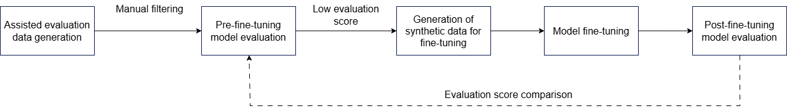

# Embedding Model Fine-Tuning

## Overview

Because general embedding models are usually trained on general-purpose datasets, they often lack accuracy in some specialized user domains, which leads to poor retrieval-augmented performance. To address this issue, this document provides a method that helps users quickly and conveniently fine-tune embedding models for specific domains. The method mainly includes four parts: evaluation data-assisted generation, model evaluation, automatic generation of fine-tuning synthetic data, and model fine-tuning.

- Evaluation data-assisted generation method: This method uses an LLM to generate question-answer pairs from representative text provided by the user for the target domain. It then uses manual review to select question-answer pairs that contain more domain-specific terminology, which helps evaluate the accuracy of the embedding model in that domain.
- Model evaluation: Based on the evaluation methods provided by the sentence-transformers framework, this method uses the evaluation dataset generated with the help of an LLM and manually reviewed to evaluate the accuracy of the embedding model, including metrics such as recall.
- Automatic generation of fine-tuning synthetic data: Based on the original text set of the target domain provided by the user, this method uses an LLM to automatically generate a fine-tuning synthetic dataset and then selects the most suitable fine-tuning data for the domain through multiple automatic filtering methods.
- Model fine-tuning: Based on the model fine-tuning methods provided by the sentence-transformers framework, this method uses the automatically generated and filtered fine-tuning synthetic data to fine-tune the embedding model and output the updated model.

When you use the embedding model fine-tuning method, you can refer to the following process.



## Automatic Generation of Fine-Tuning Synthetic Data

### Class Functionality<a id="ZH-CN_TOPIC_0000002419102888"></a>

**Function Description**

A class for automatically generating fine-tuning synthetic data. It provides document chunking for the original document set, as well as generation and filtering of fine-tuning synthetic data based on the chunked text.

**Function Prototype**

- Fine-tuning synthetic data configuration class:

    ```python
    from mx_rag.tools.finetune.generator import DataProcessConfig
    @dataclass
    class DataProcessConfig():
        generate_qd_prompt: str = GENERATE_QD_PROMPT
        llm_preferred_prompt: str = SCORING_QD_PROMPT
        question_number: int = 3
        featured: bool = True
        featured_percentage: float = 0.8
        preferred: bool = True
        llm_threshold_score: float = 0.8
        rewrite: bool = True
        query_rewrite_number: int = 2
    ```

- Fine-tuning synthetic data method class:

    ```python
    from mx_rag.tools.finetune.generator import TrainDataGenerator
    TrainDataGenerator(llm: Text2TextLLM, dataset_path: str, reranker: Reranker, encrypt_fn, decrypt_fn)
    ```

**Parameters**

Parameters of the fine-tuning synthetic data configuration class `DataProcessConfig`:

|Parameter|Data Type|Optional/Optional/Required|Description|
|--|--|--|--|
|generate_qd_prompt|str|Optional|The prompt used to automatically generate fine-tuning synthetic data. You can modify it according to the target domain for better fine-tuning results. The default value is `GENERATE_QD_PROMPT`. The string length must be in the range `(0, 1 * 1024 * 1024]`.|
|llm_preferred_prompt|str|Optional|The prompt used in the fine-tuning synthetic data filtering process. You can modify it according to the target domain for better fine-tuning results. The default value is `SCORING_QD_PROMPT`. The string length must be in the range `(0, 1 * 1024 * 1024]`.|
|question_number|int|Optional|The number of questions generated for each original text chunk. A larger number produces questions from more angles, which helps improve fine-tuning results, but it takes longer. The default value is 3. The value range is `(0, 20]`.|
|featured|bool|Optional|Indicates whether to use fused BM25 + Reranker relevance scoring for filtering. The default value is `True`.|
|featured_percentage|float|Optional|The retained proportion after BM25 + Reranker fusion filtering. The value range is `(0.0, 1.0)`, and the default value is 0.8.|
|preferred|bool|Optional|Indicates whether to use LLM relevance scoring for filtering. The default value is `True`.|
|llm_threshold_score|float|Optional|The threshold retained after LLM relevance scoring filtering. The value range is `(0.0, 1.0)`, and the default value is 0.8.|
|rewrite|bool|Optional|Indicates whether to use the LLM to rewrite the generated data from multiple semantic angles and expand it. The default value is `True`.|
|query_rewrite_number|int|Optional|The number of rewrite expansions for each question-answer pair. The default value is 2. The value range is `(0, 20]`.|

`GENERATE_QD_PROMPT` and `SCORING_QD_PROMPT` are defined as follows:

```text
GENERATE_QD_PROMPT = """Read the article and generate one relevant question. For example:
Article: Climate change has caused serious impacts on marine ecosystems, including rising ocean temperatures, rising sea levels, and acidification. These changes have had a profound effect on the distribution of marine life populations, the stability of ecosystems, and fisheries. Against the backdrop of global warming, protecting marine ecosystems has become an urgent priority.
Question: What are the main impacts of climate change on marine ecosystems?
Article: Retail is another important area for artificial intelligence applications. Through data analysis and machine learning algorithms, retailers can better understand consumer buying behavior, trends, and preferences. Artificial intelligence can help retailers optimize inventory management, recommendation systems, marketing, and other tasks, improving sales and customer satisfaction.
Question: How does artificial intelligence help retailers improve customer experience and sales performance?
Please follow the examples and generate {question_number} relevant questions for the following article:
Article: {doc}
Output format:
Question 1: ...
...
"""
SCORING_QD_PROMPT = """Your task is to evaluate the relevance between the given question and document. The relevance score should be between 0 and 1, where 1 means highly relevant and 0 means irrelevant. The score should be based on how directly the document answers the question.
Please carefully read the question and document, then give a relevance score based on the following criteria:
- If the document directly answers the question, give a score close to 1.
- If the document is related to the question but does not answer it directly, give a score between 0 and 1, decreasing with relevance.
- If the document is not related to the question, give 0.
For example:
Question: What did Xiao Ming eat yesterday?
Document: Xiao Ming went out with friends yesterday and had a meal together. He ate Haidilao. It was a happy day.
Because the document directly answers the question, give a score of 0.99.
Question: How is Xiao Hong's academic performance?
Document: Xiao Hong is active in class, completes assignments on time, helps classmates, and was awarded the class active member title by the teacher.
The document does not mention Xiao Hong's academic performance. It only mentions that she is active in class and completes assignments on time, so give a score of 0.10.
Please give a relevance score for the following question and document based on the criteria above. Keep the score to two decimal places.
Question: {query}
Document: {doc}
"""
```

Parameters of the fine-tuning synthetic data method class `TrainDataGenerator`:

|Parameter|Data Type|Optional/Optional/Required|Description|
|--|--|--|--|
|llm|Text2TextLLM|Required|The LLM used to generate and filter fine-tuning synthetic data. For details, see [Text2TextLLM](./llm_client.md#text2textllm).|
|dataset_path|str|Required|The directory used to store the automatically generated and filtered fine-tuning synthetic dataset. The path length must be in the range `[1, 1024]`. The path cannot contain symlinks, and `..` is not allowed. <br>The storage path cannot be one of the following paths: [`/etc`, `/usr/bin`, `/usr/lib`, `/usr/lib64`, `/sys/`, `/dev/`, `/sbin`, `/tmp`].|
|reranker|Reranker|Required|The reranker used during the fine-tuning synthetic data filtering process. For details, see [Reranker](./reranker.md#rerank).|
|encrypt_fn|Callable[[str], str]|Optional|Encrypts the generated Q-D pairs before storage. The default value is `None`, which means no encryption. <br>If the uploaded documents involve personal data such as bank card numbers, ID numbers, passport numbers, or passwords, configure this parameter to ensure personal data security.|
|decrypt_fn|Callable[[str], str]|Optional|Decrypts the stored Q-D pairs. The default value is `None`.|

**Call Example**

```python
from paddle.base import libpaddle
from langchain_community.document_loaders import TextLoader
from langchain_text_splitters import RecursiveCharacterTextSplitter
from mx_rag.document import LoaderMng
from mx_rag.document.loader import DocxLoader
from mx_rag.llm import Text2TextLLM
from mx_rag.reranker.local import LocalReranker
from mx_rag.tools.finetune.generator import TrainDataGenerator, DataProcessConfig

from mx_rag.utils import ClientParam


llm = Text2TextLLM(model_name="Llama3-8B-Chinese-Chat", base_url="https://{ip}:{port}/v1/chat/completions",
client_param=ClientParam(ca_file="/path/to/ca.crt")
)
reranker = LocalReranker("/home/data/bge-reranker-large", dev_id=0)
dataset_path = "path to data_output"  # Output location of the fine-tuning synthetic dataset.

document_path = "path to document dir"  # Location of the original document set provided by the user.

loader_mng = LoaderMng()

loader_mng.register_loader(loader_class=TextLoader, file_types=[".txt", ".md"])
loader_mng.register_loader(loader_class=DocxLoader, file_types=[".docx"])

# Load the document splitter from LangChain
loader_mng.register_splitter(splitter_class=RecursiveCharacterTextSplitter,
                             file_types=[".docx", ".txt", ".md"],
                             splitter_params={"chunk_size": 750,
                                              "chunk_overlap": 150,
                                              "keep_separator": False
                                              }
                             )

train_data_generator = TrainDataGenerator(llm, dataset_path, reranker)

split_doc_list = train_data_generator.generate_origin_document(document_path=document_path, loader_mng=loader_mng)
config = DataProcessConfig()
train_data_generator.generate_train_data(split_doc_list, config)

```

### `generate_origin_document`

**Function Description**

Parses and chunks the original text set provided by the user for later generation of fine-tuning synthetic data.

**Function Prototype**

```python
def generate_origin_document(document_path: str, loader_mng: LoaderMng, filter_func: Callable[[List[str]], List[str]])
```

**Parameters**

|Parameter|Data Type|Optional/Required|Description|
|--|--|--|--|
|document_path|str|Required|The directory that contains the original document set provided by the user. The directory length must be in the range `[1, 1024]`. The path cannot contain symlinks, and `..` is not allowed.|
|loader_mng|LoaderMng|Required|The file loading and parsing component. For details, see [LoaderMng](./knowledge_management.md#loadermng).|
|filter_func|Callable|Optional|A callback function for cleaning the parsed and chunked document fragments. The input and output are both `List[str]`. The default value is `None`.|

**Return Values**

|Data Type|Description|
|--|--|
|`list[str]`|The list of chunked original text documents.|

### `generate_train_data`

**Function Description**

Generates a certain number of questions for each text in the text list. It then improves the quality of the fine-tuning data through multiple rounds of filtering, rewriting, and expansion. The final output is a dataset for fine-tuning the embedding model.

**Function Prototype**

```python
def generate_train_data(split_doc_list: list[str], data_process_config: DataProcessConfig, batch_size: int)
```

**Parameters**

|Parameter|Data Type|Optional/Required|Description|
|--|--|--|--|
|split_doc_list|list[str]|Required|The list of original text documents. The list length range is `[1, 1000 * 1000]`, and the string length range is `[1, 128 * 1024 * 1024]`.|
|data_process_config|DataProcessConfig|Required|The configuration options for the fine-tuning synthetic data method. For details, see the `DataProcessConfig` class description in [Class Functionality](#ZH-CN_TOPIC_0000002419102888).|
|batch_size|int|Optional|The number of concurrent requests during fine-tuning data generation. The default value is 8. The value range is `(0, 1024]`.|

## Evaluation Data-Assisted Generation Method

### Class Functionality

**Function Description**

A class that helps users generate model evaluation datasets. It provides the original document dataset to the user and generates an evaluation dataset based on the text. Users must manually review the generated evaluation set and select the question-answer pairs that match the characteristics of the target domain in order to evaluate the accuracy of the model in that domain more effectively.

**Function Prototype**

```python
from mx_rag.tools.finetune.generator.eval_data_generator import EvalDataGenerator
EvalDataGenerator(llm: Text2TextLLM, dataset_path: str, encrypt_fn, decrypt_fn)
```

**Parameters**

|Parameter|Data Type|Optional/Optional/Required|Description|
|--|--|--|--|
|llm|Text2TextLLM|Required|The LLM used to generate the evaluation dataset. For details, see [Text2TextLLM](./llm_client.md#text2textllm).|
|dataset_path|str|Required|The directory used to store the evaluation dataset. The path length must be in the range `[1, 1024]`. The path cannot contain symlinks, and `..` is not allowed. <br>The storage path cannot be in the following list: [`/etc`, `/usr/bin`, `/usr/lib`, `/usr/lib64`, `/sys/`, `/dev/`, `/sbin`, `/tmp`].|
|encrypt_fn|Callable[[str], str]|Optional|A callback function whose return value is a string no longer than 128 \* 1024 \* 1024. It encrypts the generated Q-D pairs before storage. The default value is `None`, which means no encryption. <br>If the uploaded documents involve personal data such as bank card numbers, ID numbers, passport numbers, or passwords, configure this parameter to ensure personal data security.|
|decrypt_fn|Callable[[str], str]|Optional|A callback function whose return value is a string no longer than 128 \* 1024 \* 1024. It decrypts the stored Q-D pairs. The default value is `None`.|

**Call Example**

```python
from paddle.base import libpaddle
from langchain_community.document_loaders import TextLoader
from langchain_text_splitters import RecursiveCharacterTextSplitter
from mx_rag.document import LoaderMng
from mx_rag.document.loader import DocxLoader
from mx_rag.llm import Text2TextLLM
from mx_rag.tools.finetune.generator.eval_data_generator import EvalDataGenerator
from mx_rag.utils import ClientParam

llm = Text2TextLLM(model_name="Llama3-8B-Chinese-Chat", base_url="https://{ip}:{port}/v1/chat/completions",
client_param=ClientParam(ca_file="/path/to/ca.crt")
)

dataset_path = "path to data_output"  # Output location of the fine-tuning synthetic dataset.

document_path = "path to document dir"  # Location of the original document set provided by the user.

eval_data_generator = EvalDataGenerator(llm, dataset_path)

loader_mng = LoaderMng()

loader_mng.register_loader(loader_class=TextLoader, file_types=[".txt", ".md"])
loader_mng.register_loader(loader_class=DocxLoader, file_types=[".docx"])

# Load the document splitter from LangChain
loader_mng.register_splitter(splitter_class=RecursiveCharacterTextSplitter,
                             file_types=[".docx", ".txt", ".md"],
                             splitter_params={"chunk_size": 750,
                                              "chunk_overlap": 150,
                                              "keep_separator": False
                                              }
                             )

split_doc_list = eval_data_generator.generate_origin_document(document_path=document_path, loader_mng=loader_mng)

eval_data_generator.generate_evaluate_data(split_doc_list)
```

### `generate_origin_document`

**Function Description**

Parses and chunks the original text set provided by the user for later generation of fine-tuning synthetic data.

**Function Prototype**

```python
def generate_origin_document(document_path: str, loader_mng: LoaderMng, filter_func: Callable[[List[str]], List[str]])
```

**Parameters**

|Parameter|Data Type|Optional/Required|Description|
|--|--|--|--|
|document_path|str|Required|The directory that contains the original document set provided by the user. The directory length must be in the range `[1, 1024]`. The path cannot contain symlinks, and `..` is not allowed.|
|loader_mng|LoaderMng|Required|The file loading and parsing component. For details, see [LoaderMng](./knowledge_management.md#loadermng).|
|filter_func|Callable|Optional|A callback function for cleaning the parsed and chunked document fragments. The input and output are both `List[str]`. The default value is `None`.|

**Return Values**

|Data Type|Description|
|--|--|
|`list[str]`|The list of chunked original text documents.|

### `generate_evaluate_data`

**Function Description**

Generates a certain number of questions for each text in the text list and finally produces an initial evaluation dataset for the target domain, which is used for the next step of manual review.

**Function Prototype**

```python
def generate_evaluate_data(split_doc_list: list[str], generate_qd_prompt: str , question_number: int, batch_size: int)
```

**Parameters**

|Parameter|Data Type|Optional/Required|Description|
|--|--|--|--|
|split_doc_list|list[str]|Required|The list of original text documents. The list length range is `[1, 1000 * 1000]`, and the string length range is `[1, 128 * 1024 * 1024]`.|
|generate_qd_prompt|str|Optional|The prompt used to generate the evaluation dataset. You can modify it according to domain characteristics. The length range is `(0, 1 * 1024 * 1024]`, and the default value is `GENERATE_QD_PROMPT`.|
|question_number|int|Optional|The number of questions generated for each original text chunk. A larger number produces questions from more angles, which helps improve fine-tuning results, but it takes longer. The default value is 3. The value range is `(0, 20]`.|
|batch_size|int|Optional|The number of concurrent requests during evaluation data generation. The default value is 8. The value range is `(0, 1024]`.|

`GENERATE_QD_PROMPT` is defined as follows:

```text
GENERATE_QD_PROMPT = """Read the article and generate one relevant question. For example:
Article: Climate change has caused serious impacts on marine ecosystems, including rising ocean temperatures, rising sea levels, and acidification. These changes have had a profound effect on the distribution of marine life populations, the stability of ecosystems, and fisheries. Against the backdrop of global warming, protecting marine ecosystems has become an urgent priority.
Question: What are the main impacts of climate change on marine ecosystems?
Article: Retail is another important area for artificial intelligence applications. Through data analysis and machine learning algorithms, retailers can better understand consumer buying behavior, trends, and preferences. Artificial intelligence can help retailers optimize inventory management, recommendation systems, marketing, and other tasks, improving sales and customer satisfaction.
Question: How does artificial intelligence help retailers improve customer experience and sales performance?
Please follow the examples and generate {question_number} relevant questions for the following article:

Article: {doc}

Output format:
Question 1: ...
...

"""
```

## Model Evaluation and Fine-Tuning Methods

Both the evaluation and fine-tuning functions are based on the sentence-transformers framework. This section explains how to use them.

### Evaluation Function

This function is mainly based on the `InformationRetrievalEvaluator` method provided by the sentence-transformers framework. It uses the evaluation dataset generated by the preceding evaluation data-assisted generation method to evaluate the embedding model. After a successful evaluation, it returns the following metrics:

```python
{'cosine_accuracy@1', 'cosine_accuracy@3', 'cosine_accuracy@5', 'cosine_accuracy@10', 'cosine_precision@1', 'cosine_precision@3', 'cosine_precision@5', 'cosine_precision@10', 'cosine_recall@1', 'cosine_recall@3', 'cosine_recall@5', 'cosine_recall@10', 'cosine_ndcg@10', 'cosine_mrr@10', 'cosine_map@100', 'dot_accuracy@1', 'dot_accuracy@3', 'dot_accuracy@5', 'dot_accuracy@10', 'dot_precision@1', 'dot_precision@3', 'dot_precision@5', 'dot_precision@10', 'dot_recall@1', 'dot_recall@3', 'dot_recall@5', 'dot_recall@10', 'dot_ndcg@10', 'dot_mrr@10', 'dot_map@100'}
```

**Call Example**

```python
import torch
import torch_npu
from sentence_transformers import SentenceTransformer
from sentence_transformers.evaluation import InformationRetrievalEvaluator
from datasets import load_dataset

torch.npu.set_device(torch.device("npu:0"))

model = SentenceTransformer("model_path", device="npu" if torch.npu.is_available() else "cpu")

eval_data = load_dataset("json", data_files="evaluate_data.jsonl", split="train")

eval_data = eval_data.add_column("id", range(len(eval_data)))

corpus = dict(
    zip(eval_data["id"], eval_data["corpus"])
)
queries = dict(
    zip(eval_data["id"], eval_data["query"])
)

relevant_docs = {}
for q_id in queries:
    relevant_docs[q_id] = [q_id]

evaluator = InformationRetrievalEvaluator(queries=queries, corpus=corpus, relevant_docs=relevant_docs, name="model_name")
result = evaluator(model)

print(result)
```

### Fine-Tuning Function

This function is mainly based on the `SentenceTransformerTrainer` provided by the sentence-transformers framework. It fine-tunes the embedding model with the dataset generated by the preceding automatic fine-tuning synthetic data generation method. Adjust the fine-tuning training parameters and hyperparameters according to actual needs.

**Call Example**

```python
import torch
import torch_npu
from datasets import load_dataset
from sentence_transformers import SentenceTransformer
from sentence_transformers.losses import MultipleNegativesRankingLoss
from sentence_transformers import SentenceTransformerTrainingArguments
from sentence_transformers.training_args import BatchSamplers
from sentence_transformers import SentenceTransformerTrainer

torch.npu.set_device(torch.device("npu:0"))
model = SentenceTransformer("model_path", device="npu" if torch.npu.is_available() else "cpu")
train_loss = MultipleNegativesRankingLoss(model)
train_dataset = load_dataset("json", data_files="train_data.jsonl", split="train")
args = SentenceTransformerTrainingArguments(
    output_dir="output_dir",      # output directory and model ID
    num_train_epochs=4,                         # number of epochs
    per_device_train_batch_size=8,              # training batch size
    gradient_accumulation_steps=16,             # for a global batch size of 512
    warmup_ratio=0.1,                           # warmup ratio
    learning_rate=2e-5,                         # learning rate, 2e-5 is a good value
    lr_scheduler_type="cosine",                 # use the cosine learning rate scheduler
    optim="adamw_torch_fused",                  # use the fused AdamW optimizer
    batch_sampler=BatchSamplers.NO_DUPLICATES,  # MultipleNegativesRankingLoss benefits from a batch without duplicate samples
    logging_steps=10,                           # log every 10 steps
)
trainer = SentenceTransformerTrainer(
    model=model, # bg-base-en-v1
    args=args,  # training arguments
    train_dataset=train_dataset.select_columns(["query", "corpus"]),  # training dataset
    loss=train_loss,
)
trainer.train()
trainer.save_model()
```
