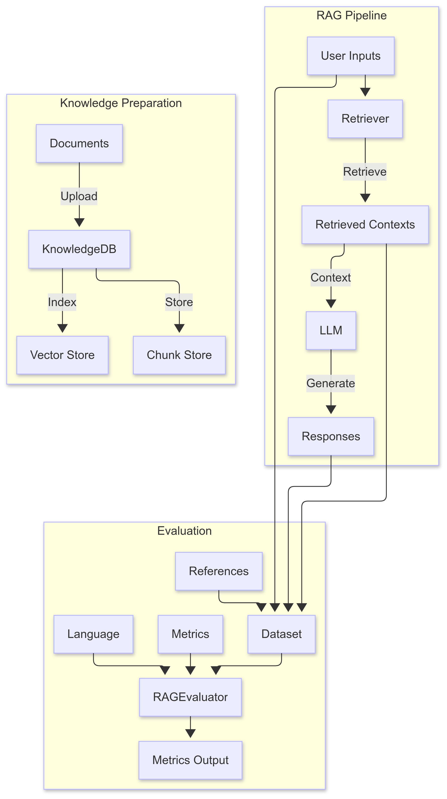

# Interface Reference - Evaluation Module

# Evaluation Module

## Overview

At present, RAGAS is the mainstream choice in RAG evaluation. RAGAS provides a comprehensive set of evaluation metrics, is widely used, and continues to evolve as RAG technology advances. Therefore, adapting this module for Ascend based on RAGAS can improve its flexibility and ease of use while also strengthening support for Chinese. The evaluation process is as follows:



The supported evaluation metrics and descriptions are listed in [Table 1](#table1226085519551). For detailed metric definitions, see the [RAGAS official documentation](https://github.com/explodinggradients/ragas/tree/v0.1.9/docs/concepts/metrics).

**Table 1** Supported evaluation metrics and descriptions<a id="table1226085519551"></a>

|Metric|Description|Required Parameters|Score Interpretation|
|--|--|--|--|
|answer_correctness|Measures how correct the model answer is compared with the reference answer by combining factual accuracy and semantic similarity.|[user_input, response, reference]|Range: `[0, 1]`. Higher values indicate better correctness. This metric focuses on two aspects: whether the answer is factually accurate and whether its wording is semantically similar to the reference answer. Only answers that are both factually reliable and aligned in meaning with the reference answer are considered correct. Higher scores indicate that the model output is both truthful and semantically aligned.|
|answer_relevancy|Evaluates how relevant an answer is to the given question. Scores are reduced if the answer is incomplete or contains extra or unnecessary information.|[user_input, response]|Score range: 0 to 1, where 1 is best. This metric focuses on whether the answer stays on topic, avoids irrelevant content, redundant information, or missing key points. Higher scores indicate that the answer better matches the user question and is concise and complete. Lower scores indicate that the answer may be off topic, contain extra information, or omit important details, resulting in poor relevance.|
|answer_similarity|Measures the semantic similarity between the generated answer and the reference answer. This metric is typically quantified using a cross-encoder score.|[reference, response]|This metric measures how close in meaning the reference answer and the generated answer are. Exact lexical matching is not required. A cross-encoder is a deep learning model used to evaluate the semantic relevance between two pieces of text. Higher scores indicate closer semantic similarity. The score is generally in the range of 0 to 1, and higher values indicate greater semantic consistency.|
|context_precision|Measures the proportion of relevant segments among the retrieved contexts. It is calculated as the average precision@k for each segment. precision@k is the ratio of relevant segments to the total number of retrieved items among the top `k` results.|[user_input, reference, retrieved_contexts]|Range: `[0, 1]`. Higher values indicate greater relevance.|
|context_recall|Measures how many relevant documents or information segments the system successfully retrieved, with an emphasis on not missing important content. Higher recall means fewer relevant documents were missed.|[user_input, reference, retrieved_contexts]|Range: `[0, 1]`. Higher values indicate greater relevance.|
|context_entity_recall|Measures recall based on the number of entities in the reference answer and the retrieved contexts. It calculates the proportion of entities in the reference answer that also appear in the retrieved contexts.|[reference, retrieved_contexts]|Range: `[0, 1]`. Higher values indicate greater relevance.|
|context_utilization|Measures the relevance of the answer to the contexts.|[user_input, response, retrieved_contexts]|Range: `[0, 1]`. Higher values indicate greater relevance.|
|faithfulness|Measures how factually consistent the system response is with the retrieved contexts.|[user_input, response, retrieved_contexts]|Score range: 0 to 1. Higher scores indicate better consistency.|
|noise_sensitivity|Measures how often the system produces incorrect answers when it uses relevant or irrelevant retrieved documents.|[user_input, reference, response, retrieved_contexts]|The score range is 0 to 1. Lower values indicate better system performance.|
|nv_accuracy|Measures how closely the model response matches the reference answer. The method uses two different LLM judge prompts, and each judge scores the model response separately with a score of 0, 2, or 4. The two scores are then converted to the `[0, 1]` range, and their average is taken as the final score.|[user_input, response, reference]|The score range is 0 to 1. Higher scores indicate that the model response is closer to the reference answer.|
|nv_context_relevance|Evaluates whether the retrieved context, such as a segment or paragraph, is relevant to the user input, that is, the question. The evaluation uses two independent LLM judge prompts, and each judge scores relevance separately with a score of 0, 1, or 2. The scores are then converted to the `[0, 1]` range and averaged to produce the final score.|[user_input, retrieved_contexts]|The score range is 0 to 1. Higher scores indicate that the retrieved context is more relevant to the user question.|
|nv_response_groundedness|Measures the degree to which the model response is supported by the retrieved contexts. It evaluates whether each claim or piece of information in the response can be fully or partially backed by the retrieved contexts.|[response, retrieved_contexts]|The score range is 0 to 1. Higher scores indicate that more of the response is supported by the retrieved contexts.|

## `RAGEvaluator`

### Class Functionality

**Description**

The `RAGEvaluator` class provides a unified interface for evaluating retrieval-augmented generation (RAG) systems. It supports custom evaluation metrics and can adapt evaluation prompts for different languages, such as English or Chinese.

**Function Prototype**

```python
from mx_rag.evaluate import RAGEvaluator
RAGEvaluator(llm: LLM, embeddings: Embeddings)
```

**Input Parameters**

|Parameter|Data Type|Optional/Required|Description|
|--|--|--|--|
|`llm`|LLM|Required|The `llm` module is mainly used to interact with large language models. It must inherit from `langchain.llms.base.LLM`. See [Text2TextLLM](./llm_client.md#text2textllm).|
|`embeddings`|Embeddings|Required|The `embeddings` module is used to vectorize the user question during evaluation. It must be an instance of either [TextEmbedding](./embedding.md#textembedding) or [TEIEmbedding](./embedding.md#teiembedding).|

**Example**

```python
from datasets import Dataset

from mx_rag.embedding.service import TEIEmbedding
from mx_rag.evaluate import RAGEvaluator
from mx_rag.llm import LLMParameterConfig, Text2TextLLM
from mx_rag.utils import ClientParam

llm = Text2TextLLM(
    base_url="https://ip:port/v1/chat/completions",
    model_name="model name",
    llm_config=LLMParameterConfig(temperature=0.1, top_p=0.8),
    client_param=ClientParam(ca_file="/path/to/ca.crt"),
)
embeddings = TEIEmbedding(
    url="https://ip:port/embed",
    client_param=ClientParam(ca_file="/path/to/ca.crt"),
)

sample_queries = [
    "Who proposed the theory of relativity?",
    "Who won the Nobel Prize twice for research on radioactivity?",
    "What were Isaac Newton's contributions to science?",
]
expected_responses = [
    "Albert Einstein proposed the theory of relativity, which transformed our understanding of time, space, and gravity.",
    "Marie Curie was a physicist and chemist who conducted groundbreaking research on radioactivity and won the Nobel Prize twice.",
    "Isaac Newton formulated the laws of motion and universal gravitation, laying the foundation for classical mechanics.",
]
retrieved_contexts = [
    [
        "Albert Einstein's theory of relativity revolutionized our understanding of time, space, and gravity.",
        "The theory of relativity was proposed by Albert Einstein, revolutionizing our understanding of time, space, and gravity.",
        "By proposing the theory of relativity, Albert Einstein redefined our view of time, space, and gravity.",
    ],
    [
        "Marie Curie was an outstanding physicist and chemist who made groundbreaking contributions to radioactivity research and won the Nobel Prize twice.",
        "As a physicist and chemist, Marie Curie's research in radioactivity was groundbreaking, earning her the Nobel Prize twice.",
        "Marie Curie was a renowned physicist and chemist who won the Nobel Prize twice for her pioneering work in radioactivity research.",
    ],
    [
        "Isaac Newton proposed the laws of motion and universal gravitation, laying the foundation for classical mechanics.",
        "By formulating the laws of motion and universal gravitation, Isaac Newton made foundational contributions to classical mechanics.",
        "Isaac Newton's laws of motion and universal gravitation laid the cornerstone for classical mechanics.",
    ],
]
# LLM responses
responses = [
    "Albert Einstein proposed the theory of relativity",
    "Marie Curie",
    "Formulated the laws of motion and universal gravitation, laying the foundation for classical mechanics.",
]
dataset = []
for query, contexts, response, reference in zip(sample_queries, retrieved_contexts, responses, expected_responses):
    dataset.append(
        {
            "user_input": query,
            "response": response,
            "retrieved_contexts": contexts,
            "reference": reference,
        }
    )
evaluation_dataset = Dataset.from_list(dataset)
evaluator = RAGEvaluator(llm=llm, embeddings=embeddings)
metrics = ["faithfulness", "answer_relevancy", "context_precision", "context_recall"]
result = evaluator.evaluate(
    metrics=metrics,
    dataset=evaluation_dataset.to_dict(),
    language="chinese"
)
print(result)
```

### `evaluate`

**Description**

Evaluation interface. The user provides data in dictionary format, and the system evaluates it according to the specified set of metrics. To display the logs printed by RAGAS, set the `DISABLE_RAGAS_LOGGING` environment variable to `0`.

**Function Prototype**

```python
def evaluate(metrics, dataset, language, prompts_path, show_progress)
```

**Parameters**

|Parameter|Data Type|Optional/Required|Description|
|--|--|--|--|
|metrics|list[str]|Required|The set of evaluation metrics. See [Table 1](#table1226085519551) for the available metrics. The number of metrics in the set must be in the range `(0, 14]`. The length of each metric name must be in the range `[1, 50]`, and the metrics must not be duplicated. When the metric is `answer_similarity`, the key in the returned score is `semantic_similarity`.|
|dataset|Dict[str, Any]|Required|The user evaluation dataset. The dictionary length must be in the range `[1, 4]`. The dictionary format is as follows: <li>`user_input`: a `List[str]` with length in the range `[0, 128]`, and each string length in the range `[1, 1000000]`.</li><li>`response`: a `List[str]` with length in the range `[0, 128]`, and each string length in the range `[1, 1000000]`.</li><li>`retrieved_contexts`: a `List[List[str]]`, where the outer list length is in the range `[1, 128]`, the inner list length is in the range `[0, 128]`, and each string length is in the range `[1, 1000000]`.</li><li>`reference`: a `List[str]` with length in the range `[0, 128]`, and each string length in the range `[1, 1000000]`.</li><br>The lengths of `user_input`, `response`, and `reference`, as well as the outer list length of `retrieved_contexts`, must be consistent.|
|language|str|Optional|The localization language parameter. If specified, evaluation is performed in the specified language.<br>The default value is `None`. If no value is set, the prompts use the default RAGAS prompts.<br>Supported values: `"chinese"` and `"english"`.|
|prompts_path|str|Optional|The localized prompt parameter. If specified, it is used together with `language` to look for the corresponding prompt files in the `prompt_dir` directory. If the files are found, evaluation can be accelerated. Each file in the directory must be no larger than 4 MB, the directory depth must not exceed 64, and the total number of files must not exceed 512.<br>The default value is `None`.<br>String length limit: `[1, 255]`.|
|show_progress|bool|Optional|Whether to display a progress bar during evaluation. The default is not to display one.|

**Returns**

|Data Type|Description|
|--|--|
|Optional[Dict[str, List[float]]]|The function returns a dictionary with the following structure: <li>Keys: metric names (strings), such as `"answer_correctness"` and `"context_precision"`.</li><li>Values: for each key, a list of floating-point numbers, where each element represents the evaluation score of that metric for one sample in the dataset.</li><li>If an exception occurs during evaluation, the function returns `None`.</li>|
