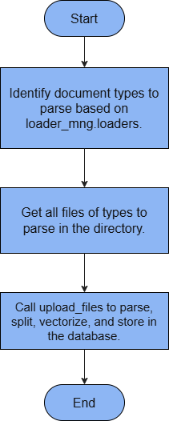
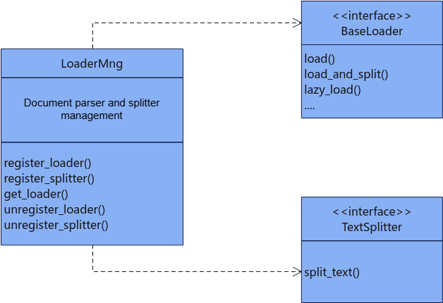

# Knowledge Management

## Knowledge Base Document Management

### Knowledge Base Dependencies


KnowledgeDB depends on KnowledgeStore, Docstore, and VectorStore for knowledge base document chunks and vectorized data. KnowledgeStore handles knowledge base creation, deletion, and query operations. Docstore handles document chunk creation, deletion, update, and query operations. Specific configuration examples include OpenGaussDocstore, MilvusDocstore, and SQLiteDocstore. VectorStore handles vector creation, deletion, update, and query operations. Specific configuration examples include OpenGaussDB, MilvusDB, and MindFAISS.

### `KnowledgeStore`

#### Class Functionality

**Description**

The knowledge base management class provides functions to create, delete, and query knowledge bases and knowledge base users.

**Prototype**

```python
from mx_rag.knowledge import KnowledgeStore
KnowledgeStore(db_path)
```

**Parameters**

|Parameter|Data Type|Optional/Required|Description|
|--|--|--|--|
|db_path|str|Required|Database path. The path length must be in the range [1, 1024]. The path cannot be a symbolic link and cannot contain `..`. The file name length cannot exceed 200. The storage path cannot be in the following path list: [`/etc`, `/usr/bin`, `/usr/lib`, `/usr/lib64`, `/sys/`, `/dev/`, `/sbin`, `/tmp`].|

**Example**

```python
from mx_rag.knowledge import KnowledgeStore
# Initialize the knowledge management relational database
knowledge_store = KnowledgeStore(db_path="./sql.db")
user_id = "Default"
knowledge_store.add_knowledge("name", user_id, "admin")
knowledge_store.add_knowledge("name01", user_id, "admin")
print(knowledge_store.check_knowledge_exist("name", user_id))
knowledge_store.add_usr_id_to_knowledge("name", "Default01", "admin")
knowledge_store.add_usr_id_to_knowledge("name", "Default02", "member")
knowledge_store.delete_usr_id_from_knowledge("name", "Default02", "member")
print(knowledge_store.get_all_knowledge_info(user_id))
print(knowledge_store.get_all_usr_role_by_knowledge("name"))
print(knowledge_store.add_doc_info("name", "1.txt", "./sql.db", user_id))
documents = [document.document_name for document in knowledge_store.get_all_documents("name", user_id)]
print(documents)
print(knowledge_store.check_document_exist("name", "1.txt", user_id))
print(knowledge_store.delete_doc_info("name", "1.txt", user_id))
```

#### `add_knowledge`

**Description**

Adds a knowledge base. The user role can only be the administrator `admin`.

**Prototype**

```python
def add_knowledge(knowledge_name, user_id, role)
```

**Parameters**

|Parameter|Data Type|Optional/Required|Description|
|--|--|--|--|
|knowledge_name|str|Required|Knowledge base name. The length must be in the range [1, 1024].|
|user_id|str|Required|User ID used to distinguish different knowledge bases. It must match the regular expression `^[a-zA-Z0-9_-]{6,64}$`.|
|role|str|Optional|User role. The default value is `admin`. After the addition, this `user_id` can access the knowledge base by default.|

**Returns**

|Data Type|Description|
|--|--|
|int|Returns the `knowledge_id` corresponding to the added knowledge base.|

#### `check_knowledge_exist`

**Description**

Checks whether the specified knowledge base name exists under this `user_id`.

**Prototype**

```python
def check_knowledge_exist(knowledge_name, user_id)
```

**Parameters**

|Parameter|Data Type|Optional/Required|Description|
|--|--|--|--|
|knowledge_name|str|Required|Knowledge base name. The length must be in the range [1, 1024].|
|user_id|str|Required|User ID used to distinguish different knowledge bases. It must match the regular expression `^[a-zA-Z0-9_-]{6,64}$`.|

**Returns**

|Data Type|Description|
|--|--|
|bool|Indicates whether the knowledge base `knowledge_name` exists under `user_id`.|

#### `add_usr_id_to_knowledge`

**Description**

Adds a user to the specified knowledge base. The user role can be the administrator `admin` or the member `member`, who has query-only permission on the knowledge base.

**Prototype**

```python
def add_usr_id_to_knowledge(knowledge_name, user_id, role)
```

**Parameters**

|Parameter|Data Type|Optional/Required|Description|
|--|--|--|--|
|knowledge_name|str|Required|Knowledge base name. The length must be in the range [1, 1024].|
|user_id|str|Required|User ID used to distinguish different knowledge bases. It must match the regular expression `^[a-zA-Z0-9_-]{6,64}$`.|
|role|str|Required|User role. It can only be the knowledge base administrator `admin` or the member `member`, who has query-only permission on the knowledge base. After the addition, the corresponding `user_id` can query the knowledge base.|

#### `delete_usr_id_from_knowledge`

**Description**

Deletes a user from the `knowledge` knowledge base and removes the record from the `knowledge_table` table. See [KnowledgeModel](./databases.md#knowledgemodel-class).

**Prototype**

```python
def delete_usr_id_from_knowledge(knowledge_name, user_id, role, force=False)
```

**Parameters**

|Parameter|Data Type|Optional/Required|Description|
|--|--|--|--|
|knowledge_name|str|Required|Knowledge base name. The length must be in the range [1, 1024].|
|user_id|str|Required|User ID to delete. It is used to distinguish different knowledge bases and must match the regular expression `^[a-zA-Z0-9_-]{6,64}$`.|
|role|str|Required|The role corresponding to the user. It can only be the knowledge base administrator `admin` or the member `member`, who has query-only permission on the knowledge base. If the `user_id` and `role` record does not exist, an error is reported.|
|force|bool|Optional|If only one user remains associated with the knowledge base to be deleted, whether to force deletion. The default value is `False`.|

#### `get_all_knowledge_info`

**Description**

Queries knowledge information by `user_id`.

**Prototype**

```python
def get_all_knowledge_info(user_id)
```

**Parameters**

|Parameter|Data Type|Optional/Required|Description|
|--|--|--|--|
|user_id|str|Required|User ID used to distinguish different knowledge bases. It must match the regular expression `^[a-zA-Z0-9_-]{6,64}$`.|

**Returns**

|Data Type|Description|
|--|--|
|List[KnowledgeModel]|Returns knowledge base information under `user_id`. For `KnowledgeModel`, see [KnowledgeModel](./databases.md#knowledgemodel-class).|

#### `get_all_usr_role_by_knowledge`

**Description**

Queries all user IDs and user roles for the knowledge base specified by `knowledge_name`.

**Prototype**

```python
def get_all_usr_role_by_knowledge(knowledge_name)
```

**Parameters**

|Parameter|Data Type|Optional/Required|Description|
|--|--|--|--|
|knowledge_name|str|Required|Knowledge base name. The length must be in the range [1, 1024].|

**Returns**

|Data Type|Description|
|--|--|
|dict{user_id: role}|Returns all user IDs and user roles under the specified knowledge base. The key is the user ID and the value is the user role.|

#### `add_doc_info`

**Description**

Adds a document name record to the knowledge base. Only the knowledge base administrator has permission to perform this operation. Before adding the record, check the DB file size. It must not exceed 100 GB. When you add a document record, ensure that the remaining drive partition space is greater than 200 MB.

**Prototype**

```python
def add_doc_info(knowledge_name, doc_name, file_path, user_id)
```

**Parameters**

|Parameter|Data Type|Optional/Required|Description|
|--|--|--|--|
|knowledge_name|str|Required|Knowledge base name. The length must be in the range [1, 1024].|
|doc_name|str|Required|Document name. The length must be in the range [1, 1024].|
|file_path|str|Required|Document upload path, which is stored in the database. The path length must be in the range [1, 1024].|
|user_id|str|Required|User ID used to distinguish different knowledge bases. It must match the regular expression `^[a-zA-Z0-9_-]{6,64}$`.|

**Returns**

|Data Type|Description|
|--|--|
|int|Adds a record to the `document_table` table and returns the `document_id` of the document.|

#### `delete_doc_info`

**Description**

Deletes a document name record from the knowledge base. Only the `user_id` of the knowledge base administrator has permission to perform this operation.

**Prototype**

```python
def delete_doc_info(knowledge_name, doc_name, user_id)
```

**Parameters**

|Parameter|Data Type|Optional/Required|Description|
|--|--|--|--|
|knowledge_name|str|Required|Knowledge base name. The length must be in the range [1, 1024].|
|doc_name|str|Required|Document name. The length must be in the range [1, 1024].|
|user_id|str|Required|User ID used to distinguish different knowledge bases. It must match the regular expression `^[a-zA-Z0-9_-]{6,64}$`.|

**Returns**

|Data Type|Description|
|--|--|
|int/None|Deletes a record from the `document_table` table and returns the `document_id` of the deleted document. If the deletion fails, returns `None`.|

#### `check_document_exist`

**Description**

Checks whether a document record exists in the knowledge base.

**Prototype**

```python
def check_document_exist(knowledge_name, doc_name, user_id)
```

**Parameters**

|Parameter|Data Type|Optional/Required|Description|
|--|--|--|--|
|knowledge_name|str|Required|Knowledge base name. The length must be in the range [1, 1024].|
|doc_name|str|Required|Document name. The length must be in the range [1, 1024].|
|user_id|str|Required|User ID used to distinguish different knowledge bases. It must match the regular expression `^[a-zA-Z0-9_-]{6,64}$`.|

**Returns**

|Data Type|Description|
|--|--|
|bool|Indicates whether the document exists.|

#### `get_all_documents`

**Description**

Gets all document records in the knowledge base.

**Prototype**

```python
def get_all_documents(knowledge_name, user_id)
```

**Parameters**

|Parameter|Data Type|Optional/Required|Description|
|--|--|--|--|
|knowledge_name|str|Required|Knowledge base name. The length must be in the range [1, 1024].|
|user_id|str|Required|User ID used to distinguish different knowledge bases. It must match the regular expression `^[a-zA-Z0-9_-]{6,64}$`.|

**Returns**

|Data Type|Description|
|--|--|
|List[DocumentModel]|Returns document information under the corresponding `user_id` and `knowledge_name`. For `DocumentModel`, see [DocumentModel](./databases.md#documentmodel-class).|

### `KnowledgeDB`

#### Class Functionality

**Description**

This is the entry class for knowledge base management. It provides document management functions, including adding and deleting documents and getting all documents in the knowledge base.

**Prototype**

```python
from mx_rag.knowledge import KnowledgeDB
KnowledgeDB(knowledge_store, chunk_store, vector_store, knowledge_name, white_paths, max_file_count, user_id, lock)
```

**Parameters**

|Parameter|Data Type|Optional/Required|Description|
|--|--|--|--|
|knowledge_store|KnowledgeStore|Required|Provides data storage for knowledge base management and stores the names of documents that have been uploaded successfully. For the data type, see [KnowledgeStore](#knowledgestore).|
|chunk_store|Docstore|Required|Provides database storage for the list of document chunk objects. For the data type, see [Docstore](./databases.md#docstore).|
|vector_store|VectorStore|Required|Vector database storage object. For the data type, see [VectorStore](./databases.md#vectorstore).|
|knowledge_name|str|Required|Knowledge base name. Users can customize it according to the knowledge base topic. The length must be in the range [1, 1024].|
|white_paths|List[str]|Required|Whitelist path list for uploaded documents. The list length must be in the range [1, 1024], and the path length must be in the range [1, 1024]. The path cannot be a symbolic link and cannot contain `..`. Documents can be uploaded only if their paths are in the whitelist.|
|max_file_count|int|Optional|Maximum number of documents allowed during upload. The value must be in the range [1, 8000]. A value that is too large is not recommended. The default value is 1000.|
|user_id|str|Required|User ID used to distinguish different knowledge bases. It must match the regular expression `^[a-zA-Z0-9_-]{6,64}$`.|
|lock|multiprocessing.synchronize.Lock or _thread.LockType|Optional|If the user needs to call this interface from multiple processes or threads, a lock is required. The default value is `None`. Optional values: <li>`None`: no lock is used. In this case, the interface does not support concurrency.</li><li>`multiprocessing.Lock()`: process lock. In this case, the interface supports multi-process calls.</li><li>`threading.Lock()`: thread lock. In this case, the interface supports multi-thread calls.</li>|

> [!NOTE]
> `chunk_store` and `vector_store` must ensure data consistency. For example, the relational database file and the vector database file must be generated at the same time.

**Example**

```python
import pathlib
from paddle.base import libpaddle
from mx_rag.embedding.local import TextEmbedding
from mx_rag.knowledge import KnowledgeStore, KnowledgeDB
from mx_rag.storage.document_store import SQLiteDocstore
from mx_rag.storage.vectorstore import MindFAISS
# Set the NPU for vector retrieval
dev = 0
# Load the embedding model
embed_func = TextEmbedding("/path/to/model", dev_id=dev)
# Initialize the vector database
vector_store = MindFAISS(x_dim=1024, devs=[dev],
                         load_local_index="./faiss.index", auto_save=True)
# Initialize the document chunk relational database
chunk_store = SQLiteDocstore(db_path="./sql.db")
# Initialize the knowledge management relational database
knowledge_store = KnowledgeStore(db_path="./sql.db")
# Add the knowledge base and the administrator
knowledge_store.add_knowledge(knowledge_name="test", user_id='Default', role='admin')
# Initialize knowledge management
knowledge_db = KnowledgeDB(knowledge_store=knowledge_store, chunk_store=chunk_store, vector_store=vector_store,
                           knowledge_name="test", user_id="Default", white_paths=["/home/"])
file_path = pathlib.Path("./gaokao.txt")
knowledge_db.add_file(file=file_path,
                      texts=["test1", "test2"],
                      embed_func={"dense": embed_func.embed_documents},
                      metadatas=[{"source": "./gaokao.txt"}, {"source": "./gaokao.txt"}])
documents =[document.document_name for document in knowledge_db.get_all_documents()]
print(documents)
print(knowledge_db.check_document_exist(doc_name=file_path.name))

knowledge_db.delete_file(doc_name=file_path.name)
knowledge_db.delete_all()
```

#### `add_file`

**Description**

Adds a single document to the knowledge base, vectorizes the information after file splitting, saves it to the vector database, stores the document chunks in the document database, and stores the document record in the knowledge base database. Only the knowledge base administrator has permission to perform this operation.

**Prototype**

```python
def add_file(file, texts, embed_func, metadatas)
```

**Parameters**

|Parameter|Data Type|Optional/Required|Description|
|--|--|--|--|
|file|pathlib.Path|Required|The `pathlib.Path` object of the uploaded document. The file path length must be in the range [1, 1024]. The path cannot be a symbolic link and cannot contain `..`. The file name length cannot exceed 200. The storage path cannot be in the following path list: [`/etc`, `/usr/bin`, `/usr/lib`, `/usr/lib64`, `/sys/`, `/dev/`, `/sbin`, `/tmp`].|
|texts|List[str]|Required|List after document splitting. The number of elements must match the number of `metadatas` items. The list length must be in the range `[1, 1000 * 1000]`, and each string length must be in the range `[1, 128 * 1024 * 1024]`.|
|embed_func|dict|Required|Embedding function that converts text or images into vectors. Only the `{'dense': x, 'sparse': y}` format is allowed. `x` and `y` are the callback functions for dense and sparse vectors, respectively, and they cannot both be `None`.|
|metadatas|List[dict]|Optional|Metadata for document chunks. The default value is `None`. The string length of each dictionary element in the list cannot exceed `128 * 1024 * 1024`, the dictionary length cannot exceed 1024, and nested dictionaries cannot exceed one level. The number of elements must match the number of `texts` items. The list length must be in the range `[1, 1000 * 1000]`.|

#### `delete_file`

**Description**

Deletes an uploaded document from the knowledge base. Only the knowledge base administrator has permission to perform this operation.

**Prototype**

```python
def delete_file(doc_name)
```

**Parameters**

|Parameter|Data Type|Optional/Required|Description|
|--|--|--|--|
|doc_name|str|Required|Name of the document to delete. The document must already exist, and the length must be in the range [1, 1024].|

#### `get_all_documents`

**Description**

Gets the names of all uploaded documents.

**Prototype**

```python
def get_all_documents()
```

**Returns**

|Data Type|Description|
|--|--|
|List[DocumentModel]|Returns document information under the corresponding `user_id`. For `DocumentModel`, see [DocumentModel](./databases.md#documentmodel-class).|

#### `check_document_exist`

**Description**

Checks whether a document has already been added to the knowledge base. Calls `KnowledgeStore.check_document_exist`.

**Prototype**

```python
def check_document_exist(doc_name)
```

**Parameters**

|Parameter|Data Type|Optional/Required|Description|
|--|--|--|--|
|doc_name|str|Required|Document name. The length must be in the range [1, 1024].|

**Returns**

|Data Type|Description|
|--|--|
|bool|Indicates whether the document exists.|

#### `delete_all`

**Description**

KnowledgeDB binds the relational database, vector database, `user_id`, and `knowledge_name`. It deletes the related records in the relational database and vector database, and then deletes the knowledge base. Only the knowledge base administrator has permission to perform this operation. See [Database Structure](./databases.md#database-structure) for the tables involved in the cleanup of the relational database.

**Prototype**

```python
def delete_all()
```

**Parameters**

None.

### Document Management

#### `upload_files`

**Description**

Uploads documents and stores them in the knowledge base. Only the knowledge base administrator has permission to perform this operation. If a document is duplicated, you can choose to force overwrite it. Document data is stored in plain text. Therefore, pay attention to the security risks. The upload fails when the number of uploaded documents exceeds the `max_file_count` limit of the knowledge base. If the upload of a document fails, an exception is raised.

**Prototype**

```python
from mx_rag.knowledge import upload_files
def upload_files(knowledge, files, loader_mng, embed_func, force)
```

**Internal Workflow**


**Parameters**

|Parameter|Data Type|Optional/Required|Description|
|--|--|--|--|
|knowledge|KnowledgeDB|Required|Knowledge base object. For the data type, see [KnowledgeDB](#knowledgedb).|
|files|List[str]|Required|List of document paths. The path length must be in the range [1, 1024], and the default number of files does not exceed 1000. The document path cannot be a symbolic link and cannot contain `..`.|
|loader_mng|LoaderMng|Required|Management class object that provides document parsing functions. For the data type, see [LoaderMng](#loadermng).|
|embed_func|Callable[[List[str]], List[List[float]]] or dict|Required|Embedding function that converts file information into vectors. If you pass a callback directly, it is treated as dense by default, that is, `{'dense': Callable, 'sparse': None}`. If you pass a dictionary, use the format `{'dense': x, 'sparse': y}`. `x` and `y` are the callback functions for dense and sparse vectors, respectively, and they cannot both be `None`. Dense and sparse vectors are both supported in the database.|
|force|bool|Optional|Indicates whether to force overwrite existing data. If you choose `False`, duplicate documents raise an exception. The default value is `False`.|

**Returns**

|Data Type|Description|
|--|--|
|List[str]|List of files that failed to be added to the knowledge base.|

**Example**

```python
from mx_rag.embedding.local import TextEmbedding
from mx_rag.knowledge import KnowledgeStore, KnowledgeDB, upload_files, delete_files, FilesLoadInfo
from mx_rag.document import LoaderMng
from mx_rag.storage.document_store import SQLiteDocstore
from mx_rag.storage.vectorstore import MindFAISS
from langchain.text_splitter import RecursiveCharacterTextSplitter
from mx_rag.knowledge import upload_dir
from mx_rag.document.loader import DocxLoader, PdfLoader, ExcelLoader

loader_mng = LoaderMng()
loader_mng.register_loader(DocxLoader, [".docx"])
loader_mng.register_loader(PdfLoader, [".pdf"])
loader_mng.register_loader(ExcelLoader, [".xlsx"])
# loader_mng.register_loader(ImageLoader, [".png"])
loader_mng.register_splitter(RecursiveCharacterTextSplitter,
                             [".docx", ".pdf", ".xlsx"])
# Set the NPU for vector retrieval
dev = 0
# Load the embedding model
emb = TextEmbedding("/path/to/model", dev_id=dev)
# Initialize the vector database
vector_store = MindFAISS(x_dim=1024, devs=[dev],
                         load_local_index="/path/to/index", auto_save=True)
# Initialize the document chunk relational database
chunk_store = SQLiteDocstore(db_path="./sql.db")
# Initialize the knowledge management relational database
knowledge_store = KnowledgeStore(db_path="./sql.db")
# Add the knowledge base and administrator
knowledge_store.add_knowledge(knowledge_name="test", user_id='Default', role='admin')
# Initialize knowledge management
knowledge_db = KnowledgeDB(knowledge_store=knowledge_store, chunk_store=chunk_store, vector_store=vector_store,
                           knowledge_name="test", user_id='Default', white_paths=["/home/"])
# Upload domain knowledge documents
# Call `upload_files`
upload_files(knowledge=knowledge_db, files=["/path/data/test.docx"], loader_mng=loader_mng,
             embed_func=emb.embed_documents, force=True)
# Upload the domain knowledge document directory
# Call `upload_dir`
params = FilesLoadInfo(knowledge=knowledge_db, dir_path="/path/data/files", loader_mng=loader_mng,
                       embed_func=emb.embed_documents, force=True, load_image=False)
upload_dir(params=params)
# Call `delete_files`
delete_files(knowledge_db, ["test.docx"])

```

#### `upload_dir`

**Description**

Save the documents in the specified directory to the knowledge base. Only the knowledge base administrator has permission to perform this operation. If a document is duplicated, you can force overwrite it. Document data is stored in plain text. Therefore, pay attention to the security risks. This method traverses only files in the current directory and does not recurse into subdirectories. It skips file types in the directory that do not have a registered loader. It exits when the number of uploaded documents exceeds the knowledge base `max_file_count` limit. If adding a document fails, it raises an exception.

**Prototype**

```python
from mx_rag.knowledge import upload_dir, FilesLoadInfo
FilesLoadInfo(knowledge, dir_path, loader_mng, embed_func, force, load_image)
def upload_dir(params: FilesLoadInfo):
```

**Internal Workflow**



**Parameters**

|Parameter|Data Type|Optional/Required|Description|
|--|--|--|--|
|params|FilesLoadInfo|Required|Parameter object for uploading a directory. For the type description, see [Table 1](#tableFilesLoadInfo).|

**Table 1** FilesLoadInfo type description
<a id="tableFilesLoadInfo"></a>

|Parameter|Data Type|Optional/Required|Description|
|--|--|--|--|
|knowledge|KnowledgeDB|Required|Knowledge base object. For the data type, see [KnowledgeDB](#knowledgedb).|
|dir_path|str|Required|Directory path for storing knowledge documents. The path length must be in the range [1, 1024]. Document paths in the directory cannot be symbolic links and cannot contain `..`. In `upload_dir`, the number of files in the limited path is capped at 8,000 by default.|
|loader_mng|LoaderMng|Required|Management class object that provides document parsing functions. For the data type, see [LoaderMng](#loadermng).|
|embed_func|Callable[[List[str]], List[List[float]]]|Required|Embedding function that converts file information into vectors.|
|force|bool|Optional|Whether to force overwrite old data. If you set it to `False`, duplicate documents raise an exception. The default value is `False`.|
|load_image|bool|Optional|Whether to support image files. The default value is `False`. If you set it to `False`, only document types such as `.docx`, `.txt`, and `.md` are supported. The supported types are the intersection of the types supported by the `loader` and `splitter` methods registered in `loader_mng`. If you set it to `True`, only image types are supported. The supported range is limited to the intersection of the types supported by the `loader` method registered in `loader_mng` and `[".jpg", ".png"]`.|

> [!NOTE]
>When document parsing is supported, the corresponding `embed_func` must also support the corresponding document type. When image parsing is supported, the corresponding `embed_func` must also support image types. Otherwise, an error occurs.

**Returns**

|Data Type|Description|
|--|--|
|List[str]|List of files that failed to be added to the knowledge base, including unsupported document types and files that failed to upload.|

**Example**

```python
from mx_rag.embedding.local import TextEmbedding
from mx_rag.knowledge import KnowledgeStore, KnowledgeDB, upload_files, delete_files, FilesLoadInfo
from mx_rag.document import LoaderMng
from mx_rag.storage.document_store import SQLiteDocstore
from mx_rag.storage.vectorstore import MindFAISS
from langchain.text_splitter import RecursiveCharacterTextSplitter
from mx_rag.knowledge import upload_dir
from mx_rag.document.loader import DocxLoader, PdfLoader, ExcelLoader

loader_mng = LoaderMng()
loader_mng.register_loader(DocxLoader, [".docx"])
loader_mng.register_loader(PdfLoader, [".pdf"])
loader_mng.register_loader(ExcelLoader, [".xlsx"])
# loader_mng.register_loader(ImageLoader, [".png"])
loader_mng.register_splitter(RecursiveCharacterTextSplitter,
                             [".docx", ".pdf", ".xlsx"])
# Set the NPU for vector retrieval
dev = 0
# Load the embedding model
emb = TextEmbedding("/path/to/model", dev_id=dev)
# Initialize the vector database
vector_store = MindFAISS(x_dim=1024, devs=[dev],
                         load_local_index="/path/to/index", auto_save=True)
# Initialize the document chunk relational database
chunk_store = SQLiteDocstore(db_path="./sql.db")
# Initialize the knowledge management relational database
knowledge_store = KnowledgeStore(db_path="./sql.db")
# Add the knowledge base and administrator
knowledge_store.add_knowledge(knowledge_name="test", user_id='Default', role='admin')
# Initialize knowledge management
knowledge_db = KnowledgeDB(knowledge_store=knowledge_store, chunk_store=chunk_store, vector_store=vector_store,
                           knowledge_name="test", user_id='Default', white_paths=["/home/"])
# Upload domain knowledge documents
# Call `upload_files`
upload_files(knowledge=knowledge_db, files=["/path/data/test.docx"], loader_mng=loader_mng,
             embed_func=emb.embed_documents, force=True)
# Upload the domain knowledge document directory
# Call `upload_dir`
params = FilesLoadInfo(knowledge=knowledge_db, dir_path="/path/data/files", loader_mng=loader_mng,
                       embed_func=emb.embed_documents, force=True, load_image=False)
upload_dir(params=params)
# Call `delete_files`
delete_files(knowledge_db, ["test.docx"])

```

#### `delete_files`

**Description**

Delete the specified documents from the knowledge base. If a document does not exist in the knowledge base, the operation skips it. An empty document list raises an error. Only the knowledge base administrator has permission to perform this operation.

**Prototype**

```python
from mx_rag.knowledge import delete_files
def delete_files(knowledge, doc_names)
```

**Parameters**

|Parameter|Data Type|Optional/Required|Description|
|--|--|--|--|
|knowledge|KnowledgeDB|Required|Knowledge base object. For the data type, see [KnowledgeDB](#knowledgedb).|
|doc_names|List[str]|Required|List of document names. The list length cannot exceed `KnowledgeDB.max_file_count`.|

**Example**

```python
from mx_rag.embedding.local import TextEmbedding
from mx_rag.knowledge import KnowledgeStore, KnowledgeDB, upload_files, delete_files, FilesLoadInfo
from mx_rag.document import LoaderMng
from mx_rag.storage.document_store import SQLiteDocstore
from mx_rag.storage.vectorstore import MindFAISS
from langchain.text_splitter import RecursiveCharacterTextSplitter
from mx_rag.knowledge import upload_dir
from mx_rag.document.loader import DocxLoader, PdfLoader, ExcelLoader

loader_mng = LoaderMng()
loader_mng.register_loader(DocxLoader, [".docx"])
loader_mng.register_loader(PdfLoader, [".pdf"])
loader_mng.register_loader(ExcelLoader, [".xlsx"])
# loader_mng.register_loader(ImageLoader, [".png"])
loader_mng.register_splitter(RecursiveCharacterTextSplitter,
                             [".docx", ".pdf", ".xlsx"])
# Set the NPU for vector retrieval
dev = 0
# Load the embedding model
emb = TextEmbedding("/path/to/model", dev_id=dev)
# Initialize the vector database
vector_store = MindFAISS(x_dim=1024, devs=[dev],
                         load_local_index="/path/to/index", auto_save=True)
# Initialize the document chunk relational database
chunk_store = SQLiteDocstore(db_path="./sql.db")
# Initialize the knowledge management relational database
knowledge_store = KnowledgeStore(db_path="./sql.db")
# Add the knowledge base and administrator
knowledge_store.add_knowledge(knowledge_name="test", user_id='Default', role='admin')
# Initialize knowledge management
knowledge_db = KnowledgeDB(knowledge_store=knowledge_store, chunk_store=chunk_store, vector_store=vector_store,
                           knowledge_name="test", user_id='Default', white_paths=["/home/"])
# Upload domain knowledge documents
# Call `upload_files`
upload_files(knowledge=knowledge_db, files=["/path/data/test.docx"], loader_mng=loader_mng,
             embed_func=emb.embed_documents, force=True)
# Upload the domain knowledge document directory
# Call `upload_dir`
params = FilesLoadInfo(knowledge=knowledge_db, dir_path="/path/data/files", loader_mng=loader_mng,
                       embed_func=emb.embed_documents, force=True, load_image=False)
upload_dir(params=params)
# Call `delete_files`
delete_files(knowledge_db, ["test.docx"])

```

## Document Parsing

### `LoaderMng`

#### Class Functionality

**Description**

Provides management functions for document loading and splitting. If you register a custom text loader, the text loader must inherit from `langchain_core.document_loaders.base.BaseLoader`. If you register a custom text splitter, the custom text splitter must inherit from `langchain_text_splitters.base.TextSplitter`.

Documents to be parsed must use UTF-8 encoding, otherwise parsing may fail.

**Prototype**

```python
from mx_rag.document import LoaderMng
LoaderMng()
```

**Example**

```python
from mx_rag.document.loader import ExcelLoader
from mx_rag.document import LoaderMng
from langchain.text_splitter import RecursiveCharacterTextSplitter
loader_mng = LoaderMng()
# Call `register_loader`
loader_mng.register_loader(ExcelLoader, [".xlsx"])
# Call `register_splitter`
loader_mng.register_splitter(RecursiveCharacterTextSplitter, [".xlsx", ".docx"],
                             {"chunk_size": 4000, "chunk_overlap": 20, "keep_separator": False})
# Call `get_loader`
loader_info = loader_mng.get_loader(".xlsx")
loader = loader_info.loader_class(file_path="/path/data/test.xlsx", **loader_info.loader_params)
# Call `get_splitter`
splitter_info = loader_mng.get_splitter(".xlsx")
splitter = splitter_info.splitter_class(**splitter_info.splitter_params)
docs = loader.load_and_split(splitter)
print(docs)
# Call `unregister_loader`
loader_mng.unregister_loader(ExcelLoader)
# Call `unregister_splitter`
loader_mng.unregister_splitter(RecursiveCharacterTextSplitter)
```

#### Dependencies

**Figure 1** Dependencies



Objects that implement the abstract `BaseLoader` and `TextSplitter` base classes can be registered in `LoaderMng`.

#### `register_loader`

**Description**

Registers a document loading function. Up to 1000 loaders are supported.

**Prototype**

```python
def register_loader(loader_class, file_types, loader_params)
```

**Parameters**

|Parameter|Data Type|Optional/Required|Description|
|--|--|--|--|
|loader_class|BaseLoader|Required|Document loading function. It must be a subclass of `langchain_core.document_loaders.base.BaseLoader`.|
|file_types|List[str]|Required|List of file extensions. The supported number of document types must be in the range [1, 32], and the supported extension length must be in the range [1, 32]. Example: `[".txt", ".docx"]`.|
|loader_params|Dict[str, Any]|Optional|Parameters required by the document loading function. The default value is `None`. The string length in the parameter configuration cannot exceed 1024, the dictionary length cannot exceed 1024, and dictionary nesting cannot exceed one level.|

#### `register_splitter`

**Description**

Registers a document splitting function. Up to 1000 splitters are supported.

**Prototype**

```python
def register_splitter(splitter_class, file_types, splitter_param)
```

**Parameters**

|Parameter|Data Type|Optional/Required|Description|
|--|--|--|--|
|splitter_class|TextSplitter|Required|Document splitting function. It must be a subclass of `langchain_text_splitters.base.TextSplitter`.|
|file_types|List[str]|Required|List of file extensions. The supported number of document types must be in the range [1, 32], and the supported extension length must be in the range [1, 32]. Files in the `.jpg` and `.png` formats are not supported. Example: `[".txt", ".docx"]`.|
|splitter_params|Dict[str, Any]|Optional|Parameters required by the document splitting function. The default value is `None`. The string length in the parameter configuration cannot exceed 1024, the dictionary length cannot exceed 1024, and dictionary nesting cannot exceed two levels. For example, when `splitter_class` is `RecursiveCharacterTextSplitter`, the following parameters can be passed: `{"chunk_size": 4000, "chunk_overlap": 20, "keep_separator": False}`. `chunk_size` defines the chunk size, `chunk_overlap` defines the overlap between chunks, and `keep_separator` indicates whether to keep the separator. The default separators are `["\n\n", "\n", " ", ""]`.|

#### `get_loader`

**Description**

Gets a document loading function.

**Prototype**

```python
def get_loader(file_suffix)
```

**Parameters**

|Parameter|Data Type|Optional/Required|Description|
|--|--|--|--|
|file_suffix|str|Required|File extension. The length must be in the range [1, 32]. Example: `.txt` and `.docx`.|

**Returns**

|Parameter|Description|
|--|--|
|LoaderInfo|The returned `LoaderInfo` instance contains information about the loader for the corresponding file type, including the loader class and the parameters to pass.|

#### `get_splitter`

**Description**

Gets a document splitting function.

**Prototype**

```python
def get_splitter(file_suffix)
```

**Parameters**

|Parameter|Data Type|Optional/Required|Description|
|--|--|--|--|
|file_suffix|str|Required|File extension. The length must be in the range [1, 32]. Example: `.txt` and `.docx`.|

**Returns**

|Parameter|Description|
|--|--|
|SplitterInfo|The returned `SplitterInfo` instance contains information about the splitter for the corresponding file type, including the splitter class and the parameters to pass.|

#### `unregister_loader`

**Description**

Unregisters a document parsing function.

**Prototype**

```python
def unregister_loader(loader_class, file_suffix)
```

**Parameters**

|Parameter|Data Type|Optional/Required|Description|
|--|--|--|--|
|loader_class|BaseLoader|Required|Document loading function. It must be a subclass of `langchain_core.document_loaders.base.BaseLoader`.|
|file_suffix|str|Optional|File extension. The length must be in the range [1, 32]. The default value is `None`, which unregisters all parsing functions for `loader_class`. If it is not empty, it unregisters the parsing function for the corresponding document type.|

#### `unregister_splitter`

**Description**

Unregisters a document splitting function.

**Prototype**

```python
def unregister_splitter(splitter_class, file_suffix)
```

**Parameters**

|Parameter|Data Type|Optional/Required|Description|
|--|--|--|--|
|splitter_class|TextSplitter|Required|Document splitting function. It must be a subclass of `langchain_text_splitters.base.TextSplitter`.|
|file_suffix|str|Optional|File extension. The length must be in the range [1, 32]. The default value is `None`, which unregisters all splitting functions for `splitter_class`. If it is not empty, it unregisters the splitting function for the corresponding document type.|

### `DocxLoader`

#### Class Functionality

**Description**

This class inherits from `langchain_core.document_loaders.base.BaseLoader` and [mx_rag.document.loader.BaseLoader](#baseloader). It parses `.docx` documents and does not support `.doc` files. It supports text parsing. If you pass a vision model object, it also supports image recognition, but it does not support layout recognition.

**Prototype**

```python
from mx_rag.document.loader import DocxLoader
DocxLoader(file_path, vlm)
```

**Parameters**

|Parameter|Data Type|Optional/Required|Description|
|--|--|--|--|
|file_path|str|Required|Path of the Docx file. The path length must be in the range [1, 1024]. The document path cannot be a symbolic link and cannot contain `..`. The number of characters in a single document must be less than or equal to 500000. The document size must be less than or equal to 100 MB.|
|vlm|Img2TextLLM|Optional|Vision model object that can parse image information in the document. For details, see [Img2TextLLM](./llm_client.md#img2textllm).|

**Example**

```python
from mx_rag.document.loader import DocxLoader
from mx_rag.llm import Img2TextLLM, LLMParameterConfig
from mx_rag.utils import ClientParam

vlm = Img2TextLLM(base_url="https://{ip}:{port}/openai/v1/chat/completions",
                   model_name="Qwen2.5-VL-7B-Instruct",
                   llm_config=LLMParameterConfig(max_tokens=512),
                   client_param=ClientParam(ca_file="/path/to/ca.crt")
                   )
loader = DocxLoader("/path/to/document.docx", vlm=vlm)
docs = loader.lazy_load()
print(list(docs))
```

#### `lazy_load`

**Description**

Executes file loading, parses the text in the document, and returns an iterator of `Document` objects in `langchain`. The file cannot be a ZIP bomb. For the specific requirements, see [BaseLoader](#baseloader).

**Prototype**

```python
def lazy_load()
```

**Returns**

|Data Type|Description|
|--|--|
|Iterator[Document]|Returns an iterator of `Document` objects in `langchain`.|

### `ExcelLoader`

#### Class Functionality

**Description**

This class inherits from `langchain_core.document_loaders.base.BaseLoader` and [mx_rag.document.loader.BaseLoader](#baseloader). It provides Excel table parsing. It supports `.xlsx` and `.xls` files. At present, it supports only plain text parsing and does not yet support image or merged-cell recognition.

**Prototype**

```python
from mx_rag.document.loader import ExcelLoader
ExcelLoader(file_path,  line_sep="**;")
```

**Parameters**

|Parameter|Type|Optional/Required|Description|
|--|--|--|--|
|file_path|str|Required|Path of the Excel file. The path length must be in the range [1, 1024]. The document path cannot be a symbolic link and cannot contain `..`. The number of sheets in a single file must be less than or equal to 1000, and the document size must be less than or equal to 100 MB. For `.xlsx` files, the uncompressed document size cannot exceed 500 MB.|
|line_sep|str|Optional|Custom row separator. The default value is `**;`, and the length must be in the range [1, 1024].|

**Example**

```python
from mx_rag.document.loader import ExcelLoader
loader = ExcelLoader("test.xlsx")
docs = loader.lazy_load()
print(list(docs))
```

#### `lazy_load`

**Description**

Implements the `lazy_load` method of the `langchain` base class. It loads and parses `.xlsx` and `.xls` files. By default, the first row of a sheet is the column header, and content starts from the second row. It reads the column headers and values row by row.

- The file must be either `.xlsx` or `.xls`. If not, parsing fails and an exception is raised.
- The file must exist. The number of sheets in the file cannot exceed 1000, and the file size cannot exceed 100 MB. Otherwise, parsing fails and returns an empty iterator.
- If the file is in `.xlsx` format, the uncompressed file size is allowed to be no more than 100 MB. The file cannot be a ZIP bomb. For the specific requirements, see [BaseLoader](#baseloader). Otherwise, parsing fails and returns an empty iterator.
- By default, the first row of a sheet is the column header, and content starts from the second row. If a sheet has fewer than two rows, it is treated as an empty sheet. If a single sheet has more than 10000 rows or more than 1000 columns, an empty sheet is returned.

**Prototype**

```python
def lazy_load()
```

**Returns**

|Data Type|Description|
|--|--|
|Iterator[Document]|Returns an iterator of `Document` objects in `langchain`.|

### `PdfLoader`

#### Class Functionality

**Description**

This class inherits from `langchain_core.document_loaders.base.BaseLoader` and [mx_rag.document.loader.BaseLoader](#baseloader). It provides PDF document parsing. Enabling layout parsing requires downloading the OCR model from the network. Therefore, keep the network available. It uses third-party PaddleOCR, and recognition accuracy depends on the third-party OCR model. If you pass a vision model object, it also supports image recognition.

**Prototype**

```python
from mx_rag.document.loader import PdfLoader
PdfLoader(file_path, vlm, lang, enable_ocr)
```

**Parameters**

|Parameter|Type|Optional/Required|Description|
|--|--|--|--|
|file_path|str|Required|Path of the PDF file. The path length must be in the range [1, 1024]. The document path cannot be a symbolic link and cannot contain `..`. The number of pages must be less than or equal to 1000, and the document size must be less than or equal to 100 MB.|
|vlm|Img2TextLLM|Optional|Vision model object that can parse image information in the document. For details, see [Img2TextLLM](./llm_client.md#img2textllm).|
|lang|Lang|Optional|Language type of the PDF document. For the enumeration values, see [Lang](./universal_api.md#lang). The default is Chinese (`Lang.CH`).|
|enable_ocr|bool|Optional|Whether to call OCR. If the value is `True`, OCR is used for image parsing and table information parsing. The default value is `False`, which means images are not parsed. The pixel width and height of images in the PDF cannot exceed 2048. <br>>[!NOTE] Note  When `enable_ocr` is set to `True`, PaddleOCR downloads files from the network. This interface uses the `pickle` module to load models internally, which may pose a security risk during deserialization of maliciously crafted files. Ensure that the model files come from a trusted source.|

**Example**

```python
from mx_rag.document.loader import PdfLoader
loader = PdfLoader("test.pdf")
docs = loader.lazy_load()
print(list(docs))
```

#### `lazy_load`

**Description**

Implements the `lazy_load` method of the `langchain` base class and loads and parses PDF files.

- The document must be in PDF format. If it is not PDF, parsing fails and an exception is raised.
- The document path must be valid and must exist. The document must have no more than 1000 pages, and the document size must be no more than 100 MB. Otherwise, parsing fails and an exception is raised.

**Prototype**

```python
def lazy_load()
```

**Returns**

|Data Type|Description|
|--|--|
|Iterator[Document]|Returns an iterator of `Document` objects in `langchain`.|

### `PowerPointLoader`

#### Class Functionality

**Description**

This class inherits from `langchain_core.document_loaders.base.BaseLoader` and [mx_rag.document.loader.BaseLoader](#baseloader). It supports only `.pptx` document parsing. It can parse text in images and text in tables in the document, with support for tables up to `100*50` in size. If you pass a vision model object, it also supports image parsing. `PowerPointLoader` needs to download the OCR model from the network during initialization. Therefore, keep the network available. It uses third-party PaddleOCR, and recognition accuracy depends on the third-party OCR model.

**Prototype**

```python
from mx_rag.document.loader import PowerPointLoader
PowerPointLoader(file_path, vlm, lang, enable_ocr)
# Parameter enum values
from mx_rag.utils.common import Lang
class Lang(Enum):
    EN: str = 'en'
    CH: str = 'ch'
```

**Parameters**

|Parameter|Type|Optional/Required|Description|
|--|--|--|--|
|file_path|str|Required|Path of the `.pptx` file. The path length must be in the range [1, 1024]. The document path cannot be a symbolic link and cannot contain `..`. The document size must be no more than 100 MB.|
|vlm|Img2TextLLM|Optional|Vision model object that can parse image information in the document. For details, see [Img2TextLLM](./llm_client.md#img2textllm).|
|lang|Lang|Optional|Language type to recognize when performing OCR on images. Chinese and English are currently supported (`Lang.CH` / `Lang.EN`). The default value is `Lang.CH`.|
|enable_ocr|bool|Optional|Whether to call OCR for image parsing. The default value is `False`, which means images are not parsed. OCR does not parse images whose pixel dimensions exceed `4096*4096` or whose width or height is less than 256. <br>>[!NOTE] Note  When `enable_ocr` is set to `True`, PaddleOCR downloads files from the network. This interface uses the `pickle` module to load models internally, which may pose a security risk during deserialization of maliciously crafted files. Ensure that the model files come from a trusted source.|

**Example**

```python
from mx_rag.document.loader import PowerPointLoader
loader = PowerPointLoader("./test.pptx")
docs = loader.lazy_load()
print(list(docs))
```

#### `lazy_load`

**Description**

Loads and parses the `.pptx` file and converts it into a list of strings. The file cannot be a ZIP bomb. For the specific requirements, see `BaseLoader`.

**Prototype**

```python
def lazy_load()
```

**Returns**

|Data Type|Description|
|--|--|
|Iterator[Document]|Returns an iterator of `Document` objects in `langchain`.|

### `BaseLoader`

#### Class Functionality

Base class for document loaders. For `.xlsx`, `.docx`, `.pptx`, and similar files, it performs ZIP bomb validation. The validation criteria are: the uncompressed file size must not exceed 500 MB, the number of uncompressed files must not exceed 5120, and the remaining disk space after decompression must be greater than 200 MB.

When loading text files, the document to be parsed must use UTF-8 encoding, otherwise parsing may fail.

**Prototype**

```python
from mx_rag.document.loader import BaseLoader
BaseLoader(file_path)
```

**Parameters**

|Parameter|Type|Optional/Required|Description|
|--|--|--|--|
|file_path|str|Required|Document path. The path length must be in the range [1, 1024]. The document path cannot be a symbolic link and cannot contain `..`. The document size must be no more than 100 MB.|

### `ImageLoader`

#### Class Functionality

**Description**

This class inherits from `langchain_core.document_loaders.base.BaseLoader` and provides image document parsing. It currently supports only `jpg` and `png` image formats, and image dimensions must be less than `4096*4096`.

**Prototype**

```python
from mx_rag.document.loader import ImageLoader
ImageLoader(file_path)
```

**Parameters**

|Parameter|Type|Optional/Required|Description|
|--|--|--|--|
|file_path|str|Required|Path of the image file. The path length must be in the range [1, 1024]. The document path cannot be a symbolic link and cannot contain `..`. The image file must be smaller than 16 MB.|

**Example**

```python
from mx_rag.document.loader import ImageLoader
loader = ImageLoader("test.png")
docs= loader.lazy_load()
print(list(docs))
```

#### `lazy_load`

**Description**

Loads and parses image files.

**Prototype**

```python
def lazy_load()
```

**Returns**

|Data Type|Description|
|--|--|
|Iterator[Document]|Returns an iterator of `Document` objects in `langchain`.|

### `MarkdownLoader`

#### Class Functionality

**Description**

This class inherits from `langchain_core.document_loaders.base.BaseLoader` and [mx_rag.document.loader.BaseLoader](#baseloader). It provides Markdown parsing and supports `.md` and `.markdown` files. The file size cannot exceed 100 MB. It can parse image information and table information in the document. Image paths must be in the same directory as the Markdown file or in a subdirectory. If you pass a vision model object, it supports image parsing and summarization. MarkdownLoader requires downloading the NLTK tokenization model from the network the first time it is used. For security reasons, it is not downloaded automatically by default. If an error occurs, you can manually download the NLTK tokenization model file to the path specified by the `nltk.data.path` variable.

**Prototype**

```python
from mx_rag.document.loader import MarkdownLoader
MarkdownLoader(file_path, vlm, process_images_separately)
```

**Parameters**

|Parameter|Data Type|Optional/Required|Description|
|--|--|--|--|
|file_path|str|Required|Path of the Markdown file. The path length must be in the range [1, 1024]. The document path cannot be a symbolic link and cannot contain `..`. The document size must be less than or equal to 100 MB.|
|vlm|Img2TextLLM|Optional|Vision model object that can parse image information in the document and generate an image summary. For details, see [Img2TextLLM](./llm_client.md#img2textllm).|
|process_images_separately|bool|Optional|Whether to parse image information separately. If the value is `True`, image information is parsed separately and generates a `Document` object. The default value is `False`, which means image information is merged with other Markdown content and parsed into a single `Document` object.|

**Example**

```python
from mx_rag.document.loader import MarkdownLoader
from mx_rag.llm import Img2TextLLM, LLMParameterConfig
from mx_rag.utils import ClientParam

vlm = Img2TextLLM(base_url="https://{ip}:{port}/openai/v1/chat/completions",
                   model_name="Qwen2.5-VL-7B-Instruct",
                   llm_config=LLMParameterConfig(max_tokens=512),
                   client_param=ClientParam(ca_file="/path/to/ca.crt")
                   )
loader = MarkdownLoader("/path/to/document.md", vlm=vlm, process_images_separately=False)
docs = loader.lazy_load()
print(list(docs))
```

#### `lazy_load`

**Description**

Implements the `lazy_load` method of the `langchain` base class and loads and parses Markdown files.

- The document must be in Markdown format. If it is not Markdown, parsing fails and an exception is raised.
- The document path must be valid and must exist, and the document size must be less than or equal to 100 MB. Otherwise, parsing fails and an exception is raised.
- If the Markdown document contains images and you pass `vlm`, the `vlm` model is called to generate an image summary. Only local images are supported.
- If the Markdown document contains tables, they are rewritten row by row as key-value pairs. The values in the first-row header become keys, and the values in other rows become values. Keys and values are separated by `:`, columns are separated by `,`, rows are separated by `;`, and the output ends with `。`.

**Prototype**

```python
def lazy_load()
```

**Returns**

|Data Type|Description|
|--|--|
|Iterator[Document]|Returns an iterator of `Document` objects in `langchain`.|

## Document Splitting

### `MarkdownTextSplitter`

#### Class Functionality

**Description**

This class inherits from `langchain_text_splitters.character.RecursiveCharacterTextSplitter` and `langchain_text_splitters.markdown.MarkdownHeaderTextSplitter`. It provides Markdown file splitting, and the length of a single split string cannot exceed 100 MB.

**Prototype**

```python
from mx_rag.document.splitter import MarkdownTextSplitter
MarkdownTextSplitter(chunk_size, chunk_overlap, header_level, **kwargs)
```

**Parameters**

|Parameter|Data Type|Optional/Required|Description|
|--|--|--|--|
|chunk_size|int|Optional|Chunk size. It must be greater than 0. The default value is 1000.|
|chunk_overlap|int|Optional|Chunk overlap size. It must be greater than or equal to 0 and must be less than `chunk_size`. The default value is 50.|
|header_level|int|Optional|Depth of heading parsing. It ranges from 0 to 6. The default value is 3.|
|**kwargs|Dict[str, Any]|Optional|Keyword arguments used to pass additional parameters to the `RecursiveCharacterTextSplitter` parent class from `langchain`.|

**Example**

```python
from mx_rag.document.loader import MarkdownLoader
from mx_rag.document.splitter import MarkdownTextSplitter
from mx_rag.llm import Img2TextLLM, LLMParameterConfig
from mx_rag.utils import ClientParam

vlm = Img2TextLLM(base_url="https://{ip}:{port}/openai/v1/chat/completions",
                   model_name="Qwen2.5-VL-7B-Instruct",
                   llm_config=LLMParameterConfig(max_tokens=512),
                   client_param=ClientParam(ca_file="/path/to/ca.crt")
                   )
loader = MarkdownLoader("/path/to/document.md", vlm=vlm, process_images_separately=False)
docs = loader.lazy_load()

splitter = MarkdownTextSplitter(chunk_size=1000, chunk_overlap=50, header_level=3)
for doc in docs:
     chunks = splitter.split_text(doc.page_content)
     print(chunks)
```

#### `split_text`

**Description**

Implements the `split_text` method of the `langchain` base class and splits the input string `text` into chunks.

- If the length of `text` is less than or equal to `chunk_size`, no splitting is performed.
- If the length of `text` is greater than `chunk_size`, the parent class `MarkdownHeaderTextSplitter` is called first to split according to the heading level selected by `header_level`, and multiple heading chunks are produced.
- If the length of a heading chunk is less than or equal to `chunk_size`, the splitter tries to merge it with subsequent heading chunks until the length is about to exceed `chunk_size` or no more heading chunks can be merged. Then it concatenates the merged headings with the chunk content and outputs a new heading chunk. Note that the heading merge rule is: if the heading content at the same level differs between two chunks, that level and all lower levels are removed, and only the same higher-level heading is kept as common content.
- If the length of a heading chunk is greater than `chunk_size`, the parent class `RecursiveCharacterTextSplitter` is called to recursively split the content of that heading chunk by character, and all headings in that chunk are merged with the content of each subchunk for output.

Note: The length of a chunk after heading concatenation may be greater than `chunk_size`.

**Prototype**

```python
def split_text(text)
```

**Parameters**

|Parameter|Data Type|Optional/Required|Description|
|--|--|--|--|
|text|str|Required|String to split. The length of `text` cannot exceed 100 MB.|

**Returns**

|Data Type|Description|
|--|--|
|List[str]|Returns the list of chunks after splitting.|
