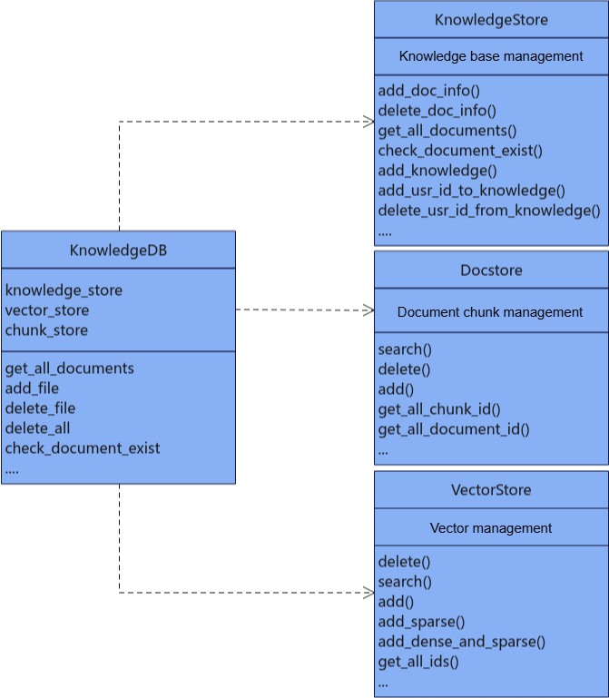
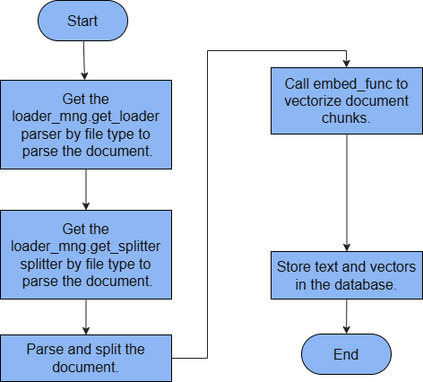

# Interface Reference - Knowledge Management

# Knowledge Management

## Knowledge Base Document Management

### Knowledge Base Dependencies



KnowledgeDB depends on KnowledgeStore, Docstore, and VectorStore for knowledge base document chunks and vectorized data. KnowledgeStore handles knowledge base creation, deletion, and query operations. Docstore handles document chunk creation, deletion, update, and query operations. Specific configuration examples include OpenGaussDocstore, MilvusDocstore, and SQLiteDocstore. VectorStore handles vector creation, deletion, update, and query operations. Specific configuration examples include OpenGaussDB, MilvusDB, and MindFAISS.

### `KnowledgeStore`

#### Class Functionality

**Description**

The knowledge base management class provides functions to create, delete, and query knowledge bases and knowledge base users.

**Prototype**

```python
from mx_rag.knowledge import KnowledgeStore
KnowledgeStore(db_path)
```

**Parameters**

|Parameter|Data Type|Optional/Required|Description|
|--|--|--|--|
|db_path|str|Required|Database path. The path length must be in the range `[1, 1024]`. The path cannot be a symbolic link and cannot contain `..`. The file name length cannot exceed 200. The storage path cannot be in the following path list: [`/etc`, `/usr/bin`, `/usr/lib`, `/usr/lib64`, `/sys/`, `/dev/`, `/sbin`, `/tmp`].|

**Example**

```python
from mx_rag.knowledge import KnowledgeStore
# Initialize the knowledge management relational database
knowledge_store = KnowledgeStore(db_path="./sql.db")
user_id = "Default"
knowledge_store.add_knowledge("name", user_id, "admin")
knowledge_store.add_knowledge("name01", user_id, "admin")
print(knowledge_store.check_knowledge_exist("name", user_id))
knowledge_store.add_usr_id_to_knowledge("name", "Default01", "admin")
knowledge_store.add_usr_id_to_knowledge("name", "Default02", "member")
knowledge_store.delete_usr_id_from_knowledge("name", "Default02", "member")
print(knowledge_store.get_all_knowledge_info(user_id))
print(knowledge_store.get_all_usr_role_by_knowledge("name"))
print(knowledge_store.add_doc_info("name", "1.txt", "./sql.db", user_id))
documents = [document.document_name for document in knowledge_store.get_all_documents("name", user_id)]
print(documents)
print(knowledge_store.check_document_exist("name", "1.txt", user_id))
print(knowledge_store.delete_doc_info("name", "1.txt", user_id))
```

#### `add_knowledge`

**Description**

Adds a knowledge base. The user role can only be the administrator `admin`.

**Prototype**

```python
def add_knowledge(knowledge_name, user_id, role)
```

**Parameters**

|Parameter|Data Type|Optional/Required|Description|
|--|--|--|--|
|knowledge_name|str|Required|Knowledge base name. The length must be in the range `[1, 1024]`.|
|user_id|str|Required|User ID used to distinguish different knowledge bases. It must match the regular expression `^[a-zA-Z0-9_-]{6,64}$`.|
|role|str|Optional|User role. The default value is `admin`. After the addition, this `user_id` can access the knowledge base by default.|

**Returns**

|Data Type|Description|
|--|--|
|int|Returns the `knowledge_id` corresponding to the added knowledge base.|

#### `check_knowledge_exist`

**Description**

Checks whether the specified knowledge base name exists under this `user_id`.

**Prototype**

```python
def check_knowledge_exist(knowledge_name, user_id)
```

**Parameters**

|Parameter|Data Type|Optional/Required|Description|
|--|--|--|--|
|knowledge_name|str|Required|Knowledge base name. The length must be in the range `[1, 1024]`.|
|user_id|str|Required|User ID used to distinguish different knowledge bases. It must match the regular expression `^[a-zA-Z0-9_-]{6,64}$`.|

**Returns**

|Data Type|Description|
|--|--|
|bool|Indicates whether the knowledge base `knowledge_name` exists under `user_id`.|

#### `add_usr_id_to_knowledge`

**Description**

Adds a user to the specified knowledge base. The user role can be the administrator `admin` or the member `member`, who has query-only permission on the knowledge base.

**Prototype**

```python
def add_usr_id_to_knowledge(knowledge_name, user_id, role)
```

**Parameters**

|Parameter|Data Type|Optional/Required|Description|
|--|--|--|--|
|knowledge_name|str|Required|Knowledge base name. The length must be in the range `[1, 1024]`.|
|user_id|str|Required|User ID used to distinguish different knowledge bases. It must match the regular expression `^[a-zA-Z0-9_-]{6,64}$`.|
|role|str|Required|User role. It can only be the knowledge base administrator `admin` or the member `member`, who has query-only permission on the knowledge base. After the addition, the corresponding `user_id` can query the knowledge base.|

#### `delete_usr_id_from_knowledge`

**Description**

Deletes a user from the `knowledge` knowledge base and removes the record from the `knowledge_table` table. See [KnowledgeModel](./databases.md#knowledgemodel-class).

**Prototype**

```python
def delete_usr_id_from_knowledge(knowledge_name, user_id, role, force=False)
```

**Parameters**

|Parameter|Data Type|Optional/Required|Description|
|--|--|--|--|
|knowledge_name|str|Required|Knowledge base name. The length must be in the range `[1, 1024]`.|
|user_id|str|Required|User ID to delete. It is used to distinguish different knowledge bases and must match the regular expression `^[a-zA-Z0-9_-]{6,64}$`.|
|role|str|Required|The role corresponding to the user. It can only be the knowledge base administrator `admin` or the member `member`, who has query-only permission on the knowledge base. If the `user_id` and `role` record does not exist, an error is reported.|
|force|bool|Optional|If only one user remains associated with the knowledge base to be deleted, whether to force deletion. The default value is `False`.|

#### `get_all_knowledge_info`

**Description**

Queries knowledge information by `user_id`.

**Prototype**

```python
def get_all_knowledge_info(user_id)
```

**Parameters**

|Parameter|Data Type|Optional/Required|Description|
|--|--|--|--|
|user_id|str|Required|User ID used to distinguish different knowledge bases. It must match the regular expression `^[a-zA-Z0-9_-]{6,64}$`.|

**Returns**

|Data Type|Description|
|--|--|
|List[KnowledgeModel]|Returns knowledge base information under `user_id`. For `KnowledgeModel`, see [KnowledgeModel](./databases.md#knowledgemodel-class).|

#### `get_all_usr_role_by_knowledge`

**Description**

Queries all user IDs and user roles for the knowledge base specified by `knowledge_name`.

**Prototype**

```python
def get_all_usr_role_by_knowledge(knowledge_name)
```

**Parameters**

|Parameter|Data Type|Optional/Required|Description|
|--|--|--|--|
|knowledge_name|str|Required|Knowledge base name. The length must be in the range `[1, 1024]`.|

**Returns**

|Data Type|Description|
|--|--|
|dict{user_id: role}|Returns all user IDs and user roles under the specified knowledge base. The key is the user ID and the value is the user role.|

#### `add_doc_info`

**Description**

Adds a document name record to the knowledge base. Only the knowledge base administrator has permission to perform this operation. Before adding the record, check the DB file size. It must not exceed 100 GB. When you add a document record, ensure that the remaining drive partition space is greater than 200 MB.

**Prototype**

```python
def add_doc_info(knowledge_name, doc_name, file_path, user_id)
```

**Parameters**

|Parameter|Data Type|Optional/Required|Description|
|--|--|--|--|
|knowledge_name|str|Required|Knowledge base name. The length must be in the range `[1, 1024]`.|
|doc_name|str|Required|Document name. The length must be in the range `[1, 1024]`.|
|file_path|str|Required|Document upload path, which is stored in the database. The path length must be in the range `[1, 1024]`.|
|user_id|str|Required|User ID used to distinguish different knowledge bases. It must match the regular expression `^[a-zA-Z0-9_-]{6,64}$`.|

**Returns**

|Data Type|Description|
|--|--|
|int|Adds a record to the `document_table` table and returns the `document_id` of the document.|

#### `delete_doc_info`

**Description**

Deletes a document name record from the knowledge base. Only the `user_id` of the knowledge base administrator has permission to perform this operation.

**Prototype**

```python
def delete_doc_info(knowledge_name, doc_name, user_id)
```

**Parameters**

|Parameter|Data Type|Optional/Required|Description|
|--|--|--|--|
|knowledge_name|str|Required|Knowledge base name. The length must be in the range `[1, 1024]`.|
|doc_name|str|Required|Document name. The length must be in the range `[1, 1024]`.|
|user_id|str|Required|User ID used to distinguish different knowledge bases. It must match the regular expression `^[a-zA-Z0-9_-]{6,64}$`.|

**Returns**

|Data Type|Description|
|--|--|
|int/None|Deletes a record from the `document_table` table and returns the `document_id` of the deleted document. If the deletion fails, returns `None`.|

#### `check_document_exist`

**Description**

Checks whether a document record exists in the knowledge base.

**Prototype**

```python
def check_document_exist(knowledge_name, doc_name, user_id)
```

**Parameters**

|Parameter|Data Type|Optional/Required|Description|
|--|--|--|--|
|knowledge_name|str|Required|Knowledge base name. The length must be in the range `[1, 1024]`.|
|doc_name|str|Required|Document name. The length must be in the range `[1, 1024]`.|
|user_id|str|Required|User ID used to distinguish different knowledge bases. It must match the regular expression `^[a-zA-Z0-9_-]{6,64}$`.|

**Returns**

|Data Type|Description|
|--|--|
|bool|Indicates whether the document exists.|

#### `get_all_documents`

**Description**

Gets all document records in the knowledge base.

**Prototype**

```python
def get_all_documents(knowledge_name, user_id)
```

**Parameters**

|Parameter|Data Type|Optional/Required|Description|
|--|--|--|--|
|knowledge_name|str|Required|Knowledge base name. The length must be in the range `[1, 1024]`.|
|user_id|str|Required|User ID used to distinguish different knowledge bases. It must match the regular expression `^[a-zA-Z0-9_-]{6,64}$`.|

**Returns**

|Data Type|Description|
|--|--|
|List[DocumentModel]|Returns document information under the corresponding `user_id` and `knowledge_name`. For `DocumentModel`, see [DocumentModel](./databases.md#documentmodel-class).|

### `KnowledgeDB`

#### Class Functionality

**Description**

This is the entry class for knowledge base management. It provides document management functions, including adding and deleting documents and getting all documents in the knowledge base.

**Prototype**

```python
from mx_rag.knowledge import KnowledgeDB
KnowledgeDB(knowledge_store, chunk_store, vector_store, knowledge_name, white_paths, max_file_count, user_id, lock)
```

**Parameters**

|Parameter|Data Type|Optional/Required|Description|
|--|--|--|--|
|knowledge_store|KnowledgeStore|Required|Provides data storage for knowledge base management and stores the names of documents that have been uploaded successfully. For the data type, see [KnowledgeStore](#knowledgestore).|
|chunk_store|Docstore|Required|Provides database storage for the list of document chunk objects. For the data type, see [Docstore](./databases.md#docstore).|
|vector_store|VectorStore|Required|Vector database storage object. For the data type, see [VectorStore](./databases.md#vectorstore).|
|knowledge_name|str|Required|Knowledge base name. Users can customize it according to the knowledge base topic. The length must be in the range `[1, 1024]`.|
|white_paths|List[str]|Required|Whitelist path list for uploaded documents. The list length must be in the range `[1, 1024]`, and the path length must be in the range `[1, 1024]`. The path cannot be a symbolic link and cannot contain `..`. Documents can be uploaded only if their paths are in the whitelist.|
|max_file_count|int|Optional|Maximum number of documents allowed during upload. The value must be in the range `[1, 8000]`. A value that is too large is not recommended. The default value is 1000.|
|user_id|str|Required|User ID used to distinguish different knowledge bases. It must match the regular expression `^[a-zA-Z0-9_-]{6,64}$`.|
|lock|multiprocessing.synchronize.Lock or _thread.LockType|Optional|If the user needs to call this interface from multiple processes or threads, a lock is required. The default value is `None`. Optional values: <li>`None`: no lock is used. In this case, the interface does not support concurrency.</li><li>`multiprocessing.Lock()`: process lock. In this case, the interface supports multi-process calls.</li><li>`threading.Lock()`: thread lock. In this case, the interface supports multi-thread calls.</li>|

> [!NOTE]
> `chunk_store` and `vector_store` must ensure data consistency. For example, the relational database file and the vector database file must be generated at the same time.

**Example**

```python
import pathlib
from paddle.base import libpaddle
from mx_rag.embedding.local import TextEmbedding
from mx_rag.knowledge import KnowledgeStore, KnowledgeDB
from mx_rag.storage.document_store import SQLiteDocstore
from mx_rag.storage.vectorstore import MindFAISS
# Set the NPU card used for vector retrieval
dev = 0
# Load the embedding model
embed_func = TextEmbedding("/path/to/model", dev_id=dev)
# Initialize the vector database
vector_store = MindFAISS(x_dim=1024, devs=[dev],
                         load_local_index="./faiss.index", auto_save=True)
# Initialize the document chunk relational database
chunk_store = SQLiteDocstore(db_path="./sql.db")
# Initialize the knowledge management relational database
knowledge_store = KnowledgeStore(db_path="./sql.db")
# Add the knowledge base and the administrator
knowledge_store.add_knowledge(knowledge_name="test", user_id='Default', role='admin')
# Initialize knowledge management
knowledge_db = KnowledgeDB(knowledge_store=knowledge_store, chunk_store=chunk_store, vector_store=vector_store,
                           knowledge_name="test", user_id="Default", white_paths=["/home/"])
file_path = pathlib.Path("./gaokao.txt")
knowledge_db.add_file(file=file_path,
                      texts=["test1", "test2"],
                      embed_func={"dense": embed_func.embed_documents},
                      metadatas=[{"source": "./gaokao.txt"}, {"source": "./gaokao.txt"}])
documents =[document.document_name for document in knowledge_db.get_all_documents()]
print(documents)
print(knowledge_db.check_document_exist(doc_name=file_path.name))

knowledge_db.delete_file(doc_name=file_path.name)
knowledge_db.delete_all()
```

#### `add_file`

**Description**

Adds a single document to the knowledge base, vectorizes the information after file splitting, saves it to the vector database, stores the document chunks in the document database, and stores the document record in the knowledge base database. Only the knowledge base administrator has permission to perform this operation.

**Prototype**

```python
def add_file(file, texts, embed_func, metadatas)
```

**Parameters**

|Parameter|Data Type|Optional/Required|Description|
|--|--|--|--|
|file|pathlib.Path|Required|The `pathlib.Path` object of the uploaded document. The file path length must be in the range `[1, 1024]`. The path cannot be a symbolic link and cannot contain `..`. The file name length cannot exceed 200. The storage path cannot be in the following path list: [`/etc`, `/usr/bin`, `/usr/lib`, `/usr/lib64`, `/sys/`, `/dev/`, `/sbin`, `/tmp`].|
|texts|List[str]|Required|List after document splitting. The number of elements must match the number of `metadatas` items. The list length must be in the range `[1, 1000 * 1000]`, and each string length must be in the range `[1, 128 * 1024 * 1024]`.|
|embed_func|dict|Required|Embedding function that converts text or images into vectors. Only the `{'dense': x, 'sparse': y}` format is allowed. `x` and `y` are the callback functions for dense and sparse vectors, respectively, and they cannot both be `None`.|
|metadatas|List[dict]|Optional|Metadata for document chunks. The default value is `None`. The string length of each dictionary element in the list cannot exceed `128 * 1024 * 1024`, the dictionary length cannot exceed 1024, and nested dictionaries cannot exceed one level. The number of elements must match the number of `texts` items. The list length must be in the range `[1, 1000 * 1000]`.|

#### `delete_file`

**Description**

Deletes an uploaded document from the knowledge base. Only the knowledge base administrator has permission to perform this operation.

**Prototype**

```python
def delete_file(doc_name)
```

**Parameters**

|Parameter|Data Type|Optional/Required|Description|
|--|--|--|--|
|doc_name|str|Required|Name of the document to delete. The document must already exist, and the length must be in the range `[1, 1024]`.|

#### `get_all_documents`

**Description**

Gets the names of all uploaded documents.

**Prototype**

```python
def get_all_documents()
```

**Returns**

|Data Type|Description|
|--|--|
|List[DocumentModel]|Returns document information under the corresponding `user_id`. For `DocumentModel`, see [DocumentModel](./databases.md#documentmodel-class).|

#### `check_document_exist`

**Description**

Checks whether a document has already been added to the knowledge base. Calls `KnowledgeStore.check_document_exist`.

**Prototype**

```python
def check_document_exist(doc_name)
```

**Parameters**

|Parameter|Data Type|Optional/Required|Description|
|--|--|--|--|
|doc_name|str|Required|Document name. The length must be in the range `[1, 1024]`.|

**Returns**

|Data Type|Description|
|--|--|
|bool|Indicates whether the document exists.|

#### `delete_all`

**Description**

KnowledgeDB binds the relational database, vector database, `user_id`, and `knowledge_name`. It deletes the related records in the relational database and vector database, and then deletes the knowledge base. Only the knowledge base administrator has permission to perform this operation. See [Database Structure](./databases.md#database-structure) for the tables involved in the cleanup of the relational database.

**Prototype**

```python
def delete_all()
```

**Parameters**

None.

### Document Management

#### `upload_files`

**Description**

Uploads documents and stores them in the knowledge base. Only the knowledge base administrator has permission to perform this operation. If a document is duplicated, you can choose to force overwrite it. Document data is stored in plain text, so pay attention to the security risks. The upload fails when the number of uploaded documents exceeds the `max_file_count` limit of the knowledge base. If the upload of a document fails, an exception is raised.

**Prototype**

```python
from mx_rag.knowledge import upload_files
def upload_files(knowledge, files, loader_mng, embed_func, force)
```

**Internal Workflow**



**Parameters**

|Parameter|Data Type|Optional/Required|Description|
|--|--|--|--|
|knowledge|KnowledgeDB|Required|Knowledge base object. For the data type, see [KnowledgeDB](#knowledgedb).|
|files|List[str]|Required|List of document paths. The path length must be in the range `[1, 1024]`, and the default number of files does not exceed 1000. The document path cannot be a symbolic link and cannot contain `..`.|
|loader_mng|LoaderMng|Required|Management class object that provides document parsing functions. For the data type, see LoaderMng（需补充链接）.|
|embed_func|Callable[[List[str]], List[List[float]]] or dict|Required|Embedding function that converts file information into vectors. If you pass a callback directly, it is treated as dense by default, that is, `{'dense': Callable, 'sparse': None}`. If you pass a dictionary, use the format `{'dense': x, 'sparse': y}`. `x` and `y` are the callback functions for dense and sparse vectors, respectively, and they cannot both be `None`. Dense and sparse vectors are both supported in the database.|
|force|bool|Optional|Indicates whether to force overwrite existing data. If you choose `False`, duplicate documents raise an exception. The default value is `False`.|

**Returns**

|Data Type|Description|
|--|--|
|List[str]|List of files that failed to be added to the knowledge base.|
