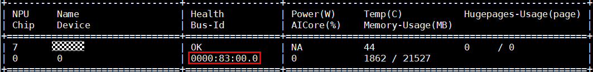
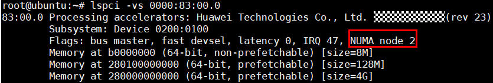
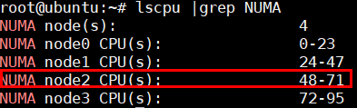

# API Reference - Model Inference Acceleration

# Model Inference Acceleration

**Model Inference Acceleration Configuration Instructions**

The `TextEmbedding` model currently supports vector inference acceleration for `bert`, `roberta`, and `xlm_roberta` embedding models, and only the `float16` data type is supported. To use this feature, install the operator module together with RAG SDK package, and ensure that you have enabled this feature. It is disabled by default. For a specific example, see the [example of enabling inference acceleration](./embedding.md#class-description).

CLIP model acceleration supports only ViT-B-16, ViT-L-14, ViT-L-14-336, and ViT-H-14. For the download [link](https://github.com/OFA-Sys/Chinese-CLIP), see the model download instructions. After you enable acceleration, the first inference triggers graph compilation and is expected to take 1 to 2 minutes.

- The inference acceleration configuration for each model is as follows.

1) Method 1:

    ```python
    from modeling_bert_adapter import enable_bert_speed
    from modeling_roberta_adapter import enable_roberta_speed
    from modeling_xlm_roberta_adapter import enable_xlm_roberta_speed
    from modeling_clip_adapter import enable_clip_speed
    ```

2) Method 2:

    ```python
    from mx_rag.transformer_adapter.modeling_bert_adapter import enable_bert_speed
    from mx_rag.transformer_adapter.modeling_roberta_adapter import enable_roberta_speed
    from mx_rag.transformer_adapter.modeling_xlm_roberta_adapter import enable_xlm_roberta_speed
    from mx_rag.transformer_adapter.modeling_clip_adapter import enable_clip_speed
    ```

Note: If the package is installed from a run package, both Method 1 and Method 2 are supported. If it is installed from a wheel package, only Method 2 is supported. Run the `pip3 show mx_rag` command to obtain the package installation path and determine which package type was used for installation. If you use the run installation package, `mx_rag` is installed in `$HOME/./local/lib`.

- Set the `ENABLE_BOOST` variable to determine whether to enable model inference acceleration. When the value is set to `"True"`, `"true"`, or `"1"`, acceleration is enabled. Any other value disables acceleration. The first import method will be phased out gradually.

    ```bash
    os.environ["ENABLE_BOOST"] = "True"
    ```

- Environment variables for model acceleration logs.

    ```bash
    ATB_LOG_TO_STDOUT: Set this value to 1 to write logs to standard output.
    ATB_LOG_TO_FILE: Set this value to 1 to write logs to a file.
    ATB_LOG_LEVEL: Set the log level. You can configure it as TRACE, DEBUG, INFO, WARN, ERROR, or FATAL.
    ```

> [!NOTE]
> For inference on CLIP series models on Atlas 300I Duo inference cards, acceleration is supported only when the batch size is less than or equal to 4. For other batch sizes, acceleration shows no obvious performance improvement and may even reduce performance.

**Binding CPU Cores to Improve Inference Performance**

If the device is a Kunpeng server, you can bind CPU cores with `numactl` when you run the program to improve inference performance.

1. Run the **npu-smi info** command to obtain the _\<bus-id>_ of the corresponding NPU.

    

2. Run the **lspci -vs** _**\<bus-id>**_ command to query the NUMA node corresponding to the NPU.

    ```bash
    lspci -vs 0000:83:00.0
    ```

    

3. Use `lscpu` to obtain the number of CPU cores corresponding to the NUMA node.

    ```bash
    lscpu | grep NUMA
    ```

    

4. Add **numactl -C** _**\<CPU core count>**_ before the program runs.

    ```bash
    numactl -C 48-71 your_program
    ```

**Example of Enabling Inference Acceleration**

```python
import os
import torch
import torch_npu
# Adapt the vector inference acceleration for BERT-like models
from modeling_bert_adapter import enable_bert_speed
from mx_rag.embedding.local import TextEmbedding

# Enable vector inference acceleration. Setting this value to "True" enables the feature, and setting it to "False" disables it
os.environ["ENABLE_BOOST"] = "True"

device_id = 1
torch_npu.npu.set_device(f"npu:{device_id}")

embed = TextEmbedding(model_path="/path/to/model", dev_id=device_id)
print(embed.embed_documents(["What attractions are there in Beijing?"]))
print(embed.embed_query("What attractions are there in Beijing?"))
```
