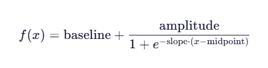

# API Reference - Reranking

# Reranking

## `Reranker`

### Class Functionality

**Description**

Abstract base class for reranking.

**Function Prototype**

```python
from mx_rag.reranker import Reranker
Reranker(k) # abstract class
```

**Input Parameters**

|Parameter|Data Type|Optional/Required|Description|
|--|--|--|--|
|k|int|Required|Returns the k most relevant results after reranking.|

**Return Values**

Reranker object.

### `rerank`

**Description**

Abstract function that subclasses must implement. The implementation sorts the list in `texts` by similarity to `query`, with the most similar item first.

**Function Prototype**

```python
@abstractmethod
def rerank(query, texts, batch_size)
```

**Input Parameters**

|Parameter|Data Type|Optional/Required|Description|
|--|--|--|--|
|query|str|Required|The input query to rank against.|
|texts|List[str]|Required|The list of texts to rank.|
|batch_size|int|Optional|The batch size. The default value is 32. The configurable value depends on the device's memory.|

**Return Values**

|Data Type|Description|
|--|--|
|np.array|The score array corresponding to `texts`.|

### `rerank_top_k`

**Description**

Returns the top `k` objects with the highest scores in the list. The higher the score, the more similar the object.

**Function Prototype**

```python
def rerank_top_k(objs, scores)
```

**Input Parameters**

|Parameter|Data Type|Optional/Required|Description|
|--|--|--|--|
|objs|List|Required|The list of objects to rank. The list length ranges from `[1, 1000 * 1000]`. The `page_content` field in each `Document` element ranges from `[1, 128 * 1024 * 1024]` characters.|
|scores|np.ndarray|Required|The score array corresponding to the objects to rank. The array supports one dimension. The array length ranges from `[1, 1000 * 1000]`.|

**Return Values**

|Data Type|Description|
|--|--|
|List|Returns the k highest-scoring objects.|

## `LocalReranker`

### Class Functionality<a id="ZH-CN_TOPIC_0000002419262724"></a>

**Description**

Uses transformers locally to load the model and provide text relevance scoring. It inherits the abstract class `Reranker`. The currently supported models are bge-reranker-large and bge-reranker-base.

> [!NOTE]
> If the configured model does not use the safetensors weight format, convert the model weights to the safetensors format before use to prevent security issues caused by unsafe weight formats such as ckpt and bin.

**Function Prototype**

```python
from mx_rag.reranker.local import LocalReranker
LocalReranker(model_path, dev_id, k, use_fp16)
```

**Input Parameters**

|Parameter|Data Type|Optional/Required|Description|
|--|--|--|--|
|model_path|str|Required|The directory that contains the model weight files. The path length cannot exceed 1024. The path cannot be a symbolic link or a relative path.<li>No file in the directory can exceed 10 GB, the directory depth cannot exceed 64, and the total number of files cannot exceed 512.</li><li>The running user's group and non-running users must not have write permission for files in this directory.</li><li>The group ownership of the files in the directory and the parent directory of those files must belong to the running user.</li><br>The storage path cannot be in the following list: [`/etc`, `/usr/bin`, `/usr/lib`, `/usr/lib64`, `/sys/`, `/dev/`, `/sbin`, `/tmp`].|
|dev_id|int|Optional|The card on which the model runs. The value ranges from `[0, 63]`. The default value is 0.|
|k|int|Optional|The number of most relevant results to return after reranking. The value ranges from `[1, 10000]`. The default value is 1.|
|use_fp16|bool|Optional|Whether to convert the model to half precision. The default value is `True`.|

**Return Values**

LocalReranker object.

**Example**

```python
from paddle.base import libpaddle
from langchain_core.documents import Document
from mx_rag.reranker.local import LocalReranker
# Same as LocalReranker(model_path="path to model", dev_id=0)
doc_1 = Document(
                page_content="我是小红",
                metadata={"source": ""}
            )
doc_2 = Document(
                page_content="我是小明",
                metadata={"source": ""}
            )
docs = [doc_1, doc_2]
rerank = LocalReranker.create(model_path="path to model", dev_id=0)
scores = rerank.rerank('你好', [doc.page_content for doc in docs])
res = rerank.rerank_top_k(docs, scores)
print(res)
```

### `create`

**Description**

Creates and returns a `LocalReranker` object.

**Function Prototype**

```python
@staticmethod
def create(**kwargs)
```

**Input Parameters**

|Parameter|Data Type|Optional/Required|Description|
|--|--|--|--|
|kwargs|dict|Required|Keyword arguments. See the inputs in [Class Functionality](#ZH-CN_TOPIC_0000002419262724). Required parameters must be passed. Otherwise, a `KeyError` is raised.|

**Return Values**

|Data Type|Description|
|--|--|
|LocalReranker|LocalReranker object.|

### `rerank`

**Description**

Computes relevance scores for the text list against the query.

**Function Prototype**

```python
def rerank(query, texts, batch_size)
```

**Input Parameters**

|Parameter|Data Type|Optional/Required|Description|
|--|--|--|--|
|query|str|Required|The question to compare with all texts for relevance. The string length ranges from `[1, 1024 * 1024]`.|
|texts|List[str]|Required|The text list. The list length ranges from `[1, 1000 * 1000]`, and each text length ranges from `[1, 1024 * 1024]`.|
|batch_size|int|Optional|The batch size. Each call groups `batch_size` texts for embedding. The value ranges from `[1, 1024]`. The default value is 32.|

**Return Values**

|Data Type|Description|
|--|--|
|numpy.array|A numpy array with the same length as `texts`, storing the relevance score of each text and the query.|

## `TEIReranker`

### Class Functionality<a id="ZH-CN_TOPIC_0000002419262728"></a>

**Description**

Connects to the TEI service and provides text relevance scoring. It inherits the abstract class `Reranker`.

**Function Prototype**

```python
from mx_rag.reranker.service import TEIReranker
TEIReranker(url,  k, client_param)
```

**Input Parameters**

|Parameter|Data Type|Optional/Required|Description|
|--|--|--|--|
|url|str|Required|The TEI rerank service address. The string length ranges from `[1, 128]`. It supports the `/rerank` and `/v1/rerank` endpoints.<br>Note: The rerank service created based on the TEI framework does not support the HTTPS protocol. For security, you can set up an nginx service so that it and the rerank service are in a trusted network. When you use it, the client accesses nginx over HTTPS, and nginx forwards the request to the rerank service.|
|k|int|Optional|The number of most relevant results to return after reranking. The value ranges from `[1, 10000]`. The default value is 1.|
|client_param|ClientParam|Optional|HTTPS client configuration parameters. The default value is `ClientParam()`. For details, see [ClientParam](./universal_api.md#clientparam).|

**Return Values**

TEIReranker object.

**Example**

```python
from paddle.base import libpaddle
from mx_rag.reranker.service import TEIReranker
from mx_rag.utils import ClientParam
# Same as LocalReranker(url="https://ip:port/rerank", client_param=ClientParam(xxx))
rerank = TEIReranker.create(url="https://ip:port/rerank",
                            client_param=ClientParam(ca_file="/path/to/ca.crt"))
docs = ['我是小红', '我是小明']
scores = rerank.rerank('你好', docs)
res = rerank.rerank_top_k(docs, scores)
print(res)
```

### `create`

**Description**

Creates and returns a `TEIReranker` object.

**Function Prototype**

```python
@staticmethod
def create(**kwargs)
```

**Input Parameters**

|Parameter|Data Type|Optional/Required|Description|
|--|--|--|--|
|kwargs|dict|Required|Keyword arguments. See the inputs in [Class Functionality](#ZH-CN_TOPIC_0000002419262728). Required parameters must be passed. Otherwise, a `KeyError` is raised.|

**Return Values**

|Data Type|Description|
|--|--|
|TEIReranker|TEIReranker object.|

### `rerank`

**Description**

Calls the TEI service to compute text relevance scores.

**Function Prototype**

```python
def rerank(query, texts, batch_size)
```

**Input Parameters**

|Parameter|Data Type|Optional/Required|Description|
|--|--|--|--|
|query|str|Required|The question, which is compared with all `text` values for relevance. The string length ranges from `[1, 1024 * 1024]`.|
|texts|List[str]|Required|The text list. The list length ranges from `(0, 1000 * 1000]`, and the string length ranges from `[1, 1024 * 1024]`.|
|batch_size|int|Optional|The batch size. Each call groups `batch_size` texts for embedding. The value ranges from `[1, 1024]`. The default value is 32.|

**Return Values**

|Data Type|Description|
|--|--|
|numpy.array|A numpy array with the same length as `texts`, storing the relevance score of each text and the query.|

## `RerankerFactory`

### Class Functionality

**Description**

Factory class for rerankers. It creates rerankers for RAG SDK.

**Function Prototype**

```python
from mx_rag.reranker import RerankerFactory
class RerankerFactory(ABC):
    _NPU_SUPPORT_RERANKER: Dict[str, Callable[[Dict[str, Any]], Reranker]] = {
        "local_reranker": LocalReranker.create,
        "tei_reranker": TEIReranker.create
    }
```

**Example**

```python
from paddle.base import libpaddle
from mx_rag.reranker import RerankerFactory
from mx_rag.utils import ClientParam
docs = ['我是小红', '我是小明']
local_reranker = RerankerFactory.create_reranker(similarity_type="local_reranker", model_path="path to model", dev_id=0)
local_scores = local_reranker.rerank('你好', docs)
print(local_scores)
# Modify the parameters based on the actual situation
tei_reranker = RerankerFactory.create_reranker(similarity_type="tei_reranker",
                                               url="https://ip:port/rerank",
                                               client_param=ClientParam(ca_file="/path/to/ca.crt"))
tei_scores = local_reranker.rerank('你好', docs)
print(tei_scores)
```

### `create_reranker`

**Description**

Constructs a reranker. It calls the static `create` methods of `LocalReranker` and `TEIReranker` to return an instance.

**Function Prototype**

```python
@classmethod
def create_reranker(cls, **kwargs):
```

**Input Parameters**

|Parameter|Data Type|Optional/Required|Description|
|--|--|--|--|
|similarity_type|str|Required|The reranker type in `kwargs`.<br>Possible values:<li>local_reranker</li><li>tei_reranker</li>|
|**kwargs|Any|Optional|All parameters other than `similarity_type` are used to construct the reranker.<li>If it is `local_reranker`, see [Class Functionality](#ZH-CN_TOPIC_0000002419262724).</li><li>If it is `tei_reranker`, see [Class Functionality](#ZH-CN_TOPIC_0000002419262728).</li>|

## `MixRetrieveReranker`

### Class Functionality

**Description**

Provides weighted ranking for hybrid retrieval results from BM25 and dense vectors. It inherits the abstract class `Reranker`.

**Function Prototype**

```python
from mx_rag.reranker.local import MixRetrieveReranker
MixRetrieveReranker(k, baseline, amplitude, slope, midpoint)
```

**Input Parameters**

|Parameter|Data Type|Optional/Required|Description|
|--|--|--|--|
|k|int|Optional|The number of most relevant results to return after ranking. The value ranges from `[1, 10000]`. The default value is 100.|
|baseline|float|Optional|The base value of the weight calculation formula. The value ranges from `[0.0, 1.0]`. The default value is 0.4.|
|amplitude|float|Optional|The amplitude of the weight calculation formula. The value ranges from `[0.0, 1.0]`. The default value is 0.3.|
|slope|float|Optional|Controls how steep the transition is. The value must be greater than 0. The default value is 1.|
|midpoint|float|Optional|The query length at which the function value reaches the midpoint between the base value and the maximum value. The value must be greater than 0. The default value is 6.|

Note: The weight is calculated by the formula shown below. Ensure that the result is in `[0, 1]`.



**Return Values**

MixRetrieveReranker object.

**Example**

```python
from langchain_core.documents import Document
from mx_rag.reranker.local import MixRetrieveReranker

doc_1 = Document(
    page_content="document1",
    metadata={
        "score": 1.0,
        "retrieval_type": "dense",
    }
)
doc_2 = Document(
    page_content="document2",
    metadata={
        "score": 2.0,
        "retrieval_type": "sparse",
    }
)
docs = [doc_1, doc_2]
query = "This is a question"
reranker = MixRetrieveReranker(k=100, baseline=0.4, amplitude=0.3, slope=1, midpoint=6)
res = reranker.rerank(query, docs)
```

### `rerank`

**Description**

Applies weights to hybrid retrieval results, ranks them, and returns the `k` highest-scoring results.

**Function Prototype**

```python
def rerank(query, texts, batch_size)
```

**Input Parameters**

|Parameter|Data Type|Optional/Required|Description|
|--|--|--|--|
|query|str|Required|The question, which is compared with all `text` values for relevance. The string length ranges from `[1, 1024 * 1024]`.|
|texts|list[Document]|Required|The text list. The list length ranges from `(0, 1000 * 1000]`, and the string length ranges from `[1, 1024 * 1024]`.|
|batch_size|int|Optional|The batch size. The default value is 32. This variable is not used yet.|

**Return Values**

|Data Type|Description|
|--|--|
|list[Document]|The k highest-scoring results.|
