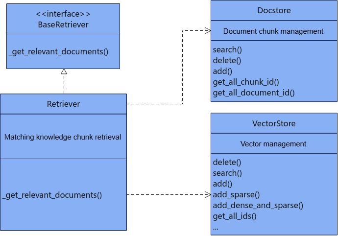

# Retrieval

## `Retriever`

### Class Overview

**Description**

Embeds the query, then uses an approximate search algorithm to retrieve the top `k` similar vector IDs from the vector database. Uses those vector IDs to fetch the top `k` related documents from the relational database. This class inherits from `langchain_core.retrievers.BaseRetriever`. Calls the base class `invoke` method to perform retrieval. The query to retrieve must be of the `str` type, and its length cannot exceed 1,000,000.

**Prototype**

```python
from mx_rag.retrievers import Retriever
# Pass all parameters as keyword arguments
Retriever(vector_store, document_store, embed_func, k, score_threshold)
```

**Dependencies**



**Parameters**

All parameters must be passed as keyword arguments.

|Parameter Name|Data Type|Optional/Required|Description|
|--|--|--|--|
|vector_store|`VectorStore`|Required|Vector database instance. For the exact type, see [VectorStore](./databases.md#vectorstore).|
|document_store|`Docstore`|Required|Relational database instance. For the exact type, see [Docstore](./databases.md#docstore).|
|embed_func|`Callable[[List[str]], Union[List[List[float]], List[Dict[int, float]]]]`|Required|Embedding callback function.|
|k|`int`|Optional|The number of results to retrieve. The valid range is `[1, 10000]`, and the default value is `1`.|
|score_threshold|`float`|Optional|Retrieval score threshold. The default value is `None`. If the value is `None`, threshold filtering is disabled. If you use it, the valid range is `[0, 1]`. A larger threshold makes matching stricter, and a smaller threshold makes matching less strict.|
|filter_dict|`Dict`|Optional|The default value is `{}`. This dictionary contains retrieval conditions. Currently only filtering by `document_id` is supported. Pass the document IDs as a list, and the list length cannot exceed 1,000,000. For example, to filter documents whose `document_id` values are 1, 2, and 4, pass `{"document_id": [1, 2, 4]}`.|

**Example**

```python
from paddle.base import libpaddle
from langchain_community.document_loaders import TextLoader
from langchain.text_splitter import RecursiveCharacterTextSplitter
from mx_rag.embedding.local import TextEmbedding
from mx_rag.storage.document_store import SQLiteDocstore
from mx_rag.storage.vectorstore import MindFAISS
from mx_rag.document import LoaderMng
from mx_rag.knowledge.knowledge import KnowledgeStore
from mx_rag.knowledge.handler import upload_files
from mx_rag.knowledge import KnowledgeDB
from mx_rag.retrievers import Retriever
# STEP 1: Build the knowledge base and register the document processor first
loader_mng = LoaderMng()
# Load a document loader. You can use the built-in loader from the SDK or a LangChain loader
loader_mng.register_loader(loader_class=TextLoader, file_types=[".txt"])
# Load a document splitter with LangChain
loader_mng.register_splitter(splitter_class=RecursiveCharacterTextSplitter,
                             file_types=[".txt"],
                             splitter_params={"chunk_size": 750,
                                              "chunk_overlap": 150,
                                              "keep_separator": False
                                              })
# Initialize the embedding model
emb = TextEmbedding(model_path="/path/to/bge-large-zh-v1.5", dev_id=0)
# Initialize the vector database
vector_store = MindFAISS(x_dim=1024,

                         devs=[0],
                         load_local_index="./faiss.index",
                         auto_save=True
                         )
# Initialize the relational database for document chunks
chunk_store = SQLiteDocstore(db_path="./sql.db")
# Initialize the relational database for knowledge management
knowledge_store = KnowledgeStore(db_path="./sql.db")
# Add the knowledge base and administrator
knowledge_store.add_knowledge(knowledge_name="test", user_id='Default', role='admin')
# Initialize knowledge base management
knowledge_db = KnowledgeDB(knowledge_store=knowledge_store,
                           chunk_store=chunk_store,
                           vector_store=vector_store,
                           knowledge_name="test",
                           user_id='Default',
                           white_paths=["/home"]
                           )
# Complete offline knowledge base construction, then upload the domain knowledge file gaokao.txt
upload_files(knowledge=knowledge_db,
             files=["/home/data/gaokao.txt"],
             loader_mng=loader_mng,
             embed_func=emb.embed_documents,
             force=True
             )
# STEP 2: Initialize the retriever
text_retriever = Retriever(vector_store=vector_store,
                           document_store=chunk_store,
                           embed_func=emb.embed_documents,
                           k=1,
                           score_threshold=0.2
                           )
res = text_retriever.invoke("Please describe the 2024 Gaokao Chinese essay topic.")
print(res)
```

### `set_filter`

**Description**

Sets the retrieval filter conditions.

**Prototype**

```python
def set_filter(filter_dict)
```

**Parameters**

|Parameter Name|Data Type|Optional/Required|Description|
|--|--|--|--|
|filter_dict|`Dict`|Required|This dictionary contains retrieval conditions. Currently only filtering by `document_id` is supported. Pass the document IDs as a list, and the list length cannot exceed 1,000,000. For example, to filter documents whose `document_id` values are 1, 2, and 4, pass `{"document_id": [1, 2, 4]}`.|

## `MultiQueryRetriever`

### Class Overview

**Description**

Sends the input query to the LLM for question rewriting, then retrieves the top `k` similar documents for each rewritten question. Deduplicates the results from the `n` rewritten questions and their top `k` documents, then sorts the results by text length. This class inherits from `mx_rag.retrievers.Retriever`. Calls the base class `invoke` method to perform retrieval. The input query length cannot exceed 1,000,000.

**Prototype**

```python
from mx_rag.retrievers import MultiQueryRetriever
# Pass all parameters as keyword arguments
MultiQueryRetriever(llm, prompt, parser, llm_config)
```

**Parameters**

|Parameter Name|Data Type|Optional/Required|Description|
|--|--|--|--|
|llm|`Text2TextLLM`|Required|LLM object instance. For the exact type, see [Text2TextLLM](./llm_client.md#text2textllm).|
|prompt|`langchain_core.prompts.PromptTemplate`|Optional|The default value is as follows. The `question` string is fixed and cannot be changed. It indicates the input question. `prompt.input_variables` must include `question`. The length of `prompt.template` must be in the range `(0, 1 * 1024 * 1024]`, and it defines the prompt. The actual query sent to the LLM is `prompt` concatenated with `question`. The valid value of the actual query depends on the MindIE configuration. See the description of `maxSeqLen` in the "Core Concepts and Configuration > Configuration Parameter Description (Service)" section of the *MindIE LLM Development Guide*. Ensure that the language of `prompt` and `question` is the same, or explicitly specify the response language of the LLM. Otherwise, response quality may be affected.<br>```PromptTemplate(    input_variables=["question"],    template="""You are an artificial intelligence language model assistant. Your task is to rewrite the user's original question from different angles and generate three questions.    Start numbering from 1 and answer in Chinese. Separate each question with a newline. The following is a rewriting example:    Example original question:    Can you tell me something about Einstein?    Example rewritten questions:    1. What were Einstein's life story and major scientific achievements?    2. What important contributions did Einstein make to relativity and other areas of physics?    3. What was Einstein's personal life like, and how did he influence society?    Question to rewrite: {question}""")```|
|parser|`langchain_core.output_parsers.BaseOutputParser`|Optional|The implementation class of the output parser that processes the LLM response. The default value is `DefaultOutputParser`. It inherits from `langchain_core.output_parsers.BaseOutputParser` and splits multiple questions in the LLM response by numeric labels.|
|llm_config|`LLMParameterConfig`|Optional|The parameters for calling the LLM. The default value for `temperature` is `0.5`, and the default value for `top_p` is `0.95`. For the other parameter descriptions, see [LLMParameterConfig](./llm_client.md#llmparameterconfig).|

**Example**

```python
# For the knowledge base construction example, see the preceding Retriever example. This example assumes that offline knowledge base construction is already complete

from mx_rag.retrievers import MultiQueryRetriever
from mx_rag.llm import Text2TextLLM
from mx_rag.utils import ClientParam
# Initialize the LLM
llm = Text2TextLLM(base_url="https://<ip>:<port>/v1/chat/completions",
                   model_name="Llama3-8B-Chinese-Chat",
                   client_param=ClientParam(ca_file="/path/to/ca.crt"))
# Initialize the retriever
multi_text_retriever = MultiQueryRetriever(llm=llm,
                                           vector_store=vector_store,
                                           document_store=chunk_store,
                                           embed_func=emb.embed_documents,
                                           k=1,
                                           score_threshold=0.2
                                           )
res = multi_text_retriever.invoke("Please describe the 2024 Gaokao Chinese essay topic.")
print(res)
```

## `BMRetriever`

### Class Overview

**Description**

Uses the LLM to extract keywords from the input query, then uses BM25 for top `k` retrieval. This class inherits from `langchain_core.retrievers.BaseRetriever`. Calls the base class `invoke` method to perform retrieval. The input query length cannot exceed 1,000,000.

**Prototype**

```python
from mx_rag.retrievers.bm_retriever import BMRetriever
# Pass all parameters as keyword arguments
BMRetriever(docs, llm, k, llm_config, prompt, preprocess_func)
```

**Parameters**

|Parameter Name|Data Type|Optional/Required|Description|
|--|--|--|--|
|docs|`List[Document]`|Required|List of documents to retrieve. The list length must be in the range `[0, 1000]`.|
|llm|`Text2TextLLM`|Required|LLM object instance. For the exact type, see [Text2TextLLM](./llm_client.md#text2textllm).|
|k|`int`|Optional|The number of top `k` results returned by retrieval. The valid range is `[1, 10000]`, and the default value is `1`.|
|llm_config|`LLMParameterConfig`|Optional|The parameters for calling the LLM. The default values here are `temperature=0.5` and `top_p=0.95`. For the other parameter descriptions, see [LLMParameterConfig](./llm_client.md#llmparameterconfig).|
|prompt|`langchain_core.prompts.PromptTemplate`|Optional|The default value is as follows. The `question` string is fixed and cannot be changed. It indicates the input question. `prompt.input_variables` must include `question`. The length of `prompt.template` must be in the range `(0, 1 * 1024 * 1024]`, and it defines the prompt. The actual query sent to the LLM is `prompt` concatenated with `question`. The valid value of the actual query depends on the MindIE configuration. See the description of `maxSeqLen` in the "Core Concepts and Configuration > Configuration Parameter Description (Service)" section of the *MindIE LLM Development Guide*. Ensure that the language of `prompt` and `question` is the same, or explicitly specify the response language of the LLM. Otherwise, response quality may be affected.<br>```PromptTemplate(```<br>```input_variables=["question"],<br>template="""Extract keywords from the question. Use no more than 10 keywords. Split the keywords into individual verbs, nouns, or adjectives whenever possible.<br>Do not use long phrases. The goal is to better match semantically related materials that are phrased differently. Extract keywords according to the provided reference material. Separate keywords with commas, for example {{keyword 1, keyword 2}}.```<br>```Question: How do I install CANN?```<br>```Keywords: CANN, install, installation```<br>```Question: How do I build a MindStudio container image?```<br>```Keywords: MindStudio, container image, Docker build```<br>```Question: {question}<br>Keywords:<br>"""```)|
|preprocess_func|`Callable[[str], List[str]]`|Optional|Preprocessing before BM25 retrieval. It splits the text string returned by the LLM to obtain the keyword list. By default, it splits the string on commas.|

**Example**

```python
from mx_rag.document.loader import DocxLoader
from mx_rag.chain import SingleText2TextChain
from mx_rag.llm import Text2TextLLM
from mx_rag.retrievers.bm_retriever import BMRetriever
from langchain_text_splitters import RecursiveCharacterTextSplitter
from mx_rag.utils import ClientParam
loader = DocxLoader("/path/to/MindIE.docx")
docs = loader.load_and_split(RecursiveCharacterTextSplitter(chunk_size=750, chunk_overlap=150))
client_param = ClientParam(ca_file="/path/to/ca.crt")
llm = Text2TextLLM(base_url="https://ip:port/v1/chat/completions", model_name="qianwen-7b", client_param = client_param)
bm_retriever = BMRetriever(docs=docs, llm=llm, k=10)
text2text_chain = SingleText2TextChain(llm=llm, retriever=bm_retriever)
res = text2text_chain.query("How do I install MindIE?")
print(res)
```

## `FullTextRetriever`

### Class Overview

**Description**

Uses BM25 to perform top `k` retrieval on the input query. This class inherits from `langchain_core.retrievers.BaseRetriever`. Calls the base class `invoke` method to perform retrieval. The input query length cannot exceed 1,000,000.

**Prototype**

```python
from mx_rag.retrievers.full_text_retriever import FullTextRetriever
FullTextRetriever(document_store, k)
```

**Parameters**

|Parameter Name|Data Type|Optional/Required|Description|
|--|--|--|--|
|document_store|`MilvusDocstore` or `OpenGaussDocstore`|Required|The relational database instance that stores the text corpus to retrieve. Currently only `MilvusDocstore` and `OpenGaussDocstore` are supported.|
|k|`int`|Optional|The number of `MxDocument` results returned by retrieval. The valid range is `[1, 10000]`, and the default value is `1`.|
|filter_dict|`Dict`|Optional|The default value is `{}`. This dictionary contains retrieval conditions. Currently only filtering by `document_id` is supported. Pass the document IDs as a list, and the list length cannot exceed 1,000,000. For example, to filter documents whose `document_id` values are 1, 2, and 4, pass `{"document_id": [1, 2, 4]}`.|

**Example**

```python
import getpass
from pymilvus import MilvusClient
from langchain_text_splitters import RecursiveCharacterTextSplitter
from mx_rag.document.loader import DocxLoader
from mx_rag.storage.document_store import MxDocument, MilvusDocstore
from mx_rag.retrievers import FullTextRetriever


client = MilvusClient("https://x.x.x.x:port", user="xxx", password=getpass.getpass(), secure=True, client_pem_path="path_to/client.pem",   client_key_path="path_to/client.key",   ca_pem_path="path_to/ca.pem",   server_name="localhost")

chunk_store = MilvusDocstore(client)
docs = DocxLoader("test.docx").load_and_split(
        RecursiveCharacterTextSplitter(chunk_size=750, chunk_overlap=100))
mxdocs = [MxDocument(page_content=doc.page_content, metadata=doc.metadata, document_name="text.docx") for doc in docs]
chunk_store.add(mxdocs, 1)
full_retrieve = FullTextRetriever(document_store=chunk_store, k=3)
print(full_retrieve.invoke("Java Island"))
```

### `set_filter`

**Description**

Sets the filter conditions for full-text retrieval.

**Prototype**

```python
def set_filter(filter_dict)
```

**Parameters**

|Parameter Name|Data Type|Optional/Required|Description|
|--|--|--|--|
|filter_dict|`Dict`|Required|This dictionary contains retrieval conditions. Currently only filtering by `document_id` is supported. Pass the document IDs as a list, and the list length cannot exceed 1,000,000. For example, to filter documents whose `document_id` values are 1, 2, and 4, pass `{"document_id": [1, 2, 4]}`.|
