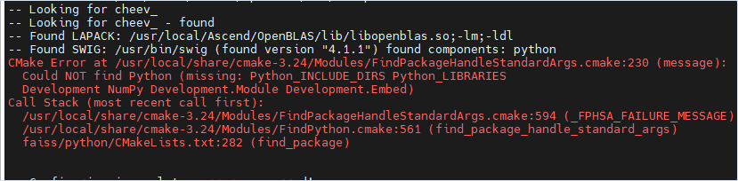
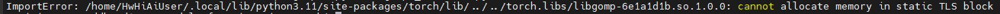
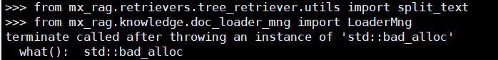

# FAQ

## Common Installation Issues

### Errors Encountered on Kylin V10

**Symptom**

On the Kylin V10 operating system, you encounter issues such as failing to install `ascendfaiss`.

**Cause**

The dependencies are not installed correctly.

**Solution**

Install the dependencies as follows:

```bash
# Upgrade SWIG
tar -xzvf swig-4.0.2.tar.gz
cd swig-4.0.2
./configure --prefix=/usr/local/share
make && make install
# Install Python 3.10 or Python 3.11. The following example uses Python 3.10.14
# First, download and install Python 3.10.14 from the official website
tar zxvf Python-3.10.14.tgz
cd Python-3.10.14
./configure --prefix=/usr/local
make && make install
echo 'export PATH=/usr/local/python3.10.14/bin:$PATH' >> /etc/profile
source /etc/profile
# Install OpenBLAS
git clone https://github.com/xianyi/OpenBLAS.git
cd OpenBLAS && make -j8 && make install
export LD_LIBRARY_PATH=/opt/OpenBLAS/lib:$LD_LIBRARY_PATH
```

### openEuler Repository Configuration

1. Create a Yum repository configuration file.

    ```bash
    vim /etc/yum.repos.d/openEuler.repo
    ```

    The content is as follows:

    ```bash
    [openEuler]
    name=openEuler repository
    baseurl=https://mirrors.aliyun.com/openeuler/openEuler-24.03-LTS/OS/x86_64/
    gpgcheck=1
    enabled=1
    gpgkey=https://repo.openeuler.org/openEuler-24.03-LTS/OS/x86_64/RPM-GPG-KEY-openEuler
    ```

2. Update the Yum cache.

    ```bash
    yum makecache
    ```

### CMake Error When You Build Faiss 1.10.0

**Symptom**

When you build Faiss 1.10.0, an error appears that says `CMake 3.24.0 or higher is required`.

**Cause**

The current CMake version is too low. Faiss 1.10.0 requires CMake 3.24.0 or later.

**Solution**

Install CMake 3.24.0 or later. The following example uses CMake 3.24.0.

- x86 environment:
    1. Obtain the CMake installation script.

        ```bash
        wget https://github.com/Kitware/CMake/releases/download/v3.24.0/cmake-3.24.0-linux-x86_64.sh
        ```

    2. Run the installation script.

        ```bash
        bash ./cmake-3.24.0-linux-x86_64.sh --skip-license --prefix=/usr
        ```

        ```bash
        # During installation:
        # Option 1
        Do you accept the license? [y/n]:
        # Enter y
        # Option 2
        By default the CMake will be installed in:
          "/usr/cmake-3.24.0-linux-x86_64"
        Do you want to include the subdirectory cmake-3.24.0-linux-x86_64?
        Saying no will install in: "/usr" [Y/n]:
        # Enter n
        ```

    3. Check the CMake version.

        ```bash
        cmake --version
        ```

        The current CMake version is displayed as follows:

        ```text
        cmake version 3.24.0
        ```

- AArch64 environment:
    1. Obtain the CMake installation script.

        ```bash
        wget https://github.com/Kitware/CMake/releases/download/v3.24.0/cmake-3.24.0-linux-aarch64.sh
        ```

    2. Run the installation script.

        ```bash
        bash ./cmake-3.24.0-linux-aarch64.sh --skip-license --prefix=/usr
        ```

        ```bash
        # During installation:
        # Option 1
        Do you accept the license? [y/n]:
        # Enter y
        # Option 2
        By default the CMake will be installed in:
          "/usr/cmake-3.24.0-linux-aarch64"
        Do you want to include the subdirectory cmake-3.24.0-linux-aarch64?
        Saying no will install in: "/usr" [Y/n]:
        # Enter n
        ```

    3. Check the CMake version.

        ```bash
        cmake --version
        ```

        The current CMake version is displayed as follows:

        ```text
        cmake version 3.24.0
        ```

### Python Error When You Build and Install `ascendfaiss`

**Symptom**

When you build and install `ascendfaiss`, the following error appears.



**Cause**

When you build and install Python from source, you do not set the `--enable-shared` parameter.

`--enable-shared`: Keeps the shared library generated earlier.

**Solution**

Rebuild and install Python. The following example shows the build parameters.

```bash
./configure --prefix=/usr/local/python3.11.11 --enable-shared
```

## Common Runtime Issues

### `cannot allocate memory in static TLS block`

**Symptom**

Import error example: `ImportError: xxxxx cannot allocate memory in static TLS block`.



**Cause**

Different components report a conflict when they reference a `.so` file.

**Solution**

1. Add the following content to the first line of the running demo or sample code.

    ```python
    from paddle.base import libpaddle
    ```

2. Retry. If the issue still persists, add the full path of the `.so` file mentioned in the error to the `LD_PRELOAD` environment variable. Note that there may be multiple entries. The following example uses `xxxx` to represent the path of the faulty `.so` file.

    ```bash
    export LD_PRELOAD=xxxx:$LD_PRELOAD
    ```

### `std::bad_alloc` Error During Runtime

**Symptom**

The following error appears when Python imports a package.



**Cause**

Different components report a conflict when they reference `libgomp`.

**Solution**

Add the following content to the first line of the running demo or sample code.

```python
from paddle.base import libpaddle
```

### `corrupted size vs. prev_size` or Segmentation Fault During Runtime

**Symptom**

After the run completes, the following error appears: `corrupted size vs. prev_size` or `Segmentation fault`.

**Cause**

This may happen because another component in the user business process uses `acl` resources and calls `aclFinalize` to release them. As a result, the `acl` resources are released twice.

**Solution**

- Solution 1

    Set the `MX_INDEX_FINALIZE` environment variable to `0` so that Index SDK does not call `aclFinalize`. Set it to `1` to keep calling `aclFinalize`. Any other value is invalid.

    Ensure that the installed Index SDK version matches the compatible version, and add the environment variable as follows:

    ```bash
    export MX_INDEX_FINALIZE=0
    ```

- Solution 2

    If Solution 1 does not work, remove `from paddle.base import libpaddle`, and then adjust the import order. If you import packages related to `mx_rag.retrievers` or `mx_rag.storage` together with packages related to `mx_rag.document` or `mx_rag.knowledge`, import the latter first.

### Only One Line of Exception Information Is Printed in the Stack Trace When an Exception Is Raised

**Symptom**

When an exception is raised, the stack trace prints only one line of exception information.

**Cause**

The current default traceback limit is set to `0`, which means only the top of the stack is printed.

```text
sys.tracebacklimit = 0
```

**Solution**

In the running demo or at the call site, import the `mx_rag` package, and then add the following configuration:

```python
import mx_rag
import sys
# Add the following after importing mx_rag or its submodules:
sys.tracebacklimit = 1000
```

> [!NOTE]
> Printing stack traces may also print parameters from the call site. Those parameters may contain sensitive information, so inspect them carefully.
