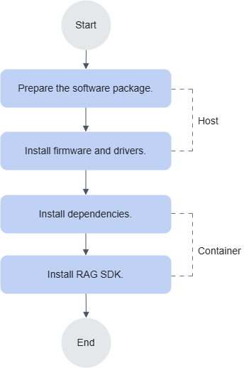
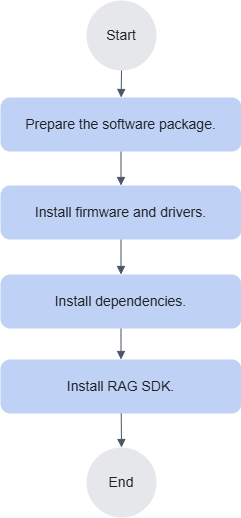

# Installation and Deployment

## Installation Instructions

RAG SDK supports two installation methods: deployment in a container and deployment on a physical machine.

- The container deployment process is shown in [Figure 1](#fig66411525144113). For details, see [Deploying RAG SDK in a Container](./installation_guide.md#deploying-rag-sdk-in-a-container).
- The physical machine deployment process is shown in [Figure 2](#fig188855012335). For details, see [Deploying RAG SDK on a Physical Machine](./installation_guide.md#deploying-rag-sdk-on-a-physical-machine).

**Figure 1** RAG SDK container deployment process<a id="fig66411525144113"></a>


**Figure 2** RAG SDK physical machine deployment process<a id="fig188855012335"></a>


## Getting RAG SDK Package

**Getting the Package**

Refer to this chapter to obtain the required package and the corresponding digital signature file. Downloading this software indicates that you agree to the terms and conditions of the [Huawei Enterprise Business End User License Agreement (EULA)](https://e.huawei.com/cn/about/eula).

|Component|Package|Download Link|
|--|--|--|
|RAG SDK|Retrieval-augmented package|[Download link](https://www.hiascend.com/zh/developer/download/community/result?module=sdk+cann)|

> [!NOTE]
>The container already includes RAG SDK. If you need to update it, see [Upgrade](#upgrading).

**Software Digital Signature Verification**

To prevent malicious tampering during transmission or storage, download the corresponding digital signature file when you download the package and use it for integrity verification.

After you download the package, refer to the OpenPGP Signature Verification Guide to verify the PGP digital signature of the downloaded package. If the verification fails, do not use the package. Contact Huawei technical support engineers for assistance.

Before you install or upgrade the package, verify the digital signature of the package in the same way to ensure that the package has not been tampered with.

Carrier customers, visit: [https://support.huawei.com/carrier/digitalSignatureAction](https://support.huawei.com/carrier/digitalSignatureAction)

Enterprise customers, visit: [https://support.huawei.com/enterprise/zh/tool/software-digital-signature-openpgp-validation-tool-TL1000000054](https://support.huawei.com/enterprise/zh/tool/software-digital-signature-openpgp-validation-tool-TL1000000054)

## Installing Dependencies

To ensure that RAG SDK works correctly, install the required dependencies.

- If you deploy RAG SDK on a physical machine, install all dependency packages listed in [Table 1](#table285894914124).
- If you deploy RAG SDK in a container, install the `npu-driver` driver package, the `npu-firmware` firmware package, and Ascend Docker Runtime on the host machine, and start the MindIE inference service. For other operations, see [Deploying RAG SDK in a Container](#deploying-rag-sdk-in-a-container).

**Installing Dependencies**

1. Install the NPU driver and firmware. For detailed steps, see the "Installing the NPU Driver and Firmware" chapter in the CANN Software Installation Guide for the commercial edition or the "Installing the NPU Driver and Firmware" chapter for the community edition. To allow non-root users to use the driver, add the `--install-for-all` option when you install the driver.
2. Install CANN Toolkit, `ops`, and the NNAL acceleration library. For detailed steps, see the "Installing Dependencies" and "Installing the CANN Software Package" chapters in the CANN Software Installation Guide. If you deploy RAG SDK with an AscendHub image, you do not need to perform this step.
3. Install and run the large model for inference. For detailed steps, see the "Method 3: Container Installation" and "Configure Server" chapters in the MindIE Installation Guide.
4. Install Ascend Docker Runtime. For detailed steps, see the "Installing > Installation and Deployment" chapter in the MindCluster Cluster Scheduling User Guide.

**Downloading Dependency Packages**

**Table 1** Ascend software dependencies
<a id="table285894914124"></a>

<table>
<tr>
<th>Short Package Name</th>
<th>Full Package Name</th>
<th>Matching Version</th>
<th>Download Link</th>
</tr>

<tr>
<td>CANN package</td>
<td>Ascend-cann-toolkit_&lt;version&gt;_linux-&lt;arch&gt;.run</td>
<td rowspan="3">9.0.0</td>
<td rowspan="3">Commercial edition: <a href="https://www.hiascend.com/developer/download/commercial/result?module=cann">Download link</a><br>Community edition: <a href="https://www.hiascend.com/developer/download/commercial/result?module=cann">Download link</a></td>
</tr>
<tr>
<td>CANN operator package <code>ops</code></td>
<td>Ascend-cann-&lt;chip_type&gt;-ops_&lt;version&gt;_linux-&lt;arch&gt;.run</td>
</tr>
<tr>
<td>NNAL acceleration library (optional)</td>
<td>Ascend-cann-nnal_&lt;version&gt;_linux-&lt;arch&gt;.run</td>
</tr>
<tr>
<td>npu-driver driver package</td>
<td>Ascend-hdk-&lt;chip_type&gt;-npu-driver_&lt;version&gt;_linux-&lt;arch&gt;.run</td>
<td rowspan="2">26.0.RC1</td>
<td rowspan="2">Commercial edition: <a href="https://www.hiascend.com/zh/hardware/firmware-drivers/commercial">Download link</a><br>Community edition: <a href="https://www.hiascend.com/hardware/firmware-drivers?tag=community">Download link</a></td>
</tr>
<tr>
<td>npu-firmware firmware package</td>
<td>Ascend-hdk-&lt;chip_type&gt;-npu-firmware_&lt;version&gt;.run</td>
</tr>
<tr>
<td>Index SDK retrieval package</td>
<td>Ascend-mindxsdk-mxindex_&lt;version&gt;_linux-&lt;arch&gt;.run</td>
<td>26.0.0</td>
<td><a href="https://www.hiascend.com/zh/developer/download/community/result?module=sdk+cann">Download link</a></td>
</tr>
<tr>
<td>MindIE inference engine package</td>
<td>Ascend-mindie_&lt;version&gt;_linux-&lt;arch&gt;.run</td>
<td>2.3.0</td>
<td><a href="https://www.hiascend.com/developer/download/community/result?module=ie%2Bpt%2Bcann">Download link</a></td>
</tr>
<tr>
<td>Ascend Docker Runtime</td>
<td>Ascend-docker-runtime_&lt;version&gt;_linux-&lt;arch&gt;.run</td>
<td>26.0.0</td>
<td><a href="https://gitcode.com/Ascend/mind-cluster/releases">Download link</a></td>
</tr>
<tr>
<td>Python</td>
<td>-</td>
<td>3.11/3.12</td>
<td>Obtain the dependency software from the <a href="https://gitcode.com/Ascend/mind-cluster/releases">Python official website</a>.</td>
</tr>
</table>

> [!NOTE]
>
>- `<version>` indicates the software version number.
>- `<arch>` indicates the CPU architecture.
>- `<chip_type>` indicates the chip type. You can run the `npu-smi info` command on a server with an Ascend AI processor installed to check this value. Remove the last digit from the displayed "Name" value, and use the result as the value of `<chip_type>`.
>- To allow non-root users to use the driver, add the `--install-for-all` option when you install `npu-driver`.
>- For open-source and third-party software integrated by the user, check vulnerabilities and issues by yourself and remediate them in time. You can confirm known vulnerabilities in the corresponding open-source software version on the [CVE website](https://cve.mitre.org/cve/search_cve_list.html), and remediate them by upgrading versions or applying patch packages.

## Installing RAG SDK

### Deploying RAG SDK in a Container

This section guides you through deploying RAG SDK in a container.

Users who run RAG SDK in a container are advised to use a non-root account. RAG SDK supports only containers built from an Ubuntu base image.

RAG SDK is already installed in the image downloaded from the [Ascend image repository](https://www.hiascend.com/developer/ascendhub/detail/b875f781df984480b0385a96fa1b03c9). If you need to update it, uninstall it first and then install it again. For details, see [Upgrade](#upgrading).

**Preparation before Installation**

- You have installed the required dependencies according to [Install dependencies](#installing-dependencies).
- Before you configure the package source, ensure that the installation environment can connect to the network.

**Procedure**

1. Obtain a base image.
    - You are advised to obtain RAG SDK image from the Ascend image repository. The steps are as follows:
        1. Go to the [Ascend image repository](https://www.hiascend.com/developer/ascendhub/detail/b875f781df984480b0385a96fa1b03c9).
        2. Click the "Image Versions" tab.
        3. Click "Download Now" for the required version and follow the page instructions to download it.

    - If you do not obtain the base image from the Ascend image repository, prepare an image by yourself. The steps are as follows:
        1. Obtain the [Dockerfile for the required version](https://gitcode.com/Ascend/RAGSDK/tree/branch_v26.1.0/docker).
        2. Refer to [Dockerfile Usage Guide](https://gitcode.com/Ascend/RAGSDK/blob/branch_v26.1.0/docker/OVERVIEW.md) to build RAG SDK image.

2. Run RAG SDK.
    1. Run the following command to start RAG SDK container.

        ```bash
        docker run -e ASCEND_VISIBLE_DEVICES=<device_id>  -itd --name <mxrag_demo> -p <port>:<port> -v <model_dir>:<model_dir>:ro <image_name>:<image_tag> bash
        ```

        > [!NOTE]
        >- `<device_id>`: indicates the NPU device ID. The default starts from 0. If there are multiple IDs, separate them with a comma. Each container can exclusively use only one NPU card. Otherwise, an error occurs. You can query the IDs by running the `ls /dev/davinci\* |grep -v /dev/davinci_manager |tr -d /dev/davinci` command.
        >- `<mxrag_demo>`: indicates the container name after startup. The default value is `mxrag_demo`.
        >- `<port>`: indicates the port to map.
        >- `<model_dir>`: indicates the parent directory that stores the models used by RAG SDK, such as `/home/data`.
        >- When you use the clip vector model acceleration on an Atlas 800I A2 device, add the `--device=/dev/dvpp_cmdlist:/dev/dvpp_cmdlist:rw` parameter to support DVPP image preprocessing. Ensure that the container user has access to `/dev/dvpp_cmdlist`.

    2. Enter the container.

        ```bash
        docker exec -it <mxrag_demo> bash
        ```

    3. Run the `npu-smi info` command to check whether the driver is mounted correctly.

        When the value of the `Health` parameter is `OK`, the current chip is healthy. The following output is only an example. Use the actual query result.

        ```text
        +--------------------------------------------------------------------------------------------------------+
        | npu-smi 24.1.rc2                            Version: 24.1.rc2                                          |
        +-------------------------------+-----------------+------------------------------------------------------+
        | NPU     Name                  | Health          | Power(W)     Temp(C)           Hugepages-Usage(page) |
        | Chip    Device                | Bus-Id          | AICore(%)    Memory-Usage(MB)                        |
        +===============================+=================+======================================================+
        | 7       xxx                 | OK              | NA           44                0     / 0             |
        | 0       0                     | 0000:83:00.0    | 0            1851 / 21527                            |
        +===============================+=================+======================================================+
        | 8       xxx                 | OK              | NA           44                0     / 0             |
        | 0       1                     | 0000:84:00.0    | 0            1852 / 21527                            |
        +===============================+=================+======================================================+
        +-------------------------------+-----------------+------------------------------------------------------+
        | NPU     Chip                  | Process id      | Process name             | Process memory(MB)        |
        +===============================+=================+======================================================+
        | No running processes found in NPU 7                                                                    |
        +===============================+=================+======================================================+
        | No running processes found in NPU 8                                                                    |
        +===============================+=================+======================================================+
        ```

### Deploying RAG SDK on a Physical Machine

This section guides you through deploying RAG SDK on a physical machine on Ubuntu 20.04 live server or Huawei Cloud EulerOS 2.0.

- Ensure that you have installed the required dependencies according to [Install dependencies](#installing-dependencies).
- The user who installs RAG SDK and the user who installs CANN must be the same user.

**Preparation before Installation**

- On Ubuntu 20.04 live server, ensure that Python 3.11, `libpq-dev`, and `cmake` are installed on the system. The minimum version of `cmake` is 3.24.3. The following describes how to install `libpq-dev` and Python:

    ```bash
    # Install libpq-dev, which psycopg2 requires
    apt install -y libpq-dev
    # Set PY_VERSION to python3.11
    export PY_VERSION=python3.11
    # Add the Python PPA
    add-apt-repository -y ppa:deadsnakes/ppa && apt-get update
    # Install Python
    apt-get install -y --no-install-recommends $PY_VERSION $PY_VERSION-dev $PY_VERSION-distutils $PY_VERSION-venv
    # Set the default python
    ln -sf /usr/bin/$PY_VERSION /usr/bin/python3
    ln -sf /usr/bin/$PY_VERSION /usr/bin/python
    # Install pip
    curl https://bootstrap.pypa.io/get-pip.py -o get-pip.py
    python3 get-pip.py
    python3 -m pip install --upgrade setuptools
    ```

- On Huawei Cloud EulerOS 2.0, install Python and dependency packages as follows. Ensure that the system yum repository contains python3.11. For configuration details, refer to the official repository configuration in [HCE REPO Source Configuration and Software Installation](https://support.huaweicloud.com/usermanual-hce/hce_repo.html) and [13.12 openEuler REPO Source Configuration](./faq.md#openeuler-repository-configuration).

    ```bash
    yum update
    yum install python3.11
    yum install cmake swig postgresql-devel patch mesa-libGL
    ```

**Procedure**

1. Switch to the user `HwHiAiUser` and go to the `“/home/HwHiAiUser”` directory.
2. Install `torch` and `torch-npu`.

    ```bash
    # For x86, install torch:
    pip3 install torch==2.1.0+cpu  --index-url [https://download.pytorch.org/whl/cpu](https://download.pytorch.org/whl/cpu)
    # For aarch64, install torch:
    pip3 install torch==2.1.0
    # For all platforms, install torch-npu
    pip3 install torch-npu==2.1.0.post12
    ```

3. Install `torchvision-npu`.

    ```bash
    # Download the Torchvision Adapter code and enter the plugin root directory
    git clone https://gitee.com/ascend/vision.git vision_npu
    cd vision_npu
    git checkout v0.16.0-6.0.0
    # Install dependency libraries
    pip3 install -r requirements.txt
    # Configure CANN environment variables
    source /usr/local/Ascend/ascend-toolkit/set_env.sh
    # Build the installation package
    python3 setup.py bdist_wheel
    # Install it
    cd dist
    pip3 install torchvision_npu-*.whl
    ```

4. Install OpenBLAS.
    1. Download the OpenBLAS v0.3.10 source archive and extract it.

        ```bash
        wget https://github.com/xianyi/OpenBLAS/archive/v0.3.10.tar.gz -O OpenBLAS-0.3.10.tar.gz
        tar -xf OpenBLAS-0.3.10.tar.gz
        ```

    2. Go to the OpenBLAS directory.

        ```bash
        cd OpenBLAS-0.3.10
        ```

    3. Build and install it.

        ```bash
        make FC=gfortran USE_OPENMP=1 -j
        # Specify the installation directory
        make PREFIX=/usr/local/Ascend/OpenBLAS install
        ```

    4. Configure the environment variables for the library path.

        ```bash
        vim ~/.bashrc
        # Add the following information to the end of the file
        export LD_LIBRARY_PATH=/usr/local/Ascend/OpenBLAS/lib:$LD_LIBRARY_PATH
        ```

    5. Verify whether the installation is successful.

        ```bash
        cat /usr/local/Ascend/OpenBLAS/lib/cmake/openblas/OpenBLASConfigVersion.cmake | grep 'PACKAGE_VERSION "'
        ```

        If the software version information is displayed correctly, the installation is successful.

5. Download the Faiss source code, build the Faiss wheel package, and install it.

    > [!NOTE]
    >The Faiss package is also installed when you install the Index SDK dependencies, but only `libfaiss.so` is built. You still need to build and install the Faiss wheel package so that you can use Faiss in Python.

    1. Download the Faiss source package and extract it.

        ```bash
        # faiss 1.10.0
        wget https://github.com/facebookresearch/faiss/archive/v1.10.0.tar.gz
        tar -xf v1.10.0.tar.gz && cd faiss-1.10.0/faiss
        ```

    2. Create the `install_faiss.sh` script.

        ```bash
        vi install_faiss.sh
        ```

    3. Add the following content to the `install_faiss.sh` script.

        ```bash
        export FAISS_INSTALL_PATH=/usr/local/faiss/faiss1.10.0
        # After installation, faiss may be placed in ${FAISS_INSTALL_PATH}/lib or ${FAISS_INSTALL_PATH}/lib64, depending on the operating system
        export FAISS_INSTALL_PATH_LIB=${FAISS_INSTALL_PATH}/lib
        mkdir -p ${FAISS_INSTALL_PATH}
        sed -i "149 i virtual void search_with_filter (idx_t n, const float *x, idx_t k, float *distances, idx_t *labels, const void *mask = nullptr) const{}" Index.h
        sed -i "49 i template <typename IndexT> IndexIDMapTemplate<IndexT>::IndexIDMapTemplate (IndexT *index, std::vector<idx_t> &ids): index (index), own_fields (false) { this->is_trained = index->is_trained; this->metric_type = index->metric_type; this->verbose = index->verbose; this->d = index->d; id_map = ids; }" IndexIDMap.cpp
        sed -i "30 i explicit IndexIDMapTemplate (IndexT *index, std::vector<idx_t> &ids);" IndexIDMap.h
        sed -i "217 i utils/sorting.h" CMakeLists.txt
        cd .. && cmake -B build . -DFAISS_ENABLE_GPU=OFF -DPython_EXECUTABLE=/usr/bin/python3 -DBUILD_TESTING=OFF -DBUILD_SHARED_LIBS=ON -DCMAKE_BUILD_TYPE=Release -DCMAKE_INSTALL_PREFIX=${FAISS_INSTALL_PATH}
        make -C build -j faiss
        make -C build -j swigfaiss
        # If wheel is missing, install it with pip
        cd build/faiss/python && python3 setup.py bdist_wheel
        cd ../../.. && make -C build install
        cd build/faiss/python && cp libfaiss_python_callbacks.so ${FAISS_INSTALL_PATH_LIB}/
        cd dist
        # This operation may upgrade numpy to version 2.x.x. If that happens, roll it back to 1.26.4
        pip3 install faiss-1.10.0*.whl
        ```

    4. Press `Esc`, type `:wq!`, and press `Enter` to save and exit the editor.
    5. Run the `install_faiss.sh` script to install Faiss.

        ```bash
        bash install_faiss.sh
        ```

        > [!NOTE]
        >- If an error indicates that `wheel` is missing, install it with pip.
        >- After Faiss is installed, numpy may be upgraded to version 2.x.x. If that happens, roll it back to 1.26.4.

6. Install the Index SDK.
    1. Grant execute permissions to the package.

        ```bash
        chmod +x Ascend-mindxsdk-mxindex_{version}_linux-{arch}.run
        ```

    2. Run the following command to verify the package consistency and integrity.

        ```bash
        ./Ascend-mindxsdk-mxindex_{version}_linux-{arch}.run --check
        ```

        If the following information is displayed, the package passes verification.

        ```ColdFusion
        Verifying archive integrity...  100%   SHA256 checksums are OK. All good.
        ```

    3. Create the installation directory for the package.
        - **If the user does not specify an installation path**, the software is installed to `/usr/local/Ascend/mxIndex` by default.

            ```bash
            mkdir -p /usr/local/Ascend/mxIndex
            ```

    4. Install the Index SDK.

        ```bash
        ./Ascend-mindxsdk-mxindex_7.2.RC1_linux-aarch64.run --install --install-path=<installation_path> --platform=<npu_type>
        ```

        If you need to install it in a specified directory, set `<installation_path>` to the directory created in the previous step. When the installer prompts `Do you accept the EULA to install RAG SDK? [Y/N]`, enter `Y` or `y` to accept the EULA and continue the installation. If you enter any other character, the installation stops and the program exits.

        If the following output is displayed, the software is installed successfully.

        ```ColdFusion
        Uncompressing ASCEND MXINDEX RUN PACKAGE  100%
        ```

    5. Run the Index SDK script after the installation.

        ```bash
        cd <installation_path>/mxIndex/ops && ./custom_opp_{arch}.run
        ```

7. Download and install ascendfaiss.
    1. Download the source package and extract it.

        ```bash
        wget https://gitee.com/ascend/mindsdk-referenceapps/repository/archive/master.zip
        unzip master.zip && cd mindsdk-referenceapps-master/IndexSDK/faiss-python
        ```

    2. Create the `install_ascendfaiss.sh` script.

        ```bash
        vi install_ascendfaiss.sh
        ```

    3. Add the following content to the `install_ascendfaiss.sh` script.

        ```bash
        # Set the following environment variables
        export PY_VERSION=python3.11
        export FAISS_INSTALL_PATH=/usr/local/faiss/faiss1.10.0
        # After installation, faiss may be placed in ${FAISS_INSTALL_PATH}/lib or ${FAISS_INSTALL_PATH}/lib64, depending on the operating system
        export FAISS_INSTALL_PATH_LIB=${FAISS_INSTALL_PATH}/lib
        export INDEXSDK_INSTALL_PATH=/usr/local/Ascend/mxIndex
        export PYTHON_HEADER=/usr/include/$PY_VERSION/
        export ASCEND_INSTALL_PATH=/usr/local/Ascend/ascend-toolkit/latest
        export DRIVER_INSTALL_PATH=/usr/local/Ascend/
        export OPENBLAS_INSTALL_PATH=/usr/local/Ascend/OpenBLAS
        export NUMPY_INCLUDE=$(python3 -c "import numpy; print(numpy.get_include())")
        swig -python -c++ -Doverride= -module swig_ascendfaiss -I${PYTHON_HEADER} -I${FAISS_INSTALL_PATH}/include -I${INDEXSDK_INSTALL_PATH}/include -DSWIGWORDSIZE64 -o swig_ascendfaiss.cpp swig_ascendfaiss.swig

        g++ -std=c++11 -DFINTEGER=int -fopenmp -I/usr/local/include -I${ASCEND_INSTALL_PATH}/acllib/include -I${ASCEND_INSTALL_PATH}/runtime/include -fPIC -fstack-protector-all -Wall -Wreturn-type -D_FORTIFY_SOURCE=2 -g -O3 -Wall -Wextra -I${PYTHON_HEADER} -I${NUMPY_INCLUDE} -I${FAISS_INSTALL_PATH}/include -I${INDEXSDK_INSTALL_PATH}/include -c swig_ascendfaiss.cpp -o swig_ascendfaiss.o

        g++ -std=c++11 -shared -fopenmp -L${ASCEND_INSTALL_PATH}/lib64 -L${ASCEND_INSTALL_PATH}/acllib/lib64 -L${ASCEND_INSTALL_PATH}/runtime/lib64 -L${DRIVER_INSTALL_PATH}/driver/lib64 -L${DRIVER_INSTALL_PATH}/driver/lib64/common -L${DRIVER_INSTALL_PATH}/driver/lib64/driver -L${FAISS_INSTALL_PATH_LIB} -L${INDEXSDK_INSTALL_PATH}/lib -Wl,-rpath-link=${ASCEND_INSTALL_PATH}/acllib/lib64:${ASCEND_INSTALL_PATH}/runtime/lib64:${DRIVER_INSTALL_PATH}/driver/lib64:${DRIVER_INSTALL_PATH}/driver/lib64/common:${DRIVER_INSTALL_PATH}/driver/lib64/driver -L/usr/local/lib -Wl,-z,relro -Wl,-z,now -Wl,-z,noexecstack -s -o _swig_ascendfaiss.so swig_ascendfaiss.o -L.. -lascendfaiss -lfaiss -lascend_hal -lc_sec

        # If build is missing, install it with pip
        python3 -m build
        # This operation may upgrade numpy to version 2.x.x. If that happens, roll it back to 1.26.4
        cd dist && pip3 install ascendfaiss*.whl
        export LD_LIBRARY_PATH=${INDEXSDK_INSTALL_PATH}/lib:${FAISS_INSTALL_PATH}/lib:$LD_LIBRARY_PATH
        ```

    4. Press `Esc`, type `:wq!`, and press `Enter` to save and exit the editor.
    5. Run the `install_ascendfaiss.sh` script to install `ascendfaiss`.

        ```bash
        bash install_ascendfaiss.sh
        ```

8. Install RAG SDK.

    ```bash
    bash  Ascend-mindxsdk-mxrag_<version>_linux-<arch>.run --install --install-path=<installation_path> --platform=<npu_type>
    # Install third-party dependency packages
    pip3 install  rank_bm25==0.2.2 langchain-opengauss==0.1.5
    # Install dependency packages
    pip3 install -r <installation_path>/mxRag/requirements.txt
    ```

    If the following output is displayed, the software is installed successfully.

    ```ColdFusion
    Install package successfully
    ```

    The `--install` command also supports the optional parameters listed in [Table 1](#table7138521890). If you enter a parameter that is not listed, the installation may still succeed or an error may occur.

    > [!NOTICE]
    >If the parameters returned by the `./{run_file_name}.run --help` command are not explained in the following table, the parameters are reserved or apply to other processor versions. You do not need to pay attention to them.

    **Table 1** Parameters Supported by the Installation Package
    <a id="table7138521890"></a>

    | Input Parameter | Description |
    | --- | --- |
    | --help &#124; -h | Query help information. |
    | --info | Query package build information. |
    | --list | Query the file list. |
    | --check | Query package integrity. |
    | --quiet&#124;-q | Perform a silent operation to reduce interactive output. |
    | --nox11 | Deprecated interface. It has no practical effect. |
    | --noexec | Extract the package to the current directory without running the installation script. Use it together with `--extract=<path>`, in the format `--noexec --extract=<path>`. |
    | --extract=\<path> | Extract files in the package to the specified directory. You can use this parameter with `--noexec`, `--install`, or `--upgrade`. |
    | --tar arg1 [arg2 ...] | Run the `tar` command on the package and use the arguments after `tar` as command arguments. For example, run the `--tar xvf` command to extract the contents of the `.run` installation package to the current directory. |
    | --version | Query RAG SDK version of the installation package. |
    | --install | Package installation command. |
    | --install-path=\<path> | Optional. Custom root directory for RAG SDK package installation. If this parameter is not set, the current command directory is used by default. The path must start with `/` or `~`. Valid characters are `-_.0-9a-zA-Z/`, and the path cannot contain `..`. The length must not exceed 1024. <br>If you do not specify this parameter, the package is installed to the default path. <br>- If you install the package as the root user, the default installation path is `/usr/local/Ascend`. <br>- If you install the package as a non-root user, the default installation path is `${HOME}/Ascend`. <br>If you specify an installation directory with this parameter, the `other` user must not have write permissions on that directory. If you install the package as a normal user, the installation directory owner must be the current installing user. |
    | --upgrade | Package upgrade command. It upgrades RAG SDK to the version included in the installation package. |
    | --platform | Optional. Corresponds to the Ascend AI processor type. <br>Run the `npu-smi info` command on a server with an Ascend AI processor installed to query it. Remove the last digit from the displayed "Name" value, and use the result as the value of `--platform`. <br>If the server is an Atlas 800I A3 super-node server, the value is `A3`. |
    | --whitelist | Optional. Installs a whitelist feature module. The value can be `operator` or `whl`. To install multiple feature modules, separate them with commas. If you do not set this parameter, all feature modules are installed. <br>`operator`: Installs the inference acceleration operator module. <br>`whl`: Installs RAG SDK function module, including knowledge base management, vectorization, and cache. |

    > [!NOTE]
    >The following parameters are not shown in the `--help` output. Do not use them directly.
    >- `-xwin`: Uses xwin mode.
    >- `-phase2`: Requires the second step action.

9. Set RAG SDK runtime environment variables.
    1. Open `~/.bashrc` with `vim` and add the following content to the end of the file.

        ```bash
        export MX_INDEX_FINALIZE=0
        export PY_VERSION=python3.11
        export LOGURU_FORMAT='<green>{time:YYYY-MM-DD HH:mm:ss.SSS}</green> | <level>{level: <8}</level> | <cyan>{name}</cyan>:<cyan>{function}</cyan>:<cyan>{line}</cyan> - <level>{message!r}</level>'
        export MX_INDEX_MODELPATH=/home/ascend/modelpath
        # Set the Index SDK installation path. If you do not use the default installation path, modify this value according to the actual path
        export MX_INDEX_INSTALL_PATH=/usr/local/Ascend/mxIndex
        export MX_INDEX_MULTITHREAD=1
        export ASCEND_HOME=/usr/local/Ascend
        export ASCEND_VERSION=/usr/local/Ascend/ascend-toolkit/latest
        export LD_LIBRARY_PATH=/usr/local/Ascend/mxIndex/lib:/usr/local/faiss/faiss1.10.0/lib:/usr/local/Ascend/OpenBLAS/lib:$LD_LIBRARY_PATH
        export LD_PRELOAD=\$(find \$(python3 -c "import sklearn; print(sklearn.__path__[0])")/../scikit_learn.libs -name "libgomp-*" | head -1):\$LD_PRELOAD
        export PATH=/usr/local/bin:$PATH
        source /usr/local/Ascend/ascend-toolkit/set_env.sh
        source /usr/local/Ascend/nnal/atb/set_env.sh
        source /usr/local/Ascend/mxRag/script/set_env.sh
        ```

    2. After you save and exit, run the following command to activate the environment.

        ```bash
        source ~/.bashrc
        ```

> [!NOTE]
> An error may occur when you install RAG SDK.
> `ERROR: Cannot uninstall 'xxx'. It is a distutils installed project and thus we cannot accurately determine which files belong to it which would lead to only a partial uninstall.`
> This indicates that `xxx` is a component that comes with the operating system and cannot be upgraded directly. You can try running the installation command again.
> `pip3 install -r requirements.txt --ignore-installed`

**Checking the Runtime Environment**

Run the `npu-smi info` command to check whether the driver is mounted correctly.

When the value of the `Health` parameter is `OK`, the current chip is healthy. The following output is only an example. Use the actual query result.

```text
+--------------------------------------------------------------------------------------------------------+
| npu-smi 24.1.rc2                            Version: 24.1.rc2                                          |
+-------------------------------+-----------------+------------------------------------------------------+
| NPU     Name                  | Health          | Power(W)     Temp(C)           Hugepages-Usage(page) |
| Chip    Device                | Bus-Id          | AICore(%)    Memory-Usage(MB)                        |
+===============================+=================+======================================================+
| 7       xxx                 | OK              | NA           44                0     / 0             |
| 0       0                     | 0000:83:00.0    | 0            1851 / 21527                            |
+===============================+=================+======================================================+
| 8       xxx                 | OK              | NA           44                0     / 0             |
| 0       1                     | 0000:84:00.0    | 0            1852 / 21527                            |
+===============================+=================+======================================================+
+-------------------------------+-----------------+------------------------------------------------------+
| NPU     Chip                  | Process id      | Process name             | Process memory(MB)        |
+===============================+=================+======================================================+
| No running processes found in NPU 7                                                                    |
+===============================+=================+======================================================+
| No running processes found in NPU 8                                                                    |
+===============================+=================+======================================================+
```

# Upgrading

**Notes**

The upgrade operation uninstalls the current installation and then reinstalls it in the installation directory. If other files exist in the directory, they are deleted as well. Before you perform the upgrade, ensure that all data has been handled properly.

**Procedure**

If you need to upgrade the current version of RAG SDK to the latest version, upload the latest RAG SDK package to the installation environment and then run the command in the directory that contains the package. For details, see the following command.

1. Use the `--upgrade` command to upgrade.

    ```bash
    bash Ascend-mindxsdk-mxrag_<version>_linux-<arch>.run --upgrade --install-path=<installation_path> --platform=<npu_type>
    ```

    `<version>` is the version number, `<arch>` is the operating system architecture, and `<npu_type>` is the chip type.

    **Table 1** Parameter Names and Descriptions

    | Parameter Name | Parameter Description |
    | --- | --- |
    | --upgrade | Package upgrade command. It upgrades RAG SDK to the version included in the installation package. |
    | --platform | Corresponds to the Ascend AI processor type. <br>Run the `npu-smi info` command on a server with an Ascend AI processor installed to query it. Remove the last digit from the displayed "Name" value, and use the result as the value of `--platform`. <br>If the server is an Atlas 800I A3 super-node server, the value is `A3`. |
    | --install-path | Optional. Custom root directory for the package installation. If this parameter is not set, the current command directory is used by default. The path must start with `/` or `~`. Valid characters are `a-zA-Z0-9_/-`. <br>If you use a custom installation directory, you are advised to specify this parameter during the upgrade. <br>Ensure that RAG SDK is already installed in the specified path. |
    | --quiet | Performs a silent operation. |
    | --whitelist | Optional. Installs a whitelist feature module. The value can be `operator` or `whl`. To install multiple feature modules, separate them with commas. |

    During the upgrade, when the prompt `Do you want to upgrade to a newer version provided by this package and the old version will be removed? [Y/N]` is displayed, enter `Y` or `y` to agree to the upgrade. The old version of RAG SDK is then uninstalled. If you enter any other value, the upgrade exits.

2. If the following prompt is displayed, the upgrade is successful.

    ```text
    Upgrade RAG SDK successfully
    ```

# Uninstallation

If you need to remove RAG SDK package deployment, run the following command to uninstall it:

```bash
bash installation_path/mxRag/script/uninstall.sh
```

If the following information is displayed, the software is successfully uninstalled.

```bash
Uninstall RAG SDK package successfully.
```
