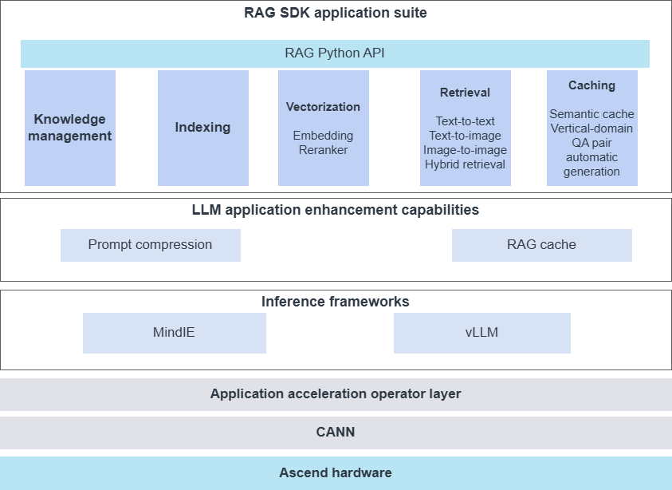

# Introduction

With the rapid development of AI technologies in recent years, large language models (LLMs) have shown strong capabilities. However, in real-world applications, LLMs still face challenges such as insufficient accuracy, slow knowledge refresh, and a lack of answer transparency. To address these issues, the retrieval-augmented generation (RAG) technology emerged. By connecting an LLM to an external knowledge base, RAG effectively improves the accuracy of question-answering (QA) systems and addresses the hallucination and timeliness issues of LLMs.

RAG can convert a base LLM into a domain-specific LLM at low cost. Therefore, it has become a key technology for improving the last-mile deployment and application of LLMs. The Ascend-based knowledge-enhancement RAG SDK is designed to provide efficient retrieval-augmented generation capabilities. RAG SDK helps users build QA systems for specific application scenarios, thereby improving system practicality and reliability.

**What is RAG SDK**

RAG SDK is the knowledge-enhancement development kit of Ascend for LLMs. To address the slow knowledge refresh of LLMs and weak QA performance in vertical domains, it provides modular function interfaces, including vector-model fine-tuning data generation for vertical domains, retrieval, and knowledge management, for users to develop upper-layer applications. It does not include user, permissions, or other function interfaces closely tied to business logic.

**Main functions of RAG SDK**

RAG SDK provides the ability to quickly build QA systems based on the Ascend platform. It provides multimodal document parsing, knowledge base management, and other capabilities, lowers the barrier to LLM application development, and supports integration with the open-source ecosystem.

- Quick setup: It provides modular function interfaces and supports on-demand calls. With built-in end-to-end workflow templates, users can quickly launch a QA service with very little code.
- Multimodal parsing: It supports parsing documents, tables, PDFs, images, and other file types to provide diverse corpora for LLMs.
- High-performance inference: It provides Ascend-friendly model optimization and acceleration for higher throughput and shorter response times.

**Intended audience**

This document is mainly intended for the following personnel:

- Huawei technical support engineers.
- Channel partner technical support engineers.

## Software Architecture

RAG SDK software architecture is shown in [Figure 1](#fig10342102918356). The key modules in the architecture are described below.

**Figure 1** Software architecture diagram

- RAG Python API: The Python API provides modular function interfaces that let users flexibly call various RAG services.
- Knowledge management: It provides knowledge base management for RAG scenarios. It supports users in creating multiple knowledge bases. Each knowledge base can upload documents, tables, images, and other files, which can serve as external knowledge bases for LLMs during retrieval. It supports loading and parsing documents, tables, and images, document chunking, and efficient vector retrieval technologies. Therefore, it significantly improves retrieval quality and recall. It provides data support for subsequent vectorization and retrieval.
- Indexing: It usually includes corpus collection, corpus parsing, corpus splitting, and index construction (vectorization) for later vector retrieval. The generated index is based on the content of the knowledge management module and depends on the vectorization results to complete efficient retrieval matching.
- Vectorization: It provides the ability to call vectorization models, including embedding and reranker models. It supports both local deployment and service-based deployment. The service-based framework uses text-embeddings-inference. It provides loading for embedding models and reranking models, as well as third-party service integration, and supports integration with LLM and image generation model services. The vectorization results form the basis of retrieval and ensure that queries match the knowledge base content.
- Retrieval: The vector retrieval acceleration uses the Ascend NPU heterogeneous retrieval acceleration framework to provide high-performance retrieval for massive data in high-dimensional spaces. After it receives a user query, it calls the LLM to transform the query text and generate a query vector. It then searches and reranks based on the query vector, and returns the search results to the LLM for further processing. Retrieval depends on vectorization results and uses vector comparison for efficient matching.
- Caching: It integrates the open-source gptcache and supports exact-match caching (memory cache) and semantic-similarity caching (similarity cache) to accelerate RAG applications. By caching queried results, it reduces repeated computation and improves retrieval speed.
- Application acceleration operator layer: It provides Ascend-friendly model optimization and acceleration for higher throughput and shorter response times. It optimizes the runtime efficiency of core modules such as vectorization and retrieval, ensuring that the entire system responds quickly.

## Supported Hardware and Runtime Environments

<table>
<tr>
<th>Product model</th>
<th>OS versions</th>
</tr>

<tr>
<td>Atlas 300I Duo inference card</td>
<td rowspan="2"><li>Ubuntu 20.04</li><li>Ubuntu 22.04</li><li>Ubuntu 24.04</li><li>KylinOS V10 SP3</li><li>BCLinux 21.10</li><li>EulerOS 2.13 for AArch64</li><li>EulerOS 2.15 for AArch64</li><li>Huawei Cloud EulerOS for x86_64</li><li>openEuler 24.03</li><li>openEuler 22.03 LTS SP4 for AArch64</li><li>CUlinux 3.0</li><li>CTyunOS 23.01</li><li>Kylin V10 SP3 2403</li><li>KylinOS V11</li></td>
</tr>
<td>
Atlas 800I A2 inference server
Atlas 800I A3 SuperNode server</td>
</table>
