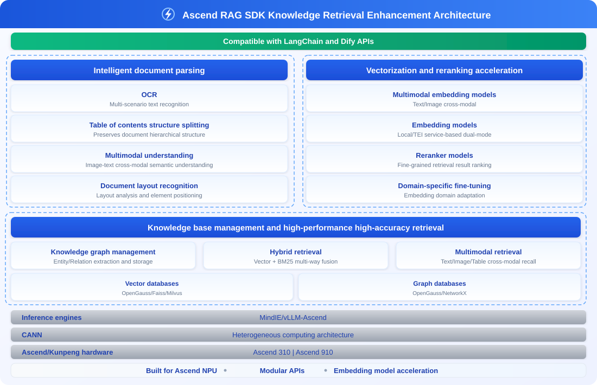

# Introduction

With the rapid development of artificial intelligence technologies in recent years, large language models have demonstrated powerful capabilities. However, in practical applications, large language models still face challenges such as insufficient accuracy, slow knowledge updates, and a lack of answer transparency. To address these issues, retrieval-augmented generation (RAG) technology emerged. By connecting large language models to external knowledge bases, RAG effectively improves the accuracy of question-answering systems and addresses hallucination and timeliness issues in large language models.

RAG technology can convert a base large language model into a domain-specific large language model at a relatively low cost, making it a key technology for improving the effectiveness of large language models in last-mile applications. The knowledge-enhanced RAG SDK based on the Ascend platform is designed to provide efficient retrieval-augmented generation capabilities. RAG SDK helps users build question-answering systems for specific application scenarios, thereby improving system practicality and reliability.

## What Is RAG SDK

RAG SDK is a knowledge retrieval-augmented development kit for large language models on the Ascend platform. To address slow knowledge updates in large language models and weak responses to questions in specialized domains, it provides modular APIs, including vector model fine-tuning data generation for specialized domains, retrieval, and knowledge management, for users to develop upper-layer applications. It does not include APIs for users, permissions, or other functions closely related to business operations.

**Main Functions of RAG SDK**

RAG SDK provides capabilities for quickly building question-answering systems based on the Ascend platform. It provides capabilities such as multimodal document parsing and knowledge base management, lowers the barrier to developing large language model applications, and supports integration with the open-source ecosystem.

* Quick setup: Provides modular APIs that can be called as needed. Built-in end-to-end workflow templates allow users to quickly launch question-answering services with minimal code.
* Multimodal parsing: Supports parsing various types of files, such as documents, tables, PDFs, and images, to provide diverse corpora for large language models.
* High-performance inference: Provides Ascend-friendly model optimization and acceleration to achieve higher throughput and shorter response times.

For more details, see the [wikipedia](https://en.wikipedia.org/wiki/Retrieval-augmented_generation) introduction.

**Intended Audience**

This document is mainly intended for the following personnel:

* Huawei technical support engineers
* Channel partner technical support engineers

## Software Architecture

The RAG SDK software architecture is shown in [Figure 1](#fig10342102918356). The key modules in the architecture are described below.

**Figure 1** Software architecture

* RAG Python API: The Python API provides modular APIs that allow users to flexibly call various RAG services.
* Knowledge management: Provides knowledge base management for RAG scenarios. Users can create multiple knowledge bases, and each knowledge base can be used to upload documents, tables, images, and other files. During retrieval, a knowledge base can be selected as an external knowledge base for the large language model. Supports loading and parsing documents, tables, and images, document splitting, and efficient vector retrieval technologies, significantly improving retrieval effectiveness and recall rate. Provides data support for subsequent vectorization and retrieval.
* Indexing: Typically includes corpus collection, corpus parsing, corpus splitting, and index construction (vectorization) for subsequent vector retrieval. The generated indexes are based on the content of the knowledge management module and depend on vectorization results to achieve efficient retrieval matching.
* Vectorization: Provides the capability to call vectorization models, including embedding and reranker models. Supports both local deployment and service-based deployment. The service-based framework uses text-embeddings-inference. Provides loading of embedding and reranking models and integration with third-party services, and supports integration with large language model and image generation model services. Vectorization results form the basis of retrieval and ensure matching between queries and knowledge base content.
* Retrieval: Vector retrieval acceleration uses the Ascend NPU heterogeneous retrieval acceleration framework to provide high-performance retrieval for massive amounts of data in high-dimensional spaces. After receiving a user query, it calls a large language model to transform the query text and generate a query vector. It then performs search and reranking based on the query vector and returns the search results to the large language model for further processing. Retrieval depends on vectorization results and uses vector comparison for efficient matching.
* Caching: Integrates with the open-source gptcache and supports exact-match caching (memory cache) and semantic-similarity caching (similarity cache) to accelerate RAG applications. By caching queried results, it reduces repeated computation and improves retrieval speed.
* Application acceleration operator layer: Provides Ascend-friendly model optimization and acceleration to achieve higher throughput and shorter response times. Optimizes the runtime efficiency of core modules such as vectorization and retrieval to ensure fast overall system response.

## Supported Hardware and Runtime Environments

<table>
<tr>
<th>Product Model</th>
<th>Operating System Version</th>
</tr>

<tr>
<td>Atlas 300I Duo inference card</td>
<td rowspan="2"><li>Ubuntu 20.04</li><li>Ubuntu 22.04</li><li>Ubuntu 24.04</li><li>KylinOS V10 SP3</li><li>BCLinux 21.10</li><li>EulerOS 2.13 for aarch64</li><li>EulerOS 2.15 for aarch64</li><li>Huawei Cloud EulerOS for x86_64</li><li>openEuler 24.03</li><li>openEuler 22.03 LTS SP4 for aarch64</li><li>CUlinux 3.0</li><li>CtyunOS 23.01</li><li>Kylin V10 SP3 2403</li><li>KylinOS V11</li></td>
</tr>
<td>
Atlas 800I A2 inference server
Atlas 800I A3 SuperPoD server</td>
</table>
