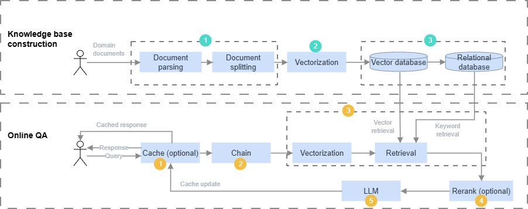
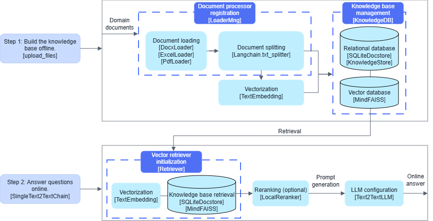
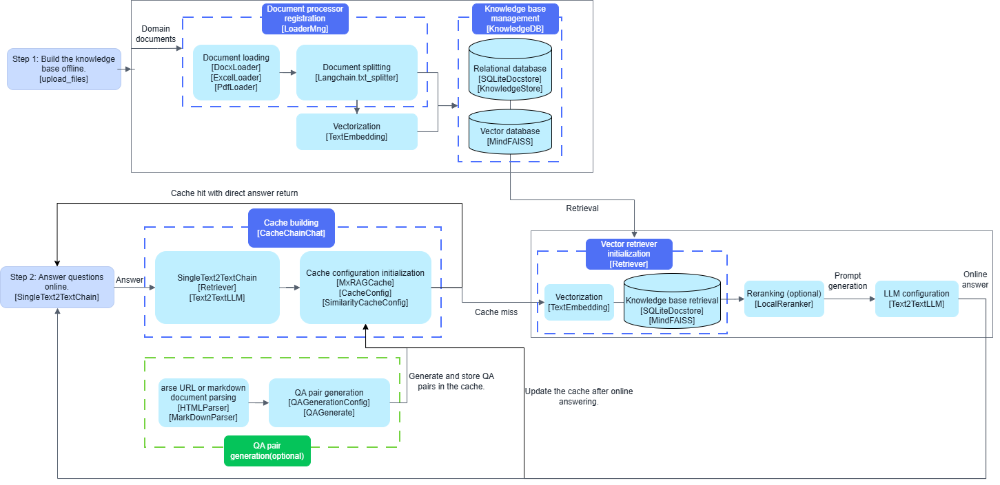
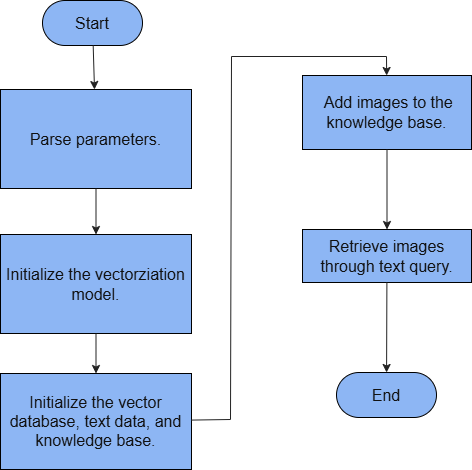

# Development Process

The complete development process for RAG SDK is shown in [Figure 1](#fig1495610311102). Follow the steps below to call the API.

During the runtime phase, run the relevant test cases as the `root` user.

The knowledge base build and online question-answering (QA) flows support concurrency. See the corresponding demo for details.

**Figure 1** RAG SDK development process<a id="fig1495610311102"></a>



- Build the knowledge base.
    1. Upload the domain documents, then load and split them. Initialize the document processor. You can register the corresponding document parser based on the uploaded file type. See Document Parsing（需补充链接）, the [LangChain document loader API](https://python.langchain.com/v0.2/docs/integrations/document_loaders/#all-document-loaders), or a custom implementation based on LangChain. You can also register a document splitter. See the [LangChain text splitter API](https://python.langchain.com/v0.2/docs/how_to/recursive_text_splitter/) or a custom implementation based on LangChain. Supported document types include Docx, Excel, PDF, and PowerPoint. You can load the corresponding parsing and splitting functions as needed. The output is the text chunks produced by document splitting.
    2. Convert the text to vectors. Load the embedding model. See [Vectorization](./api/embedding.md). Configure it according to the specific model path. After the text chunks are vectorized, store them in the vector database in knowledge base management.
    3. Initialize knowledge base management. See [Knowledge Base Document Management](./api/knowledge_management.md#knowledge-base-document-management). This includes initializing the relational database and the vector database. See the [relational database](./api/databases.md#relational-databases) and the [vector database](./api/databases.md#vector-databases).

        The split text chunks are stored in the relational database, and the vectorized chunk data is stored in the vector database in one-to-one correspondence.

- Online QA.
    1. Initialize the cache. See [Cache Module](./api/cache_module.md#cache-module). This step is optional. RAG SDK supports cache configuration and approximate search. When a user asks a question, the system first searches for the answer in the cache. If the question hits, it returns the cached answer directly. If you do not configure a cache or the question does not hit the cache, the following inference process continues.
    2. Initialize the LLM chain. See [LLM Chain](./api/llm_chains.md). Use the chain to connect the LLM, retrieval, and reranking modules for question answering. You can choose chains such as text-to-text, text-to-image, and image-to-image. The chain supports multi-turn conversations and parallel retrieval and inference.
    3. Initialize the retrieval method. See [Retrieval](./api/retrieval.md). You can define approximate retrieval, query-rewrite retrieval, and other methods. After the question is vectorized by the embedding model, retrieval finds the context in the knowledge base for the next step.
    4. Use the reranker to rerank the retrieved context. See [Ranking](./api/reranker.md). This step is optional. It improves retrieval quality.
    5. Finally, assemble the user question and the context into a prompt, then pass it to the LLM. See [LLM](./api/llm_client.md). The model performs inference and returns the answer to the user. If you configure a cache, the system refreshes the question-answer pair in the cache after QA completes. When the same question hits again, the response time is shorter.

# Application Development

## Text-to-Text Scenario

### FlatL2 Retrieval Method

#### Overview

**Example Overview**

This section describes how to use RAG SDK Python interface on an Atlas 800I A2 inference server to build a QA system based on a knowledge base. RAG SDK runtime framework is shown in [Figure 1](#fig17633219113617). Its workflow is divided into "Building the Knowledge Base" and "Retrieving Answers".

This example is a text-to-text scenario. The retrieval method is the distance-based "FLAT:L2" method. In the framework diagram, `"[xxx]"` in each step indicates an optional method class. The inference LLM is Llama3-8B-Chinese-Chat, the embedding model is bge-large-zh-v1.5, and the optional reranker model is bge-reranker-large.

**Figure 1** QA process based on the knowledge base<a id="fig17633219113617"></a>


**Prerequisites**

- You have already downloaded and run the Llama3-8B-Chinese-Chat LLM in the MindIE container. Model download link: <a href="https://www.modelscope.cn/models/LLM-Research/Llama3-8B-Chinese-Chat">Link</a>.
- You have completed containerized deployment on the host machine according to "Install MindIE > Option 3: Container Installation" in the MindIE Installation Guide, and you have started the service according to "Quick Start > Start the Service" in the MindIE Motor Development Guide.
- You have completed [RAG SDK installation](./installation_guide.md#installing-rag-sdk).
- You have downloaded the embedding model "bge-large-zh-v1.5" and the reranker model "bge-reranker-large", and placed them in the model directory configured when running the container in [2.a](./installation_guide.md#deploying-rag-sdk-in-a-container). Model download links:
    - bge-large-zh-v1.5 model: <a href="https://www.modelscope.cn/models/BAAI/bge-large-zh-v1.5">Link</a>
    - bge-reranker-large model: <a href="https://www.modelscope.cn/models/BAAI/bge-reranker-large">Link</a>

**TEI Service Notes**

The embedding model and reranker model can run as services. If you choose text-embeddings-inference (TEI) service deployment, deploy and run the embedding service and reranker service. See <a href="https://www.hiascend.com/developer/ascendhub/detail/07a016975cc341f3a5ae131f2b52399d">this link</a>.

#### Building the Knowledge Base

**Procedure**

1. Compile the retrieval operator to enable retrieval.

    ```bash
    cd $MX_INDEX_INSTALL_PATH/tools/ && python3 aicpu_generate_model.py -t <chip_type> && python3 flat_generate_model.py -d <dim> -t <chip_type>  && cp op_models/* $MX_INDEX_MODELPATH
    ```

    > [!NOTE]
    >- The `MX_INDEX_INSTALL_PATH` and `MX_INDEX_MODELPATH` variables are already configured in `~/.bashrc`, so you do not need to configure them separately. Check `~/.bashrc` for the specific values.
    >- `-d <dim>` indicates the vector dimension after embedding model vectorization. The bge-large-zh-v1.5 embedding model has a vector dimension of 1024, so set `-d` to 1024 here.
    >- `-t <chip_type>` indicates the chip type. For an Atlas 300I Duo inference card, run the `npu-smi info` command on a server with Ascend AI processors. Remove the last digit from the queried "Name" field to obtain the value of `<chip_type>`. For an Atlas 800I A2 inference server, run the `npu-smi info` command on a server with Ascend AI processors and use the value of the corresponding "Name" field. For an Atlas 800I A3 supernode server, run `npu-smi info -t board -i 0 -c 0` to obtain the `NPU Name` information. `910_<NPU Name>` is the value of `<chip_type>`.

2. Create the domain knowledge document.

    Create the `gaokao.txt` file in the `/workspace` directory, encoded in UTF-8. Its content is as follows:

    ```text
    2024年高考语文作文试题
    新课标I卷
    阅读下面的材料，根据要求写作。（60分）
    随着互联网的普及、人工智能的应用，越来越多的问题能很快得到答案。那么，我们的问题是否会越来越少？
    以上材料引发了你怎样的联想和思考？请写一篇文章。
    要求：选准角度，确定立意，明确文体，自拟标题；不要套作，不得抄袭；不得泄露个人信息；不少于800字。
    ```

    > [!NOTE]
    > The selected LLM was trained before 2024. The model itself has not learned knowledge related to the "2024 college entrance exam Chinese composition topic."

3. Build the domain knowledge base.

    Refer to and run the `rag_demo_knowledge.py` example code in the [demo](https://gitcode.com/Ascend/mindsdk-referenceapps/tree/master/RAGSDK/MainRepo/Samples/rag_with_api). Adjust the default parameters in the code, such as file paths and model paths, according to the actual environment. For detailed parameter settings, see the `readme.md` file.

    ```python
    python3 rag_demo_knowledge.py --file_path "/path/to/gaokao.txt"
    ```

4. Run the program to get the result.

    If the example code prints the list of uploaded file names, the knowledge base is built successfully.

    ```text
    [‘gaokao.txt’]
    ```

#### Retrieving Answers

**Procedure**

1. Run the online QA example. Refer to and run the `rag_demo_query.py` code in the [demo](https://gitcode.com/Ascend/mindsdk-referenceapps/tree/master/RAGSDK/MainRepo/Samples/rag_with_api). Adjust the default parameters in the code, such as the model path, the MindIE service IP address, and the port, according to the actual environment. For detailed parameter settings, see the `readme.md` file.

    ```python
    python3 rag_demo_query.py --query "请描述2024年高考作文题目"
    ```

2. Run the program to get the result.

    ```text
    {
        'query': '请描述2024年高考作文题目',
        'result': '题目：新时代下的生活\n\n材料：\n\n随着科技的不断发展，人们的生活逐渐便利。各种智能设备的应用，让我们的生活更加便捷。然而，在这种便利背后，我们是否面临着一些问题？\n\n请根据以上材料，结合自己的思考，以新时代下的生活为题材，自拟标题，写一篇议论文。',
        'source_documents': [
            {
                'metadata':
                {
                    'source': '/workspace/gaokao.txt'
                },
                'page_content': '2024年高考语文作文试题\n新课标I卷\n阅读下面的材料，根据要求写作。（60分）\n随着互联网的普及、人工智能的应用，越来越多的问题能很快得到答案。那么，我们的问题是否会越来越少？\n以上材料引发了你怎样的联想和思考？请写一篇文章。\n要求：选准角度，确定立意，明确文体，自拟标题；不要套作，不得抄袭；不得泄露个人信息；不少于800字。'
            }
        ]
    }
    ```

> [!NOTE]
>
>- The embedding model, relational database path, and vector database path used in the "Building the Knowledge Base" and "Retrieving Answers" processes must remain consistent for the example to run correctly.
>- When you run the example code, if the `tei_emb` parameter is `False`, it means the embedding model runs locally, and `embedding_path` takes the local model directory. If the `tei_emb` parameter is `True`, it means the service-based model runs, and `embedding_url` takes the service-based model URI. The same applies to reranker.

### MxRAGCache Cache and Automatic QA Generation

**Example Overview**

This example extends [Building the Knowledge Base](#building-the-knowledge-base) and [Retrieving Answers](#retrieving-answers) with MxRAGCache caching and QA generation. The automatic QA generation feature supports parsing Markdown documents and storing them in MxRAGCache. It uses memory cache and similarity cache.

**Figure 1** Cache-based RAG SDK QA process


**Prerequisites**

- You have already downloaded and run the Llama3-8B-Chinese-Chat LLM in the MindIE container. Model download: <a href="https://www.modelscope.cn/models/LLM-Research/Llama3-8B-Chinese-Chat">Link</a>.

- RAG SDK container can access `config.json` and `tokenizer.json` in the path of the Llama3-8B-Chinese-Chat LLM, which it uses to calculate text token size.
- You have completed containerized deployment on the host machine according to "Install MindIE > Option 3: Container Installation" in the MindIE Installation Guide, and you have started the service according to "Quick Start > Start the Service" in the MindIE Motor Development Guide.
- You have completed [RAG SDK installation](./installation_guide.md#installing-rag-sdk).
- You have downloaded the embedding model "bge-large-zh-v1.5" and the reranker model "bge-reranker-large", and placed them in the model directory configured when running the container in [2.a](./installation_guide.md#deploying-rag-sdk-in-a-container). Model download links:
    - bge-large-zh-v1.5 model: <a href="https://www.modelscope.cn/models/BAAI/bge-large-zh-v1.5">Link</a>
    - bge-reranker-large model: <a href="https://www.modelscope.cn/models/BAAI/bge-reranker-large">Link</a>

**Procedure**

1. Compile the retrieval operator to enable retrieval.

    ```bash
    cd $MX_INDEX_INSTALL_PATH/tools/ && python3 aicpu_generate_model.py -t <chip_type> && python3 flat_generate_model.py -d <dim> -t <chip_type>  && cp op_models/* $MX_INDEX_MODELPATH
    ```

    > [!NOTE]
    >- The `MX_INDEX_INSTALL_PATH` and `MX_INDEX_MODELPATH` variables are already configured in `~/.bashrc`, so you do not need to configure them separately. Check `~/.bashrc` for the specific values.
    >- `-d <dim>` indicates the vector dimension after embedding model vectorization. The bge-large-zh-v1.5 embedding model has a vector dimension of 1024, so set `-d` to 1024 here.
    >- `-t <chip_type>` indicates the chip type. For an Atlas 300I Duo inference card, run the `npu-smi info` command on a server with Ascend AI processors. Delete the last digit of the queried "Name" field to get the value of `<chip_type>`. For an Atlas 800I A2 inference server, run the `npu-smi info` command on a server with Ascend AI processors and use the field corresponding to "Name". For an Atlas 800I A3 supernode server, run `npu-smi info -t board -i 0 -c 0` to obtain the `NPU Name` information. `910_<NPU Name>` is the value of `<chip_type>`.

2. Create the domain knowledge document.

    Create the `gaokao.md` document in the `/workspace` directory in UTF-8 encoding. Its content is as follows:

    ```text
    2024年高考语文作文试题
    新课标I卷
    阅读下面的材料，根据要求写作。（60分）
    随着互联网的普及、人工智能的应用，越来越多的问题能很快得到答案。那么，我们的问题是否会越来越少？
    以上材料引发了你怎样的联想和思考？请写一篇文章。
    要求：选准角度，确定立意，明确文体，自拟标题；不要套作，不得抄袭；不得泄露个人信息；不少于800字。
    ```

    > [!NOTE]
    > The selected LLM was trained before 2024. The model itself has not learned knowledge related to the "2024 college entrance exam Chinese composition topic."

3. Refer to and run the `rag_demo_cache_qa.py` code in the [demo](https://gitcode.com/Ascend/mindsdk-referenceapps/tree/master/RAGSDK/MainRepo/Samples/qa_cache). Adjust the default parameters in the code, such as the file path, the model path, and the LLM IP address and port, according to the actual environment. For detailed parameter settings, see the `readme.md` file.
4. Run the example code.

    ```python
    python3 rag_demo_cache_qa.py  --query "请描述2024年高考作文题目"
    ```

5. Run the example code twice to get the result.

    ```ColdFusion
    # The first run result is the same as the second response, but the second run returns from cache, so the response time drops significantly
    {'query': '请描述2024年高考作文题目', 'result': '根据您提供的信息，2024年高考语文作文试题的具体内容尚未公开。通常，高考作文题目会在考试当天或考试前一段时间由教育部门公布。因此，无法为您提供2024年高考作文题目具体内容。\n\n不过，根据您提供的信息，题目可能会围绕“随着互联网的普及、人工智能的应用，越来越多的问题能很快得到答案。那么，我们的问题是否会越来越少？”这一主题展开。学生需要根据这个问题，选准角度，确定立意，明确文体，自拟标题，并在不少于800字的范围内进行写作。\n\n如果您需要进一步的指导或帮助，例如如何构思作文、如何组织思路、如何提高写作质量等，我可以提供一些一般性的建议。', 'source_documents': [{'metadata': {'source': '/workspace/gaokao.md'}, 'page_content': '2024年高考语文作文试题\n新课标I卷\n阅读下面的材料，根据要求写作。（60分）\n随着互联网的普及、人工智能的应用，越来越多的问题能很快得到答案。那么，我们的问题是否会越来越少？\n以上材料引发了你怎样的联想和思考？请写一篇文章。\n要求：选准角度，确定立意，明确文体，自拟标题；不要套作，不得抄袭；不得泄露个人信息；不少于800字。\n'}]}
    Elapsed time: 0.0007343292236328125s
    ```

## Text-Based Image Retrieval

This section guides you through the example for retrieving images from text with RAG SDK.

**Prerequisites**

You have completed [RAG SDK installation](./installation_guide.md#installing-rag-sdk).

**Example Process Overview**



**Procedure**

1. Create the `retrieve_img_demo.py` file in any directory. Its content is as follows:

    ```python
    import argparse

    from mx_rag.document import LoaderMng
    from mx_rag.document.loader import ImageLoader

    from mx_rag.embedding.local import ImageEmbedding
    from mx_rag.knowledge import KnowledgeDB, upload_files
    from mx_rag.knowledge.knowledge import KnowledgeStore
    from mx_rag.retrievers import Retriever
    from mx_rag.storage.document_store import SQLiteDocstore
    from mx_rag.storage.vectorstore import MindFAISS


    if __name__ == '__main__':
        parser = argparse.ArgumentParser()
        parser.add_argument('--query', type=str, help="Query image text content.")
        parser.add_argument("--image-path", type=str, action='append', help="Image path to be stored.")

        args = parser.parse_args().__dict__
        images: list[str] = args.pop("image_path")
        query = args.pop("query")
        loader_mng = LoaderMng()
        loader_mng.register_loader(ImageLoader, [".jpg"])

        dev = 0
        img_emb = ImageEmbedding("ViT-B-16", model_path="path to clip model", dev_id=dev)

        img_vector_store = MindFAISS(x_dim=512, devs=[dev],
                                     load_local_index="./image_faiss.index",
                                     auto_save=True)
        chunk_store = SQLiteDocstore(db_path="./sql.db")

        # Initialize the knowledge management relational database
        knowledge_store = KnowledgeStore(db_path="./sql.db")

        user_id = "fc557af8-5973-4893-9624-4a510c3e18fb"
        knowledge_store.add_knowledge("test", user_id=user_id)

        knowledge_db = KnowledgeDB(knowledge_store=knowledge_store, chunk_store=chunk_store, vector_store=img_vector_store,
                                   knowledge_name="test", white_paths=["/home"], user_id=user_id)

        upload_files(knowledge_db, images, loader_mng=loader_mng,
                     embed_func=img_emb.embed_images, force=True)

        img_retriever = Retriever(vector_store=img_vector_store, document_store=chunk_store,
                                  embed_func=img_emb.embed_documents, k=1, score_threshold=0.4)
        res = img_retriever.invoke(query)
        # res contains the paths of the retrieved images
        print(res)

    ```

2. Run the following command. Configure the other parameters according to the actual environment. See [ClientParam](./api/universal_api.md#clientparam).

    ```bash
    python3 retrieve_img_demo.py --image-path ./car1.jpg  --image-path ./car2.jpg  --query "小汽车"
    ```

## Multi-Turn Conversation

This section guides you through using LangChain to enable multi-turn conversations.

**Prerequisites**

- You have completed [RAG SDK installation](./installation_guide.md#installing-rag-sdk).
- You have completed containerized deployment according to "Install MindIE > Option 3: Container Installation" in the MindIE Installation Guide.
- You have run the Llama3-8B-Chinese-Chat LLM.

**Procedure**

1. Use the `vim` command in any directory in the container to create the `demo.py` file. Its content is as follows:

    ```python
    from langchain.memory import ConversationBufferWindowMemory
    from langchain.chains import LLMChain
    from langchain_core.prompts import PromptTemplate
    from mx_rag.llm import Text2TextLLM
    from mx_rag.utils import ClientParam
    if __name__ == '__main__':
        template = """You are a chatbot having a conversation with a human. Please answer as briefly as possible.

        {chat_history}
        Human: {human_input}"""
        dev = 1
        prompt = PromptTemplate(
            input_variables=["chat_history", "human_input"], template=template
        )
        # k can set how many historical conversation turns to keep. ConversationBufferMemory and ConversationTokenBufferMemory are also supported. See the official LangChain documentation
        memory = ConversationBufferWindowMemory(memory_key="chat_history", k=3)
        client_param = ClientParam(ca_file="/path/to/ca.crt")
        chat = Text2TextLLM(base_url="https://ip:port/v1/chat/completions",
                            model_name="Llama3-8B-Chinese-Chat",
                            client_param=client_param)
        llm_chain = LLMChain(llm=chat, prompt=prompt, memory=memory, verbose=True)
        questions = ["请记住小明的爸爸是小刚",
                     "七大洲前四个是啥？",
                     "后三个呢？"]
        for question in questions:
            llm_chain.predict(human_input=question)
        completion = llm_chain.predict(human_input="请问小明的爸爸是谁？")
        print(completion)
    ```

2. Run the example code. The LLM request includes historical information. The concatenated prompt is as follows:

    ```ColdFusion
    You are a chatbot having a conversation with a human. Please answer as briefly as possible.

    Human: 请记住小明的爸爸是小刚
    AI: 记住了，小明的爸爸是小刚。
    Human: 七大洲前四个是啥？
    AI: 亚洲、非洲、欧洲、北美洲。
    Human: 后三个呢？
    AI: 南美洲、澳大利亚、南极洲。
    Human: 请问小明的爸爸是谁？
    小明的爸爸是小刚。
    ```

## Agentic RAG Example

For details, see [RAG SDK-based knowledge retrieval enhanced application enablement solution using LangGraph](https://gitcode.com/Ascend/mindsdk-referenceapps/tree/master/RAGSDK/MainRepo/Samples/langgraph).

## Chatting with RAG SDK

Start the web service to configure parameters, upload and delete documents, and perform question answering. For the detailed process, see [chat_with_ragsdk](https://gitcode.com/Ascend/mindsdk-referenceapps/blob/master/RAGSDK/MainRepo/Samples/chat_with_ascend/README.md).
