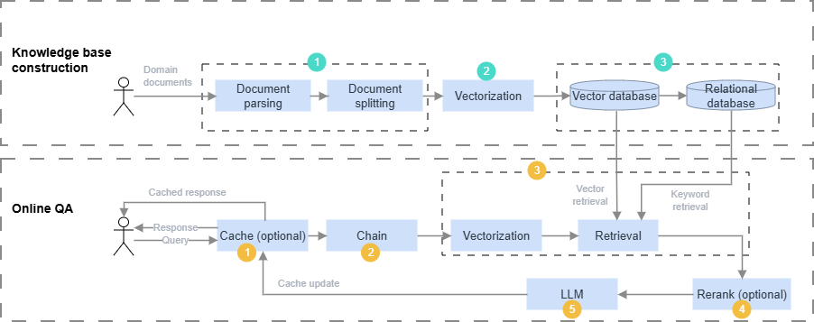
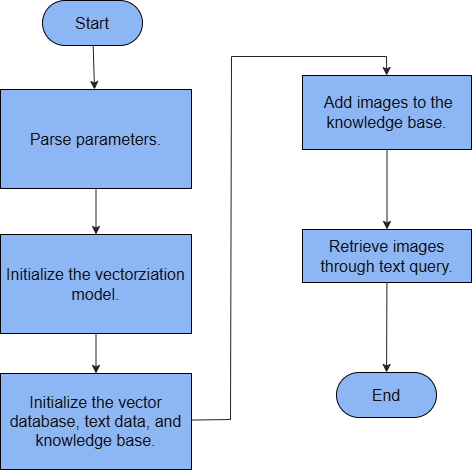

# Development Process

The complete development process for RAG SDK is shown in [Figure 1](#fig1495610311102). Follow the steps below to call the APIs.

During the runtime phase, run the relevant test cases as the `root` user.

Knowledge base construction and online question answering support concurrency. See the corresponding demo for details.

**Figure 1** RAG SDK development process<a id="fig1495610311102"></a>



- Build the knowledge base.
    1. Upload domain documents, then load and split them. Initialize the document processor. You can register the appropriate document parser based on the uploaded file type (see [Document Parsing](./api/knowledge_management.md#document-parsing), the [LangChain document loader API](https://python.langchain.com/v0.2/docs/integrations/document_loaders/#all-document-loaders), or a custom implementation based on LangChain) and document splitter (see the [LangChain text splitter API](https://python.langchain.com/v0.2/docs/how_to/recursive_text_splitter/) or a custom implementation based on LangChain). Supported document types include Docx, Excel, PDF, and PowerPoint. You can load the required parsing and splitting functions as needed. The output is the text chunks produced by document splitting.
    2. Vectorize the text. Load the embedding model (see [Vectorization](./api/embedding.md)) and configure it according to the specific model path. After the text chunks are vectorized, store the resulting vectors in the vector database in knowledge base management.
    3. Initialize knowledge base management. See [Knowledge Base Document Management](./api/knowledge_management.md#knowledge-management). This includes initializing the relational database and vector database (see [Relational Databases](./api/databases.md#relational-databases) and [Vector Databases](./api/databases.md#vector-databases)).

        The split text chunks are stored in the relational database, and the vectorized chunk data is stored in the vector database in one-to-one correspondence.

- Online question answering.
    1. Initialize the cache (see [Cache Module](./api/cache_module.md#cache-module); optional). RAG SDK supports cache configuration and approximate search. When a user asks a question, the system first searches the cache for an answer. If the question hits the cache, the cached answer is returned directly. If the cache is not configured or the question does not hit the cache, the following inference process continues.
    2. Initialize the LLM chain (see [LLM Chain](./api/llm_chains.md)). Use the chain to connect the LLM, retrieval, and reranking modules for question answering. You can choose chains such as text-to-text, text-to-image, and image-to-image. The chains support multi-turn conversations and parallel retrieval and inference.
    3. Initialize the retrieval method (see [Retrieval](./api/retrieval.md)). You can define approximate retrieval, query-rewrite retrieval, and other methods. After the question is vectorized by the embedding model, the retrieval method finds the context in the knowledge base for further processing.
    4. Rerank the retrieved context using the reranker (see [Reranking](./api/reranker.md); optional) to improve retrieval quality.
    5. Finally, assemble the user question and context into a prompt, pass the prompt to the LLM (see [LLM](./api/llm_client.md)) for inference, and return the answer to the user. If a cache is configured, the question-answer pair is added to the cache after question answering is completed. When the same question hits the cache again, the question-answering latency is reduced.

# Application Development

## Text-to-Text Scenario

### Prerequisites

Before you start, make sure that the following requirements are met:

- **Hardware**: An Atlas 300I Duo inference card or Atlas 800I A2/A3 inference servers, with the corresponding drivers, dependencies, and firmware installed.
- **Docker**: Docker is installed, and the current user can run containers.
- **Embedding model service**: Deploy the `bge-large-zh-v1.5` embedding model by referring to the [mis-tei documentation](https://www.hiascend.com/developer/ascendhub/detail/07a016975cc341f3a5ae131f2b52399d).
- **LLM service**: Deploy the Qwen3-4B LLM by referring to the [Qwen3-Dense documentation](https://docs.vllm.ai/projects/ascend/en/latest/tutorials/models/Qwen3-Dense.html).

### Step 1: Pull the Image

1. **Determine the image version to download**
   - Visit the Ascend Community [image repository](https://www.hiascend.com/developer/ascendhub/detail/b875f781df984480b0385a96fa1b03c9) and check the RAG SDK image compatibility table to obtain the latest image version and corresponding CANN version.
   - Select the corresponding version based on the current hardware model, such as the Atlas 800I A2 inference server.

    > [!NOTE]
    > CANN is preinstalled in the image. You do not need to install it again.
    > Make sure to select the correct CPU architecture (`x86_64` or `aarch64`).

2. **Perform an environment precheck**
   - Run the `npu-smi info` command to check the NPU driver version installed in the current environment.
   - Obtain the corresponding CANN version from the RAG SDK image compatibility table, and see the [Firmware and Drivers](https://www.hiascend.com/hardware/firmware-drivers/community) page for the corresponding NPU driver version. If the installed driver version is not compatible, update the NPU driver to the corresponding version. For update instructions, see the [Driver and Firmware Installation Guide](https://support.huawei.com/enterprise/zh/doc/EDOC1100568434/36e8d875?idPath=23710424|251366513|254884019|261408772|252764743).

3. **Image pull example**

    The image tag uses the format `{version}-{chip}-{os}-{python}`. The variables are defined as follows:

    | Variable | Description | Example |
    |------|------------|--------|
    | `{version}` | RAG SDK version | `26.0.0` |
    | `{chip}` | Ascend chip series | `910b` |
    | `{os}` | Base operating system | `ubuntu22.04` / `openeuler24.03` |
    | `{python}` | Python version | `py3.11` |

    ```bash
    TAG={version}-{chip}-{os}-{python}
    docker pull swr.cn-south-1.myhuaweicloud.com/ascendhub/ragsdk:${TAG}
    docker tag swr.cn-south-1.myhuaweicloud.com/ascendhub/ragsdk:${TAG} \
        ragsdk:${TAG}
    ```

    For example, for version 26.0.0, the 910b chip, Ubuntu 22.04, and Python 3.11:

    ```bash
    docker pull swr.cn-south-1.myhuaweicloud.com/ascendhub/ragsdk:26.0.0-910b-ubuntu22.04-py3.11
    docker tag swr.cn-south-1.myhuaweicloud.com/ascendhub/ragsdk:26.0.0-910b-ubuntu22.04-py3.11 ragsdk:26.0.0-910b-ubuntu22.04-py3.11
    ```

### Step 2: Start the Container

> [!NOTE]
>
> - Adjust the device number in `--device /dev/davinci0` according to the actual NPU number on the host.
> - `-v /path/to/model:/home/data` mounts a host directory to the container (optional).
> - The sample code in the container is located in `/workspace/RAGSDK_Samples`.

```bash
docker run \
    --name ragsdk_demo \
    --device /dev/davinci0 \
    --device /dev/davinci_manager \
    --device /dev/devmm_svm \
    --device /dev/hisi_hdc \
    -v /usr/local/dcmi:/usr/local/dcmi \
    -v /usr/local/bin/npu-smi:/usr/local/bin/npu-smi \
    -v /usr/local/Ascend/driver:/usr/local/Ascend/driver \
    -v /usr/local/Ascend/driver/version.info:/usr/local/Ascend/driver/version.info \
    -v /etc/ascend_install.info:/etc/ascend_install.info \
    -v /path/to/model:/home/data \
    -itd ragsdk:26.0.0-910b-ubuntu22.04-py3.11 bash
```

### Step 3: Enter the Container

```bash
docker exec -it ragsdk_demo bash
```

### Step 4: Create a Test Document

Create a test document in the working directory:

```bash
mkdir -p /workspace/testdata
cat > /workspace/testdata/gaokao.txt << 'EOF'
2024 National College Entrance Examination Chinese Language and Literature Essay Prompt
New Curriculum Standards Paper I
Read the following material and write an essay as instructed. (60 points)
With the widespread adoption of the Internet and the application of artificial intelligence, more and more questions can be answered quickly. So, will we have fewer and fewer questions?
What associations and reflections does the material above inspire in you? Write an essay.
Requirements: Choose an appropriate perspective, develop a clear thesis, specify the genre, and create your own title; do not use formulaic compositions or plagiarize; do not disclose personal information; write at least 800 words.
EOF
```

### Step 5: Build the Knowledge Base

Go to the sample directory and run the knowledge base construction script:

```bash
cd /workspace/RAGSDK_Samples/rag_with_api
python3 rag_demo_knowledge.py \
    --embedding_url http://127.0.0.1:8080/v1/embeddings \
    --white_path /workspace \
    --file_path /workspace/testdata/gaokao.txt
```

> [!NOTE]
> `http://127.0.0.1:8080` is an example URL parameter. Configure the URL according to the parameters used in your local deployment.

### Step 6: Verify That the Knowledge Base Was Built Successfully

If the following result is output, the knowledge base was built successfully:

```text
['gaokao.txt']
```

### Step 7: Perform Question Answering

```bash
python3 rag_demo_query.py \
    --embedding_url http://127.0.0.1:8080/v1/embeddings \
    --llm_url http://127.0.0.1:1025/v1/chat/completions \
    --model_name Qwen3-4B \
    --query "Describe the 2024 National College Entrance Examination essay prompt."
```

> [!NOTE]
> `http://127.0.0.1:8080` and `http://127.0.0.1:1025` are example URL parameters. Configure the URLs according to the parameters used in your local deployment.

### Step 8: Verify That Question Answering Was Successful

If the output contains the retrieved document content and generated answer, the question-answering process is running properly:

```text
{'query': 'Describe the 2024 National College Entrance Examination essay prompt.', 'result': '...', 'source_documents': [...]}
```

## Text-Based Image Retrieval

This section guides you through using RAG SDK to retrieve images based on text.

**Prerequisites**

You have completed [RAG SDK installation](./installation_guide.md#installation-methods).

**Example Process Overview**



**Procedure**

1. Create the `retrieve_img_demo.py` file in any directory. Its content is as follows:

    ```python
    import argparse

    from mx_rag.document import LoaderMng
    from mx_rag.document.loader import ImageLoader

    from mx_rag.embedding.local import ImageEmbedding
    from mx_rag.knowledge import KnowledgeDB, upload_files
    from mx_rag.knowledge.knowledge import KnowledgeStore
    from mx_rag.retrievers import Retriever
    from mx_rag.storage.document_store import SQLiteDocstore
    from mx_rag.storage.vectorstore import MindFAISS


    if __name__ == '__main__':
        parser = argparse.ArgumentParser()
        parser.add_argument('--query', type=str, help="Query image text content.")
        parser.add_argument("--image-path", type=str, action='append', help="Image path to be stored.")

        args = parser.parse_args().__dict__
        images: list[str] = args.pop("image_path")
        query = args.pop("query")
        loader_mng = LoaderMng()
        loader_mng.register_loader(ImageLoader, [".jpg"])

        dev = 0
        img_emb = ImageEmbedding("ViT-B-16", model_path="path to clip model", dev_id=dev)

        img_vector_store = MindFAISS(x_dim=512, devs=[dev],
                                     load_local_index="./image_faiss.index",
                                     auto_save=True)
        chunk_store = SQLiteDocstore(db_path="./sql.db")

        # Initialize the knowledge management relational database
        knowledge_store = KnowledgeStore(db_path="./sql.db")

        user_id = "fc557af8-5973-4893-9624-4a510c3e18fb"
        knowledge_store.add_knowledge("test", user_id=user_id)

        knowledge_db = KnowledgeDB(knowledge_store=knowledge_store, chunk_store=chunk_store, vector_store=img_vector_store,
                                   knowledge_name="test", white_paths=["/home"], user_id=user_id)

        upload_files(knowledge_db, images, loader_mng=loader_mng,
                     embed_func=img_emb.embed_images, force=True)

        img_retriever = Retriever(vector_store=img_vector_store, document_store=chunk_store,
                                  embed_func=img_emb.embed_documents, k=1, score_threshold=0.4)
        res = img_retriever.invoke(query)
        # res contains the paths of the retrieved images
        print(res)

    ```

2. Run the following command. Configure the other parameters according to the actual environment. See [ClientParam](./api/universal_api.md#clientparam).

    ```bash
    python3 retrieve_img_demo.py --image-path ./car1.jpg  --image-path ./car2.jpg  --query "Cars"
    ```

## Multi-Turn Conversation

This section guides you through using LangChain for multi-turn conversations.

**Prerequisites**

- You have completed [RAG SDK installation](./installation_guide.md#installation-methods).
- You have deployed the Qwen3-4B LLM by referring to the [Qwen3-Dense documentation](https://docs.vllm.ai/projects/ascend/en/latest/tutorials/models/Qwen3-Dense.html).

**Procedure**

1. Use the `vim` command in any directory in the container to create the `demo.py` file. Its content is as follows:

    ```python
    from langchain.memory import ConversationBufferWindowMemory
    from langchain.chains import LLMChain
    from langchain_core.prompts import PromptTemplate
    from mx_rag.llm import Text2TextLLM
    from mx_rag.utils import ClientParam
    if __name__ == '__main__':
        template = """You are a chatbot having a conversation with a human. Please answer as briefly as possible.

        {chat_history}
        Human: {human_input}"""
        dev = 1
        prompt = PromptTemplate(
            input_variables=["chat_history", "human_input"], template=template
        )
        # k sets the number of historical conversation turns to retain. ConversationBufferMemory and ConversationTokenBufferMemory are also supported. See the official LangChain documentation for details.
        memory = ConversationBufferWindowMemory(memory_key="chat_history", k=3)
        client_param = ClientParam(ca_file="/path/to/ca.crt")
        chat = Text2TextLLM(base_url="https://ip:port/v1/chat/completions",
                            model_name="Llama3-8B-Chinese-Chat",
                            client_param=client_param)
        llm_chain = LLMChain(llm=chat, prompt=prompt, memory=memory, verbose=True)
        questions = ["Please remember that Xiaoming's father is Xiaogang.",
                     "What are the first four of the seven continents?",
                     "What about the last three?"]
        for question in questions:
            llm_chain.predict(human_input=question)
        completion = llm_chain.predict(human_input="Who is Xiaoming's father?")
        print(completion)
    ```

2. Run the sample code. The request to the LLM includes historical information, and the concatenated prompt is as follows:

    ```ColdFusion
    You are a chatbot having a conversation with a human. Please answer as briefly as possible.

    Human: Please remember that Xiaoming's father is Xiaogang.
    AI: Got it. Xiaoming's father is Xiaogang.
    Human: What are the first four of the seven continents?
    AI: Asia, Africa, Europe, North America.
    Human: What about the last three?
    AI: South America, Australia, Antarctica.
    Human: Who is Xiaoming's father?
    Xiaoming's father is Xiaogang.
    ```

## Agentic RAG Example

For details, see [RAG SDK-based knowledge retrieval enhanced application enablement solution using LangGraph](https://gitcode.com/Ascend/RAGSDK/tree/master/example/langgraph).

## Chat with RAG SDK

Start the web service to configure parameters, upload and delete documents, and perform question answering. For details, see [chat_with_ragsdk](https://gitcode.com/Ascend/RAGSDK/blob/master/example/chat_with_ascend/README.md).
