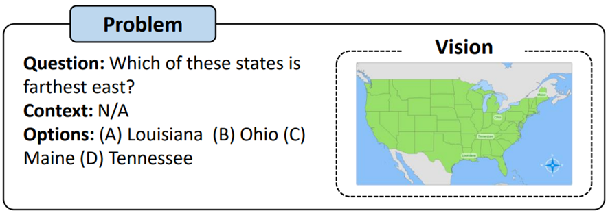
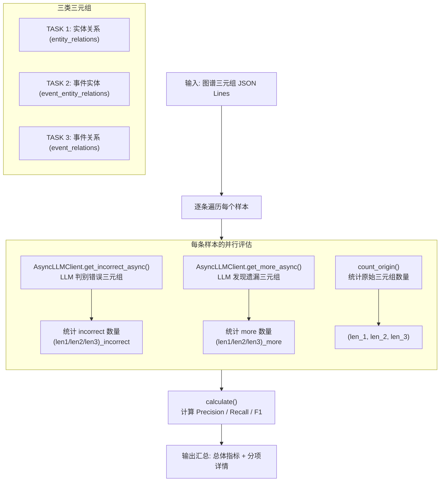
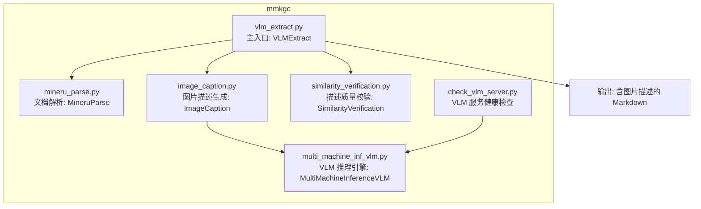
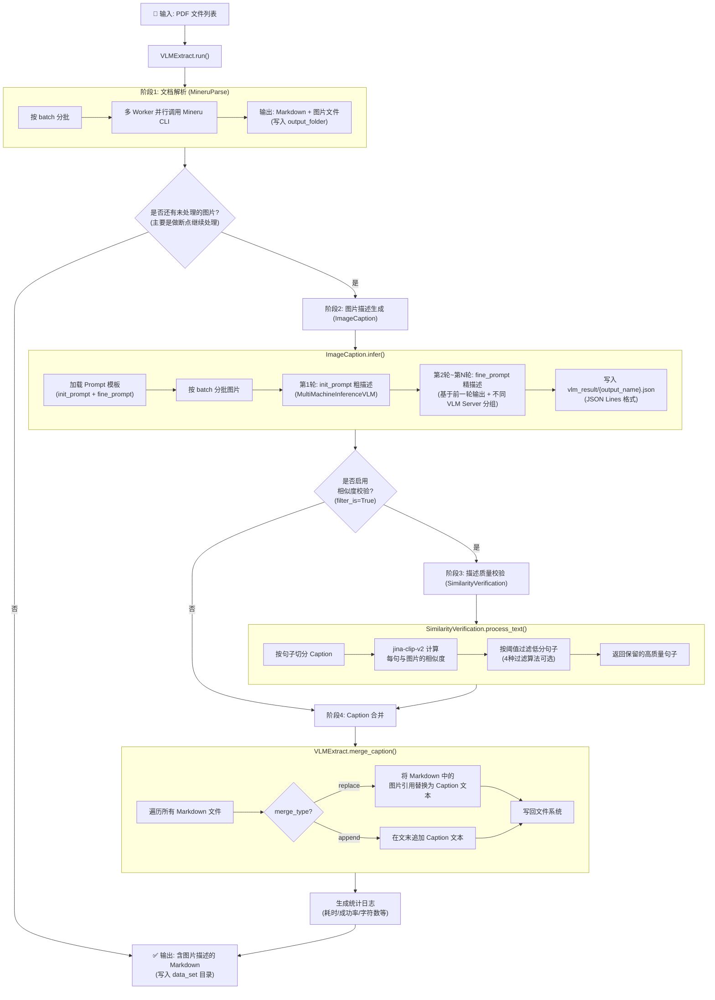
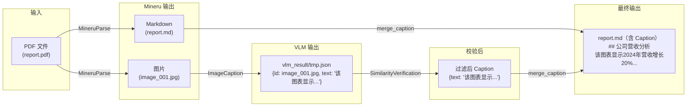
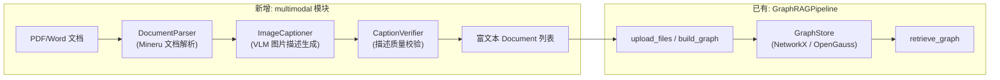
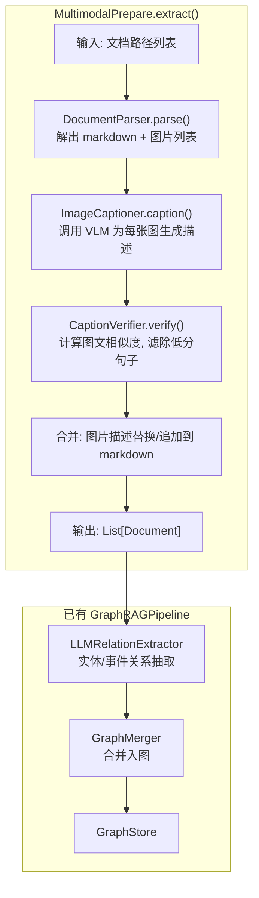

# 知识图谱支持多模态信息提取提案技术方案设计 (RFC)

**状态 (Status):** Draft\
**作者 (Authors):** @yihao1234\
**创建日期 (Created):** 2026-06-13\
**更新日期 (Updated):** 2026-06-13\
**相关 Issue/PR:** #38

***

# 1. 概述

## 1.1 简介

本提案为 RAGSDK 的 GraphRAG 模块新增**多模态文档预处理**能力，在现有纯文本知识图谱构建流程之前，增加文档解析 → 图片描述生成 → 描述质量校验的预处理管线，使 GraphRAG 能从含图片的文档（PDF/Word 等）中提取视觉语义信息并融入知识图谱。

## 1.2 动机

当前 GraphRAG 仅支持文本输入构建知识图谱。实际语料（PDF 报告、论文、手册）中普遍包含图片（图表、示意图、照片），其关键信息未被抽取入图，导致知识覆盖不全。本提案补齐这一短板。

## 1.3 目标

| 阶段     | 功能                       | 说明                          |
| ------ | ------------------------ | --------------------------- |
| 文档解析   | PDF/Word → Markdown + 图片 | 基于 Mineru 引擎提取文档结构与图片       |
| 图片描述生成 | 图片 → 文本描述                | 调用 VLM（qwen3-vl-8b）生成图片语义描述 |
| 描述质量校验 | 过滤幻觉/低质量描述               | 多模态嵌入模型计算图文相似度，滤除低分片段       |

**验收标准：** 知识抽取召回率 ≥85%（挑战 95%），预测准确率 ≥85%（挑战 95%）。

# 2. 用例分析

多模态数据集：ScienceQA数据集
https://github.com/lupantech/ScienceQA
数据集简介：ScienceQA(2022)包含21,208道来自中小学科学课程的问答多选题。一道典型的问题包含多模态的背景（context）、正确的选项、通用的背景知识（lecture）以及具体的解释（explanation）。

名称: 训练集
字节数: 16416902
示例数: 12726
名称: 验证集
字节数: 5404896
示例数: 4241
名称: 测试集
字节数: 5441676
示例数: 4241

训练数据集：12726个样本 原始：文本语料（13.95M）+ 图像（9678 张）
训练数据样例：
'''json
{'image': Image,
 'question': 'Which of these states is farthest north?',
 'choices': ['West Virginia', 'Louisiana', 'Arizona', 'Oklahoma'],
 'answer': 0,
 'hint': '',
 'task': 'closed choice',
 'grade': 'grade2',
 'subject': 'social science',
 'topic': 'geography',
 'category': 'Geography',
 'skill': 'Read a map: cardinal directions',
 'lecture': 'Maps have four cardinal directions, or main directions. Those directions are north, south, east, and west.\nA compass rose is a set of arrows that point to the cardinal directions. A compass rose usually shows only the first letter of each cardinal direction.\nThe north arrow points to the North Pole. On most maps, north is at the top of the map.',
 'solution': 'To find the answer, look at the compass rose. Look at which way the north arrow is pointing. West Virginia is farthest north.'}
'''

测试数据样例：


本次通过评估三元组抽取质量来确定优化效果，ScienceQA数据集12726训练集用于构图，4241测试集用于评估，构图时只使用训练集。评估大模型为qwen2.5-72b-instruct，处理后无图片信息，不需要多模态模型。

## 知识图谱三元组质量评估方法

> 来源于graph_eval_parallel.py，采用 **LLM-as-Judge** 策略对知识图谱抽取结果进行自动化质量评估。

### 评估流程



流程说明：

1. 读取图谱抽取结果文件（JSON Lines，每行一条样本，包含原文 `original_text` 和 `entity_relation_dict`/`event_entity_relation_dict`/`event_relation_dict` 三类三元组）
2. 对每条样本并行执行两路 LLM 评估：
   - **错误判别** (`get_incorrect_async`)：让 LLM 判断已抽取的三元组中哪些与原文不符，输出错误三元组列表
   - **遗漏发现** (`get_more_async`)：让 LLM 检查原文中还有哪些三元组未被抽取，输出遗漏三元组列表
3. 统计各类三元组的原始数量、错误数量、遗漏数量
4. 按三类三元组分别计算指标并汇总

### 核心指标计算公式

| 指标 | 公式 | 说明 |
|------|------|------|
| Precision | `(len_val - len_incorrect) / len_val` | 抽取结果中正确三元组的占比 |
| Recall | `(len_val - len_incorrect) / (len_val - len_incorrect + len_more)` | 所有应抽三元组中被正确抽到的比例 |
| F1 | `2 * Precision * Recall / (Precision + Recall)` | 精确率与召回率的调和平均 |

### LLM 判别 Prompt 策略

三类三元组的判别各有针对性 Prompt，核心理念是**宽松判定**——只要语义上合理即认为正确，避免过度严苛：

| 任务 | Prompt 策略要点 |
|------|----------------|
| TASK 1 实体关系 | 关注语义本质而非精确措辞，允许概括性表达和上下文合理推断 |
| TASK 2 事件实体 | 宽松认定实体关联性，标题/角色/间接参与均视为有效实体 |
| TASK 3 事件关系 | 关系类型限定为 before/after/at the same time/because/as a result，允许逻辑推断 |

### 并行执行策略

| 机制 | 说明 |
|------|------|
| 异步并发 | `asyncio.gather` 并行执行 Task1/2/3 的 incorrect 和 more 共 6 路 LLM 调用 |
| 信号量限流 | `asyncio.Semaphore(max_concurrent)` 控制最大并发请求数（默认 16） |
| 批次处理 | 按 batch_size 分批处理后短暂暂停（batch_delay），避免服务器过载 |
| 指数退避 | LLM 调用失败时按 2^attempt 秒等待后重试（最多 10 次） |

# 3. 方案设计

## 3.1 迁移原代码分析

> mmkgc（RAG_GraphChain-main/mmkgc/）为本次迁移的原始参考实现，以下对原模块核心文件结构与处理流程进行分析。

### 3.1.1 文件结构与职责



| 文件 | 核心类/函数 | 职责 |
|------|------------|------|
| vlm_extract.py | `VLMExtract` | **主入口**：编排完整的多模态文档抽取管线，协调解析→Caption→校验→合并全流程 |
| mineru_parse.py | `MineruParse` | **文档解析**：调用 Mineru CLI 将 PDF 解析为 Markdown + 提取嵌入图片，支持多机并行 + 批处理 |
| image_caption.py | `ImageCaption` | **图片描述生成**：为每张图片调用 VLM 生成文字描述，支持多轮 init/fine prompt 精炼 |
| multi_machine_inf_vlm.py | `MultiMachineInferenceVLM` | **VLM 推理引擎**：多 VLM Server 分片并行推理，支持同步（multiprocessing）和异步（asyncio）两种模式，指数退避重试 |
| similarity_verification.py | `SimilarityVerification` | **描述质量校验**：用多模态嵌入模型 (jina-clip-v2) 计算图片与描述句子的相似度，过滤幻觉/低质量片段 |
| check_vlm_server.py | `check_server()` | **健康检查**：向 VLM 服务发送测试图片验证连通性 |

### 3.1.2 完整处理流程

其中阶段2：图片描述生成，生成一段话，可能包括多句描述。



### 3.1.3 数据流转示意



## 3.2 总体架构

新增模块位于 `mx_rag/graphrag/multimodal/`，作为 GraphRAG 管线的**预处理阶段**。产出富文本 `Document` 对象后，无缝对接现有 `GraphRAGPipeline.build_graph()` 流程。



### 模块内部结构

```txt
mx_rag/graphrag/
├── multimodal/                    ← 新增
│   ├── __init__.py                ← exports: MultimodalPrepare, MultimodalConfig
│   ├── extractor.py               ← MultimodalPrepare (对外唯一入口)
│   ├── parser.py                  ← DocumentParser
│   ├── captioner.py               ← ImageCaptioner
│   ├── verifier.py                ← CaptionVerifier
│   ├── prompts/                   ← prompt放到graphrag已有的文件中
│   └── multimodal_config.py/      ← MultimodalConfig
├── graphrag_pipeline.py           ← 已有（无需变更）
├── relation_extraction.py         ← 已有
├── graph_merger.py                ← 已有
└── ...
```

## 3.3 管线流程



## 3.4 关键技术

### 3.4.1 文档深度解析

| 项目   | 说明                           |
| ---- | ---------------------------- |
| 引擎   | Mineru（命令行调用）                |
| 输入   | PDF、Word 等常见格式               |
| 输出   | 结构化 Markdown 文件 + 提取的图片文件    |
| 并行策略 | 多机多 Worker 并行解析，按 batch 分批处理 |

### 3.4.2 全景 Caption 生成

| 项目 | 说明                                       |
| -- | ---------------------------------------- |
| 模型 | qwen3-vl-8b（VLM）                         |
| 策略 | 两轮迭代：init\_prompt 粗描述 → fine\_prompt 精描述 |
| 推理 | 多 VLM Server 分片并行，指数退避重试                 |

### 3.4.3 Caption 质量评估

| 项目   | 说明                                      |
| ---- | --------------------------------------- |
| 模型   | 多模态嵌入模型（如 jina-clip-v2）                 |
| 方法   | 按句子切分 Caption → 计算每句与图片的相似度 → 按阈值过滤幻觉句子 |
| 阈值策略 | 支持多种过滤算法（标准差、最大间隔分段、百分比等）               |

## 3.5 编程与调用设计

### 3.5.1 MultimodalConfig（配置类）

| 参数                       | 类型                | 必填 | 说明                                                   |
| ------------------------ | ----------------- | -- | ---------------------------------------------------- |
| `parser_servers`         | `List[str]`       | 是  | Mineru 服务地址列表                                        |
| `vlm_servers`            | `List[List[str]]` | 是  | VLM 服务地址（支持多轮分组）                                     |
| `vlm_model_name`         | `str`             | 是  | VLM 模型名称                                             |
| `vlm_headers`            | `Dict[str,str]`   | 否  | VLM 请求头，默认 `{"Content-Type":"application/json"}`     |
| `emb_model_path`         | `str`             | 否  | 验证用嵌入模型路径，不传则跳过校验                                    |
| `filter_type`            | `int`             | 否  | 过滤算法选择（1-4），默认 `4`                                   |
| `truncate_dim`           | `int`             | 否  | 嵌入截断维度，默认 `512`                                      |
| `num_workers_per_server` | `int`             | 否  | 单服务器并发 Worker 数，默认 `8`                               |
| `batch_size`             | `int`             | 否  | 批处理大小，默认 `64`                                        |
| `output_folder`          | `str`             | 否  | 中间产物输出目录，默认使用GraphRAGPipeline的work_dir                              |
| `merge_type`             | `str`             | 否  | Caption 合并方式 `"replace"` / `"append"`，默认 `"replace"` |
| `prompt_path`            | `str`             | 否  | 多模态提示词模板路径（JSON）                                     |

### 3.5.2 MultimodalPrepare

**接口描述：** 多模态文档抽取器，从包含图片的文档中提取文本与图片语义描述，输出可供 GraphRAG 管线直接使用的 `Document` 列表。
本次需求相当于实现一个多模态文档预处理模块，pdf/其他文档 -> 生成图片/md -> 图片生成文字 -> 相似性过滤 -> 替换markdown，后续构图使用之前GraphRAGPipeline直接加载markdown处理即可。

**接口原型：**

```python
class MultimodalPrepare:
    def __init__(self, config: MultimodalConfig):
        """初始化多模态抽取器"""

    def extract(self, file_list: List[str]) -> None:
        """解析文档并提取多模态信息，返回富文本文档列表"""
```

**`extract`** **参数说明：**

| 参数          | 类型          | 输入/输出 | 说明         | 取值范围                     |
| ----------- | ----------- | ----- | ---------- | ------------------------ |
| `file_list` | `List[str]` | 输入    | 待处理的文档路径列表 | 长度 1-100，支持 .pdf/.docx 等mineru支持的文档都可以 |

**异常处理：**

- 文件不存在/格式不支持 → `FileNotFoundError` / `ValueError`
- Mineru 解析失败 → `RuntimeError` + 日志
- VLM 调用超时/失败 → 指数退避重试（最多 10 次），最终失败返回空描述
- 嵌入模型加载失败 → `RuntimeError`

**调用示例：**

```python
from mx_rag.graphrag.multimodal import MultimodalPrepare, MultimodalConfig
from mx_rag.graphrag import GraphRAGPipeline

# 1. 配置多模态抽取
config = MultimodalConfig(
    parser_servers=["http://127.0.0.1:8382"],
    vlm_servers=[["http://127.0.0.1:8100/v1/chat/completions"]],
    vlm_model_name="qwen3-vl-8b",
    emb_model_path="/home/models/jina-clip-v2",
    output_folder="./output",
)

# 2. 抽取多模态文档
extractor = MultimodalPrepare(config)
docs = extractor.extract(["report.pdf", "paper.pdf"])

# 后续构图，不需要修改
pipeline = GraphRAGPipeline(work_dir="./work", llm=llm, embedding_model=emb, dim=1024)
pipeline.build_graph(lang=Lang.CH)
```

**约束说明：**

- 当前仅支持 PDF 格式文档解析（Word 后续扩展）
- VLM Server 需兼容 OpenAI Chat Completions API 格式
- 嵌入模型需支持 `encode_text` / `encode_image` 方法（jina-clip-v2 兼容接口）

***

## 3.6 安全隐私与 DFX 设计

| 要求       | 设计措施                                          |
| -------- | --------------------------------------------- |
| **数据安全** | 文件路径校验、文件大小限制，遵循 RAGSDK `SecFileCheck` 规范     |
| **隐私保护** | SDK 参考设计，不涉及用户数据外传；本地部署 VLM / 嵌入模型            |
| **兼容性**  | 支持MinerU支持的格式，图片格式 JPG/PNG/JPEG           |
| **可维护性** | 模块化设计：parser / captioner / verifier 独立封装，单一职责 |
| **可测试性** | 每个子模块可单独 Mock 测试；集成测试覆盖完整 extract 流程          |
| **可靠性**  | VLM 调用指数退避重试；Mineru 解析异常捕获与日志记录               |

***

# 4. 缺点和风险

| 风险                      | 应对                                     |
| ----------------------- | -------------------------------------- |
| Mineru 为 CLI 调用，进程管理成本高 | 后续评估替换为 SDK/API 调用方式                   |
| VLM 生成描述存在幻觉            | CaptionVerifier 过滤 + 可选的 multi-loop 精炼 |
| 增加管线耗时（解析+VLM+校验）       | 全异步+多机并行设计，耗时可控                        |
| 嵌入模型需 NPU/GPU 资源        | 校验步骤可通过 `emb_model_path=None` 跳过       |

***

# 5. 现有技术

参考mmkgc项目的多模态 KG 构建方案。本设计对其做了以下适配：

| 对比项  | mmkgc（原）      | RAGSDK 迁移方案                             |
| ---- | ------------- | --------------------------------------- |
| 编排方式 | 命令行参数驱动       | 类实例 + 配置对象                              |
| 文档加载 | 手工指定路径 glob   | 统一通过 `MultimodalPrepare.extract()`    |
| 输出格式 | 写回文件系统        | 返回 `List[Document]`，对接 GraphRAGPipeline |
| 错误处理 | `exit()` 直接退出 | 异常抛出 + 日志                               |
| 参数校验 | 无             | `@validate_params` 装饰器                  |
| 代码风格 | 脚本化           | 遵循 RAGSDK 模块规范                          |

***

# 6. 未解决问题

- Word/PPT 等格式的文档解析支持优先级。

***

**附录**

- **数据集：** [ScienceQA](https://github.com/lupantech/ScienceQA)
- **模型：** qwen3-vl-8b（VLM），jina-clip-v2（嵌入），Mineru（文档解析）
