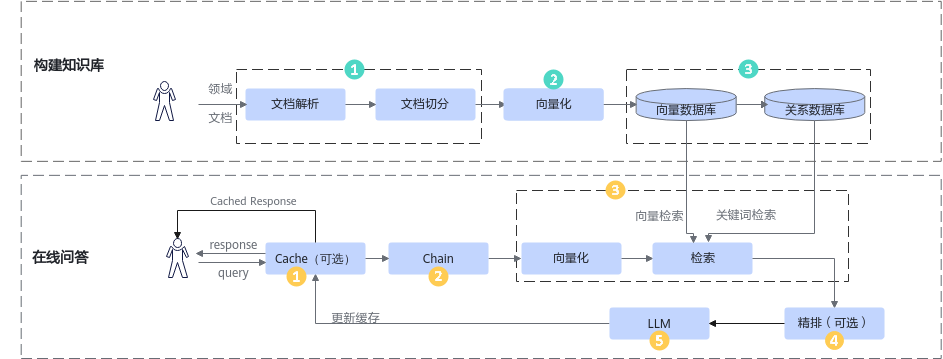
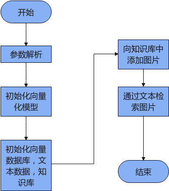

# 开发流程<a name="ZH-CN_TOPIC_0000001989074198"></a>

RAG SDK的完整开发流程如[图1](#fig1495610311102)所示。用户可参见以下步骤完成接口调用。

运行阶段请使用root用户执行相关用例。

知识库构建和在线问答支持并发，具体参见对应Demo。

**图 1** RAG SDK开发流程<a id="fig1495610311102"></a>



- 构建知识库。
    1. 上传领域文档，加载和切分。初始化文档处理器，用户可以根据上传的文件类型注册相应的文档解析器（参见[文档解析](./api/knowledge_management.md#文档解析)、[langchain文档解析API](https://python.langchain.com/v0.2/docs/integrations/document_loaders/#all-document-loaders)或基于langchain自定义）和文档切分器（参见[langchain文档切分API](https://python.langchain.com/v0.2/docs/how_to/recursive_text_splitter/)或基于langchain自定义），支持的文档类型包括Docx、Excel、Pdf、PowerPoint等。用户可以根据需要加载相应的解析和切分功能，输出为文档切分后的文本chunks。
    2. 文本向量化。加载embedding模型（参见[向量化](./api/embedding.md)），根据模型具体路径进行配置。文档切分后的文本chunks向量化后存入知识库管理中的向量数据库。
    3. 初始化知识库管理，参见[知识库文档管理](./api/knowledge_management.md#知识库文档管理)，包括初始化关系数据库和向量数据库（参见[关系型数据库](./api/databases.md#关系型数据库)和[向量数据库](./api/databases.md#向量数据库)）。

        切分后的文本chunks会存入关系数据库，chunks向量化后数据会存入向量数据库，一一对应。

- 在线问答。
    1. 初始化缓存（参见[缓存模块](./api/cache_module.md#缓存模块)，可选），RAG SDK支持配置缓存和近似搜索，当用户问答时优先从缓存中搜索答案，问题命中则直接返回缓存中的回答，未配置缓存或问题未命中缓存则继续以下推理过程。
    2. 初始化大模型Chain（参见[大模型Chain](./api/llm_chains.md)），通过Chain串联大语言模型，检索和精排模块进行问答，用户可以选择文生文、文生图、图生图等Chain，支持多轮对话、检索推理并行等方式。
    3. 初始化检索方式（参见[检索](./api/retrieval.md)），用户可以定义近似检索、查询改写检索等方式。问题经过embedding模型向量化后，通过检索在知识库中找到上下文context，进行下一步处理。
    4. 对检索到的上下文context通过reranker进行精排（参见[排序](./api/reranker.md)，可选），提高检索质量。
    5. 最后将用户问题和上下文context组装成prompt，传入大语言模型（参见[大语言模型](./api/llm_client.md)）进行推理并获得回答返回给用户。如果有配置缓存，问答完成后会将问答对刷新到缓存中，再次问答命中时将缩短问答耗时。

# 应用开发<a name="ZH-CN_TOPIC_0000002043287861"></a>

## 文生文场景<a name="ZH-CN_TOPIC_0000002024300245"></a>

### 前置条件

开始之前，请确认：

- **硬件**：Atlas 300I Duo 推理卡或Atlas 800I A2/A3 推理服务器，并安装对应的驱动、依赖和固件
- **Docker**：已安装 Docker，且当前用户可运行容器
- **向量模型服务**：参考[mis-tei文档](https://www.hiascend.com/developer/ascendhub/detail/07a016975cc341f3a5ae131f2b52399d)部署好embedding模型bge-large-zh-v1.5
- **大模型服务**：参考[Qwen3-Dense文档](https://docs.vllm.ai/projects/ascend/en/latest/tutorials/models/Qwen3-Dense.html)部署好LLM模型Qwen3-4B

### 步骤 1：拉取镜像

1. **确定待下载镜像版本**
   - 访问昇腾社区[镜像仓](https://www.hiascend.com/developer/ascendhub/detail/b875f781df984480b0385a96fa1b03c9)，查看RAG SDK镜像配套表，获取镜像最新版本以及与之配套的CANN版本
   - 根据当前硬件型号（如 Atlas 800I A2 推理服务器）选择对应版本

    > [!NOTE]
    > 镜像中已安装CANN，无需重复安装<br>
    > 注意区分 CPU 架构（x86_64 / aarch64）

2. **环境预检查**
   - 执行 `npu-smi info` 命令查看当前环境安装的 NPU 驱动版本
   - 通过RAG SDK镜像配套表中获取配套CANN版本，并参见[固件与驱动](https://www.hiascend.com/hardware/firmware-drivers/community)页面查看对应的NPU驱动版本，如果和当前环境安装的驱动版本不配套，需更新NPU驱动至对应版本，更新指导详见《[驱动和固件安装指南](https://support.huawei.com/enterprise/zh/doc/EDOC1100568434/36e8d875?idPath=23710424|251366513|254884019|261408772|252764743)》。

3. **镜像拉取示例**

   镜像 Tag 格式为 `{version}-{chip}-{os}-{python}`，各变量含义如下：

   | 变量 | 含义         | 示例值 |
   |------|------------|--------|
   | `{version}` | RAG SDK 版本 | `26.0.0` |
   | `{chip}` | 昇腾芯片系列     | `910b` |
   | `{os}` | 基础操作系统     | `ubuntu22.04` / `openeuler24.03` |
   | `{python}` | Python 版本  | `py3.11` |

   ```bash
   TAG={version}-{chip}-{os}-{python}
   docker pull swr.cn-south-1.myhuaweicloud.com/ascendhub/ragsdk:${TAG}
   docker tag swr.cn-south-1.myhuaweicloud.com/ascendhub/ragsdk:${TAG} \
       ragsdk:${TAG}
   ```

   以 26.0.0 版本、910b 芯片、Ubuntu 22.04、Python 3.11为例：

   ```bash
   docker pull swr.cn-south-1.myhuaweicloud.com/ascendhub/ragsdk:26.0.0-910b-ubuntu22.04-py3.11
   docker tag swr.cn-south-1.myhuaweicloud.com/ascendhub/ragsdk:26.0.0-910b-ubuntu22.04-py3.11 ragsdk:26.0.0-910b-ubuntu22.04-py3.11
    ```

### 步骤 2：启动容器

> [!NOTE]
>
> - `--device /dev/davinci0` 中的设备编号需按宿主机实际 NPU 编号调整
> - `-v /path/to/model:/home/data` 挂载宿主机目录到容器（可选）
> - 容器内示例代码位于 `/workspace/RAGSDK_Samples`

```bash
docker run \
    --name ragsdk_demo \
    --device /dev/davinci0 \
    --device /dev/davinci_manager \
    --device /dev/devmm_svm \
    --device /dev/hisi_hdc \
    -v /usr/local/dcmi:/usr/local/dcmi \
    -v /usr/local/bin/npu-smi:/usr/local/bin/npu-smi \
    -v /usr/local/Ascend/driver:/usr/local/Ascend/driver \
    -v /usr/local/Ascend/driver/version.info:/usr/local/Ascend/driver/version.info \
    -v /etc/ascend_install.info:/etc/ascend_install.info \
    -v /path/to/model:/home/data \
    -itd ragsdk:26.0.0-910b-ubuntu22.04-py3.11 bash
```

### 步骤 3：进入容器

```bash
docker exec -it ragsdk_demo bash
```

### 步骤 4：创建测试文档

在工作目录下创建测试文档：

```bash
mkdir -p /workspace/testdata
cat > /workspace/testdata/gaokao.txt << 'EOF'
2024年高考语文作文试题
新课标I卷
阅读下面的材料，根据要求写作。（60分）
随着互联网的普及、人工智能的应用，越来越多的问题能很快得到答案。那么，我们的问题是否会越来越少？
以上材料引发了你怎样的联想和思考？请写一篇文章。
要求：选准角度，确定立意，明确文体，自拟标题；不要套作，不得抄袭；不得泄露个人信息；不少于800字。
EOF
```

### 步骤 5：构建知识库

进入示例目录，运行知识库构建脚本：

```bash
cd /workspace/RAGSDK_Samples/rag_with_api
python3 rag_demo_knowledge.py \
    --embedding_url http://127.0.0.1:8080/v1/embeddings \
    --white_path /workspace \
    --file_path /workspace/testdata/gaokao.txt
```

> [!NOTE]
> <http://127.0.0.1:8080>为示例url参数，具体url配置以用户本地部署使用参数为准。

### 步骤 6：验证知识库构建成功

若输出以下结果，表示知识库构建成功：

```text
['gaokao.txt']
```

### 步骤 7：执行问答

```bash
python3 rag_demo_query.py \
    --embedding_url http://127.0.0.1:8080/v1/embeddings \
    --llm_url http://127.0.0.1:1025/v1/chat/completions \
    --model_name Qwen3-4B \
    --query "请描述2024年高考作文题目"
```

> [!NOTE]
> 注意<http://127.0.0.1:8080>和<http://127.0.0.1:1025>为示例url参数，具体url配置以用户本地部署使用参数配置为准。

### 步骤 8：验证问答成功

若输出包含检索到的文档内容和生成的回答，表示问答流程运行正常：

```text
{'query': '请描述2024年高考作文题目', 'result': '...", 'source_documents': [...]}
```

## 文本检索图片<a name="ZH-CN_TOPIC_0000002272375173"></a>

本章节将指导用户使用RAG SDK根据文本搜索图片样例。

**前提条件<a name="section1734316490"></a>**

已经完成[安装RAG SDK](./installation_guide.md#安装方式)。

**样例流程介绍<a name="section1281432091612"></a>**



**操作步骤<a name="section7904194010166"></a>**

1. 在任意目录编辑创建retrieve\_img\_demo.py，内容如下：

    ```python
    import argparse

    from mx_rag.document import LoaderMng
    from mx_rag.document.loader import ImageLoader

    from mx_rag.embedding.local import ImageEmbedding
    from mx_rag.knowledge import KnowledgeDB, upload_files
    from mx_rag.knowledge.knowledge import KnowledgeStore
    from mx_rag.retrievers import Retriever
    from mx_rag.storage.document_store import SQLiteDocstore
    from mx_rag.storage.vectorstore import MindFAISS


    if __name__ == '__main__':
        parser = argparse.ArgumentParser()
        parser.add_argument('--query', type=str, help="查询图片文本内容")
        parser.add_argument("--image-path", type=str, action='append', help="待入库图片路径")

        args = parser.parse_args().__dict__
        images: list[str] = args.pop("image_path")
        query = args.pop("query")
        loader_mng = LoaderMng()
        loader_mng.register_loader(ImageLoader, [".jpg"])

        dev = 0
        img_emb = ImageEmbedding("ViT-B-16", model_path="path to clip model", dev_id=dev)

        img_vector_store = MindFAISS(x_dim=512, devs=[dev],
                                     load_local_index="./image_faiss.index",
                                     auto_save=True)
        chunk_store = SQLiteDocstore(db_path="./sql.db")

        # 初始化知识管理关系数据库
        knowledge_store = KnowledgeStore(db_path="./sql.db")

        user_id = "fc557af8-5973-4893-9624-4a510c3e18fb"
        knowledge_store.add_knowledge("test", user_id=user_id)

        knowledge_db = KnowledgeDB(knowledge_store=knowledge_store, chunk_store=chunk_store, vector_store=img_vector_store,
                                   knowledge_name="test", white_paths=["/home"], user_id=user_id)

        upload_files(knowledge_db, images, loader_mng=loader_mng,
                     embed_func=img_emb.embed_images, force=True)

        img_retriever = Retriever(vector_store=img_vector_store, document_store=chunk_store,
                                  embed_func=img_emb.embed_documents, k=1, score_threshold=0.4)
        res = img_retriever.invoke(query)
        # res中包含检索到的图片路径
        print(res)

    ```

2. 执行如下命令运行，其他参数按实际情况配置，参考[ClientParam](./api/universal_api.md#clientparam)。

    ```bash
    python3 retrieve_img_demo.py --image-path ./car1.jpg  --image-path ./car2.jpg  --query "小汽车"
    ```

## 多轮对话<a name="ZH-CN_TOPIC_0000002026661421"></a>

本章节将指导用户使用LangChain来使用多轮对话功能。

**前提条件<a name="section1736555225910"></a>**

- 已经完成[安装RAG SDK](./installation_guide.md#安装方式)。
- 已经参考[Qwen3-Dense文档](https://docs.vllm.ai/projects/ascend/en/latest/tutorials/models/Qwen3-Dense.html)部署好LLM模型Qwen3-4B。

**操作步骤<a name="section599518311318"></a>**

1. 在容器内任意目录执行vim命令创建demo.py代码文件，文件内容如下：

    ```python
    from langchain.memory import ConversationBufferWindowMemory
    from langchain.chains import LLMChain
    from langchain_core.prompts import PromptTemplate
    from mx_rag.llm import Text2TextLLM
    from mx_rag.utils import ClientParam
    if __name__ == '__main__':
        template = """You are a chatbot having a conversation with a human. Please answer as briefly as possible.

        {chat_history}
        Human: {human_input}"""
        dev = 1
        prompt = PromptTemplate(
            input_variables=["chat_history", "human_input"], template=template
        )
        # k可以设置保存的历史会话轮数，还支持ConversationBufferMemory和ConversationTokenBufferMemory，参考langchain官方文档
        memory = ConversationBufferWindowMemory(memory_key="chat_history", k=3)
        client_param = ClientParam(ca_file="/path/to/ca.crt")
        chat = Text2TextLLM(base_url="https://ip:port/v1/chat/completions",
                            model_name="Llama3-8B-Chinese-Chat",
                            client_param=client_param)
        llm_chain = LLMChain(llm=chat, prompt=prompt, memory=memory, verbose=True)
        questions = ["请记住小明的爸爸是小刚",
                     "七大洲前四个是啥？",
                     "后三个呢？"]
        for question in questions:
            llm_chain.predict(human_input=question)
        completion = llm_chain.predict(human_input="请问小明的爸爸是谁？")
        print(completion)
    ```

2. 运行样例代码，请求大模型中带有历史信息，prompt拼接结果如下：

    ```ColdFusion
    You are a chatbot having a conversation with a human. Please answer as briefly as possible.

    Human: 请记住小明的爸爸是小刚
    AI: 记住了，小明的爸爸是小刚。
    Human: 七大洲前四个是啥？
    AI: 亚洲、非洲、欧洲、北美洲。
    Human: 后三个呢？
    AI: 南美洲、澳大利亚、南极洲。
    Human: 请问小明的爸爸是谁？
    小明的爸爸是小刚。
    ```

## 调用Agentic RAG样例<a name="ZH-CN_TOPIC_0000002041731821"></a>

详细介绍可参见：[RAG SDK基于LangGraph知识检索增强应用使能方案](https://gitcode.com/Ascend/RAGSDK/tree/master/example/langgraph)。

## chat with ragsdk<a name="ZH-CN_TOPIC_0000002485964970"></a>

启动WEB服务，进行参数配置、文档上传、删除、问答等操作，详细流程见：[chat\_with\_ragsdk](https://gitcode.com/Ascend/RAGSDK/blob/master/example/chat_with_ascend/README.md)。
