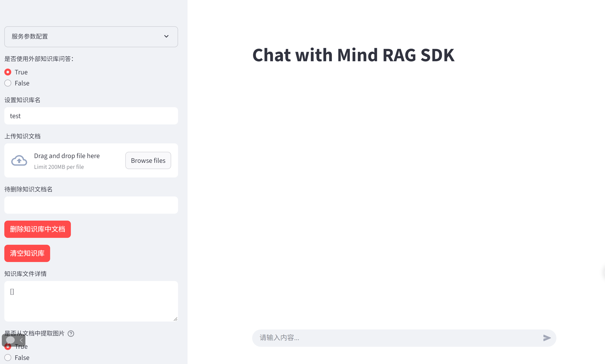

# Demo运行说明

## 功能描述

基于 Streamlit 构建的图形化 RAG 聊天系统样例。提供可视化的 Web 界面，支持用户进行参数配置、文档上传与删除、多轮对话问答等操作。主要特性包括：

- **多格式文档解析**：支持 txt、md、docx、pdf、xlsx、pptx 等格式文件的上传与解析
- **图文并茂回答**：可选启用 OCR 和 VLM 模型，解析文档中的图片并生成图文交错的回答
- **知识图谱检索**：支持基于 NetworkX 或 openGauss 的知识图谱构建与检索
- **语义缓存加速**：支持 memory cache 和 similarity cache 两级缓存，加速重复问答
- **多轮对话与查询改写**：支持对话历史管理和基于 LLM 的查询改写

## 前提条件

执行Demo前请先阅读[《RAG SDK 用户指南》](https://www.hiascend.com/document/detail/zh/mindsdk/730/rag/ragug/mxragug_0001.html)，并按照其中"安装部署"章节的要求完成必要软、硬件安装。
本章节为"应用开发"章节提供开发样例代码,便于开发者快速开发。

## 环境准备(容器化部署)

需按以下顺序完成依赖服务部署，确保各服务可正常通信：

1. 部署RAG SDK（[参考链接](https://www.hiascend.com/developer/ascendhub/detail/b875f781df984480b0385a96fa1b03c9)）
2. 部署LLM服务（[参考链接](https://docs.vllm.ai/projects/ascend/en/latest/tutorials/models/Qwen3-Dense.html)）
3. 部署Milvus服务（支持v2.5.0及以上版本，[参考链接](https://milvus.io/docs/zh/install_standalone-docker.md)）
4. 部署mis-tei embedding与reranker服务（[参考链接](https://www.hiascend.com/developer/ascendhub/detail/07a016975cc341f3a5ae131f2b52399d)）
5. 部署OCR服务（推荐模型：MinerU2.5-2509-1.2B，[参考链接](https://opendatalab.github.io/MinerU/zh/usage/acceleration_cards/Ascend/#3-docker)）
6. 图文并茂回答支持（可选）：
   若需解析docx、pdf文件中的图片并生成图文回答，需额外部署VLM模型服务（推荐模型：qwen2.5-vl-7b-instruct，[参考链接](https://www.hiascend.com/developer/ascendhub/detail/9eedc82e0c0644b2a2a9d0821ed5e7ad)）。

> [!NOTE]
> 长或宽小于256像素的图片因信息不足，将被自动丢弃。

## 运行Demo步骤

### 1. 容器内环境准备

在ragsdk容器中，打开样例代码目录：

```bash
cd /opt/package/RAGSDK/examples/chat_with_ascend/
```

> [!NOTE]
> 容器内代码可能未同步至最新版本，建议从代码仓库拉取最新版本以确保一致性

### 2. 启动WEB服务

执行以下命令启动Streamlit服务，替换`服务端口`为实际可用端口（如8501）：

```bash
streamlit run app.py --server.address "127.0.0.1" --server.port 服务端口
```

> [!NOTE]
> 安全提示：示例为简单部署，生产环境需开启HTTPS安全认证以保障服务安全。
> 配置文件说明：代码运行之后，会自动生成参数配置文件，默认保存在/home/HwHiAiUser/workspace/config.json，可在app.py中进行修改

### 3. 访问与使用

在PC浏览器中输入地址访问：`http://服务IP:服务端口`

进入界面后，即可完成参数配置、文档上传、删除、问答等操作。


